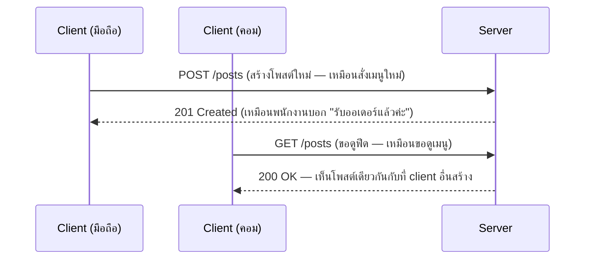

ลองนึกภาพร้านอาหารตามสั่งเจ้าหนึ่ง คุณนั่งที่โต๊ะ เปิดเมนู แล้วบอกพนักงานว่า "ขอผัดกะเพราหมูสับ ไข่ดาว" — คุณไม่ได้เดินเข้าไปทำเองในครัว คุณแค่**สั่ง** แล้วรอ พนักงานเดินใบสั่งเข้าไปให้ครัว ครัว**ทำ**อาหารแล้วส่งกลับมาให้คุณ

ระบบซอฟต์แวร์แทบทุกระบบทำงานด้วยหลักการเดียวกันเป๊ะ — มีฝั่งหนึ่งคอย "สั่ง" กับอีกฝั่งคอย "ทำ" ในวงการเรียกสองฝั่งนี้ว่า **Client** (ฝั่งสั่ง — เปรียบเหมือนตัวคุณที่นั่งอยู่โต๊ะ) กับ **Server** (ฝั่งทำ — เปรียบเหมือนครัวที่อยู่ข้างหลัง)

## ทำไมต้องแยกกันเป็นสองฝั่ง

ลองนึกภาพว่าไม่มีครัวกลาง — ลูกค้าแต่ละคนต้องทำอาหารกินเอง ถ้าอยากกินกะเพราแบบเดียวกับที่เพื่อนกิน ต้องขอสูตรมาทำเอง อยากรู้ว่าเมนูวันนี้มีอะไรบ้าง ก็ต้องไปถามคนอื่นทีละคน — วุ่นวายมาก

การมีครัวกลาง (Server) แก้ปัญหานี้ตรงๆ: **ข้อมูลอยู่ที่เดียว ทุกคนสั่งจากที่เดียวกัน** ลูกค้าคนไหนสั่งกะเพราก็ได้สูตรเดียวกัน อยากรู้เมนูก็ดูจากที่เดียวกัน ไม่ต้องเก็บอะไรไว้เองเลย

```demo
component: ComparisonDiagram
props: {"left":{"title":"CLIENT (ฝั่งสั่ง)","points":["เดินเข้าร้าน เปิดเมนู สั่งอาหาร","ตัวอย่าง: browser, มือถือ, หน้าจอสั่งอาหารในร้าน","ต้องเริ่มก่อนเสมอ — ไม่มีใครเดินมาถามก่อน"]},"right":{"title":"SERVER (ฝั่งทำ)","points":["รอรับใบสั่ง แล้วทำตามนั้น","ถือสูตรอาหาร+วัตถุดิบที่ต้องแชร์ให้ทุกโต๊ะ","1 ครัวรับใบสั่งจากหลายโต๊ะพร้อมกันได้"]},"note":"ความสัมพันธ์พื้นฐาน: หลายโต๊ะ (many clients) → ครัวเดียวหรือกลุ่มครัว (server)"}
```

## เดินตามใบสั่งดูสักครั้ง

พนักงานเสิร์ฟเดินใบสั่งจากโต๊ะไปครัว (**request**) ครัวทำเสร็จแล้วส่งจานอาหารกลับมาที่โต๊ะ (**response**) — สองคำนี้คือหัวใจของการสื่อสารระหว่าง client กับ server ทุกครั้งที่เปิดเว็บ กดปุ่มในแอป หรือแม้แต่เลื่อนดูฟีด เบื้องหลังก็คือใบสั่ง-จานอาหารแบบนี้เกิดขึ้นซ้ำๆ นับไม่ถ้วน

```demo
component: JourneyDiagram
props: {"nodes":[{"icon":"person","label":"โต๊ะคุณ (Client)"},{"icon":"building","label":"ครัว (Server)"}],"travelerIcon":"envelope","steps":[{"activeNode":0,"caption":"คุณนั่งโต๊ะ เปิดเมนู แล้วสั่งอาหาร (request) — พนักงานรับใบสั่งแล้วเดินเข้าครัว"},{"activeNode":1,"caption":"ครัว (Server) ได้รับใบสั่ง เริ่มทำอาหารตามนั้น"},{"activeNode":1,"caption":"ทำเสร็จแล้ว เตรียมจานส่งกลับ (response)"},{"activeNode":0,"caption":"จานอาหารมาส่งถึงโต๊ะคุณ — ครบหนึ่งรอบ request-response"}]}
```



สังเกตว่า Client คอมกับ Client มือถือ **ไม่ได้คุยกันตรงๆ เลย** ทั้งคู่คุยกับ Server อย่างเดียว แต่กลับเห็นข้อมูลตรงกันได้ — นี่คือพลังของการมีศูนย์กลางเดียว เหมือนสองโต๊ะในร้านที่ไม่รู้จักกัน แต่กินกะเพราสูตรเดียวกันได้เพราะมาจากครัวเดียวกัน

## แล้วถ้าร้านคนแน่นล่ะ

ร้านอาหารตามสั่งเจ้าเล็กๆ มีครัวเดียว รับออเดอร์ทีละใบ ถ้าลูกค้าเยอะขึ้นเรื่อยๆ ครัวเดียวก็เริ่มทำไม่ทัน — คำถามนี้แหละที่ทุกเรื่องในหลักสูตรนี้จากนี้ไปจะตอบ: **จะออกแบบฝั่ง server ยังไงให้รับออเดอร์จำนวนมากได้เร็วและไม่ล่ม** ไม่ว่าจะเป็นเรื่อง load balancer (คนคอยจัดคิวลูกค้า), cache (จำเมนูฮิตไว้ไม่ต้องทำใหม่ทุกครั้ง), หรือ database replication (มีสูตรสำรองหลายชุดกันเผื่อชุดหนึ่งหาย) — ทั้งหมดคือวิธีทำให้ "ครัวกลาง" รองรับคนได้เยอะขึ้นโดยไม่เสียหลักการเดิม
