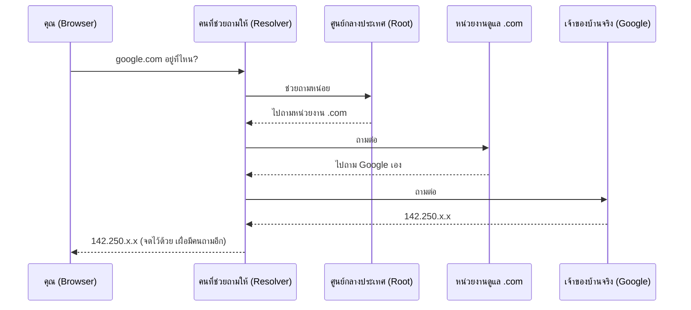

ลองนึกภาพว่าเพื่อนชวนไปงานวันเกิดที่บ้านเขา แต่บอกแค่ชื่อ "บ้านคุณเอ" ไม่ได้บอกเลขที่บ้าน คุณจะไปหาได้ยังไง? วิธีที่คนทั่วไปทำคือ**ถามคนที่รู้จักที่อยู่**ทีละคน จนกว่าจะมีใครสักคนบอกที่อยู่จริงได้ — เพื่อนบ้าน, คนขับมอเตอร์ไซค์รับจ้างแถวนั้น, หรือปากซอยที่รู้จักทุกบ้าน

เวลาพิมพ์ `google.com` ใน browser ก็เจอปัญหาเดียวกันเป๊ะ — เครื่องคอมพิวเตอร์ไม่รู้ **ที่อยู่จริง** ของ google.com (ซึ่งก็คือตัวเลขที่เรียกว่า **IP address**) รู้แค่ชื่อ กระบวนการ "ถามไปเรื่อยๆ จนกว่าจะเจอที่อยู่จริง" นี้เรียกว่า **DNS Resolution**

```demo
component: StepThroughDiagram
props: {"steps":[{"label":"1. เช็คในสมุดโน้ตตัวเองก่อน","detail":"เหมือนคุณเคยไปบ้านคุณเอมาก่อน แล้วจดที่อยู่ไว้ในสมุด — browser และ OS เก็บผลลัพธ์ DNS ที่เคยถามไว้ (มี TTL กำกับว่าใช้ได้นานแค่ไหน) ถ้ายังไม่หมดอายุ ใช้เลยไม่ต้องถามใครอีก"},{"label":"2. ถามคนที่รู้จักแถวนั้น (Recursive Resolver)","detail":"ถ้าจำไม่ได้ ก็โทรถามเพื่อนอีกคน หรือถามคนขับมอเตอร์ไซค์รับจ้าง ให้ช่วยหาที่อยู่ให้แทน — ในทางเทคนิคคือถาม resolver ที่ ISP หรือ public DNS (เช่น 8.8.8.8)"},{"label":"3. ถามศูนย์ข้อมูลกลางระดับประเทศ (Root Server)","detail":"คนที่ถามก็ไม่รู้เหมือนกัน เลยถามศูนย์ข้อมูลกลางที่สุด — ศูนย์นั้นไม่รู้ที่อยู่จริง แต่บอกได้ว่า \".com\" ต้องไปถามหน่วยงานไหนต่อ"},{"label":"4. ถามหน่วยงานดูแลโซนนั้น (TLD Server)","detail":"เหมือนถามเขต/อำเภอว่าถนนเส้นนี้อยู่ตรงไหน — หน่วยงานที่ดูแลโดเมน .com ทั้งหมด บอกว่า google.com ใช้ผู้ดูแลที่อยู่คนไหน"},{"label":"5. ถามเจ้าของบ้านโดยตรง (Authoritative Server)","detail":"สุดท้ายก็ถึงคนที่รู้จริง — เซิร์ฟเวอร์ที่ Google ตั้งค่าเอง ตอบที่อยู่จริง (IP) ของ google.com กลับมาให้"},{"label":"6. จดที่อยู่ไว้ในสมุด แล้วบอกกลับไป","detail":"resolver จดที่อยู่นี้ไว้ (cache ตาม TTL) เผื่อมีคนอื่นถามอีก แล้วส่ง IP กลับไปให้เครื่องของคุณ — จากนี้ browser ก็ต่อไปยังที่อยู่นั้นได้เลย"}]}
```

## เห็นเป็นภาพรวมอีกครั้ง



ฟังดูใช้เวลานาน แต่จริงๆ ทั้งหมดนี้เกิดขึ้นในเสี้ยววินาที และเพราะมีการ "จดที่อยู่ไว้ในสมุด" (cache) ทุกขั้นตอน ครั้งต่อไปที่มีคนถามชื่อเดียวกัน แทบไม่ต้องเดินขั้นตอนซ้ำเลย

## ทำไมเรื่องนี้สำคัญกับ system design

- **TTL** ก็เหมือน "อายุของที่จดในสมุด" — ถ้า Google ย้ายที่อยู่ (เปลี่ยน IP เพราะย้าย data center) ตั้ง TTL สั้นจะทำให้ทุกคนรู้ที่อยู่ใหม่เร็วขึ้น แต่ก็ต้องถามซ้ำบ่อยขึ้นด้วย (โหลดเยอะขึ้นที่ resolver)
- DNS ใช้เป็นตัวช่วย **กระจายคนไปหลายที่อยู่ได้แบบง่ายๆ** — ตั้งที่อยู่หลายอันให้ชื่อเดียวกัน (คล้ายมีบ้านหลายหลังใช้ชื่อ "บ้านคุณเอ" เหมือนกัน) แต่หยาบกว่า Load Balancer จริงมาก เพราะไม่มีใครคอยเช็คว่าบ้านไหนยังมีคนอยู่
- ระบบใหญ่ๆ มักใช้ **GeoDNS** — เหมือนบอกที่อยู่ "สาขาที่ใกล้คุณที่สุด" แทนที่จะบอกที่อยู่เดียวกันให้ทุกคนทั่วโลก ลดระยะทางเดินทางจริง (latency) ลงได้เยอะ
