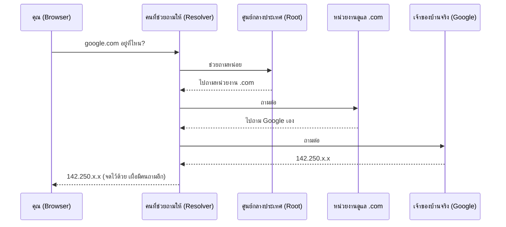

ลองนึกภาพว่าเพื่อนชวนไปงานวันเกิดที่บ้านเขา แต่บอกแค่ชื่อ "บ้านคุณเอ" ไม่ได้บอกเลขที่บ้าน คุณจะไปหาได้ยังไง? วิธีที่คนทั่วไปทำคือ**ถามคนที่รู้จักที่อยู่**ทีละคน จนกว่าจะมีใครสักคนบอกที่อยู่จริงได้ — เพื่อนบ้าน, คนขับมอเตอร์ไซค์รับจ้างแถวนั้น, หรือปากซอยที่รู้จักทุกบ้าน

เวลาพิมพ์ `google.com` ใน browser ก็เจอปัญหาเดียวกันเป๊ะ — เครื่องคอมพิวเตอร์ไม่รู้ **ที่อยู่จริง** ของ google.com (ซึ่งก็คือตัวเลขที่เรียกว่า **IP (Internet Protocol) address**) รู้แค่ชื่อ กระบวนการ "ถามไปเรื่อยๆ จนกว่าจะเจอที่อยู่จริง" นี้เรียกว่า **DNS (Domain Name System) Resolution**

```demo
component: JourneyDiagram
props: {"nodes":[{"icon":"person","label":"คุณ"},{"icon":"notebook","label":"สมุดจด (Cache)"},{"icon":"building","label":"Resolver"},{"icon":"building","label":"Root"},{"icon":"building","label":"TLD (.com)"},{"icon":"house","label":"Authoritative (Google)"}],"travelerIcon":"envelope","steps":[{"activeNode":1,"caption":"เช็คสมุดจด (cache) ก่อน — ถ้าเพิ่งถามชื่อนี้เมื่อไม่นาน อาจมีคำตอบจดไว้แล้ว ใช้เลยไม่ต้องเดินต่อ"},{"activeNode":2,"caption":"ถ้าไม่มีในสมุด ส่งคำถามไปหา Resolver (ตัวช่วยถามแทนคุณ) — มักเป็นของ ISP (Internet Service Provider) หรือ public DNS อย่าง 8.8.8.8"},{"activeNode":3,"caption":"Resolver ไม่รู้เหมือนกัน เลยถามศูนย์กลางที่สุดคือ Root Server — Root ไม่รู้ที่อยู่จริง แต่รู้ว่า \".com\" ต้องไปถามใครต่อ"},{"activeNode":4,"caption":"Root ชี้ไปหน่วยงานดูแลโซน .com (TLD - Top-Level Domain - Server) — บอกว่า google.com ให้ไปถามผู้ดูแลคนไหน"},{"activeNode":5,"caption":"สุดท้ายถึง Authoritative Server ของ Google เอง — เจ้าของบ้านตัวจริง ตอบ IP address กลับมา"},{"activeNode":1,"caption":"Resolver จดคำตอบไว้ในสมุด (cache) ตามอายุที่กำหนด (TTL) แล้วส่ง IP กลับไปให้คุณ — ครั้งหน้าถ้าถามชื่อเดิมในเวลาไม่นาน ไม่ต้องเดินซ้ำทั้งหมด"}]}
```

```demo
component: StepThroughDiagram
props: {"steps":[{"label":"1. เช็คในสมุดโน้ตตัวเองก่อน","detail":"เหมือนคุณเคยไปบ้านคุณเอมาก่อน แล้วจดที่อยู่ไว้ในสมุด — browser และ OS เก็บผลลัพธ์ DNS ที่เคยถามไว้ (มี TTL - Time To Live - กำกับว่าใช้ได้นานแค่ไหน) ถ้ายังไม่หมดอายุ ใช้เลยไม่ต้องถามใครอีก"},{"label":"2. ถามคนที่รู้จักแถวนั้น (Recursive Resolver)","detail":"ถ้าจำไม่ได้ ก็โทรถามเพื่อนอีกคน หรือถามคนขับมอเตอร์ไซค์รับจ้าง ให้ช่วยหาที่อยู่ให้แทน — ในทางเทคนิคคือถาม resolver ที่ ISP (Internet Service Provider) หรือ public DNS (เช่น 8.8.8.8)"},{"label":"3. ถามศูนย์ข้อมูลกลางระดับประเทศ (Root Server)","detail":"คนที่ถามก็ไม่รู้เหมือนกัน เลยถามศูนย์ข้อมูลกลางที่สุด — ศูนย์นั้นไม่รู้ที่อยู่จริง แต่บอกได้ว่า \".com\" ต้องไปถามหน่วยงานไหนต่อ"},{"label":"4. ถามหน่วยงานดูแลโซนนั้น (TLD Server)","detail":"เหมือนถามเขต/อำเภอว่าถนนเส้นนี้อยู่ตรงไหน — หน่วยงานที่ดูแลโดเมน .com ทั้งหมด (TLD ย่อจาก Top-Level Domain) บอกว่า google.com ใช้ผู้ดูแลที่อยู่คนไหน"},{"label":"5. ถามเจ้าของบ้านโดยตรง (Authoritative Server)","detail":"สุดท้ายก็ถึงคนที่รู้จริง — เซิร์ฟเวอร์ที่ Google ตั้งค่าเอง ตอบที่อยู่จริง (IP) ของ google.com กลับมาให้"},{"label":"6. จดที่อยู่ไว้ในสมุด แล้วบอกกลับไป","detail":"resolver จดที่อยู่นี้ไว้ (cache ตาม TTL) เผื่อมีคนอื่นถามอีก แล้วส่ง IP กลับไปให้เครื่องของคุณ — จากนี้ browser ก็ต่อไปยังที่อยู่นั้นได้เลย"}]}
```

## เห็นเป็นภาพรวมอีกครั้ง



ฟังดูใช้เวลานาน แต่จริงๆ ทั้งหมดนี้เกิดขึ้นในเสี้ยววินาที และเพราะมีการ "จดที่อยู่ไว้ในสมุด" (cache) ทุกขั้นตอน ครั้งต่อไปที่มีคนถามชื่อเดียวกัน แทบไม่ต้องเดินขั้นตอนซ้ำเลย

## ทำไมเรื่องนี้สำคัญกับ system design

- **TTL (Time To Live)** ก็เหมือน "อายุของที่จดในสมุด" ก่อนต้องถามใหม่ — สมมติ Google ตั้ง TTL ไว้ 300 วินาที (5 นาที) แปลว่าคำตอบที่จดไว้ใช้ได้แค่ 5 นาที พอครบเวลา resolver ต้องทิ้งของเก่าแล้วไปถามใหม่ทุกครั้งที่มีคนถามชื่อนี้อีก
  - **TTL สั้น** (เช่น 60 วินาที): ถ้า Google ย้ายที่อยู่ (เปลี่ยน IP เพราะย้าย data center) ทุกคนจะรู้ที่อยู่ใหม่ภายในไม่กี่นาที เพราะของเก่าหมดอายุเร็ว — แลกมาด้วย resolver ต้องถามซ้ำบ่อยขึ้นมาก (โหลดเยอะ เพราะแทบไม่มีโอกาสได้ใช้ของที่จดไว้ซ้ำเลย)
  - **TTL ยาว** (เช่น 86400 วินาที = 1 วัน): resolver แทบไม่ต้องถามซ้ำเลยทั้งวัน (โหลดน้อยมาก) แต่ถ้า Google ย้ายที่อยู่ระหว่างวันนั้น คนที่จดที่อยู่เก่าไว้จะยังพยายามต่อที่อยู่เก่าไปเรื่อยๆ จนกว่า TTL จะหมดอายุจริง — รู้ที่อยู่ใหม่ช้ากว่ามาก
- DNS ใช้เป็นตัวช่วย **กระจายคนไปหลายที่อยู่ได้แบบง่ายๆ** — ตั้งที่อยู่หลายอันให้ชื่อเดียวกัน (คล้ายมีบ้านหลายหลังใช้ชื่อ "บ้านคุณเอ" เหมือนกัน) แต่หยาบกว่า Load Balancer จริงมาก เพราะไม่มีใครคอยเช็คว่าบ้านไหนยังมีคนอยู่
- ระบบใหญ่ๆ มักใช้ **GeoDNS (Geographic DNS)** — DNS ที่ตอบ IP ไม่เหมือนกันสำหรับทุกคน โดยเช็คว่าคำถามมาจากที่ไหน (จาก IP ต้นทางของผู้ถาม) แล้วตอบที่อยู่ของสาขาที่ใกล้คนถามที่สุด เช่น คนถามจากไทยได้ IP ของ data center ฝั่งเอเชีย ส่วนคนถามจากอเมริกาได้ IP ของ data center ที่อเมริกา — พิมพ์ google.com เหมือนกันเป๊ะ แต่ได้คำตอบต่างกันตามตำแหน่งจริง ช่วยลดระยะทางเดินทางจริง (latency) ลงได้เยอะ
