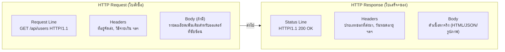

รู้ที่อยู่แล้ว (จากบทที่แล้ว) — ทีนี้ลองนึกภาพการโทรสั่งพิซซ่าเดลิเวอรี่ดู กว่าจะได้กินพิซซ่าจริงๆ ต้องผ่านหลายขั้นตอนมาก ทั้งที่รู้สึกเหมือน "แค่โทรสั่ง" เฉยๆ — เวลา browser คุยกับ server ก็ผ่านขั้นตอนซับซ้อนพอกัน ก่อนที่หน้าเว็บจะขึ้นแม้แต่ตัวอักษรเดียว

```demo
component: JourneyDiagram
props: {"nodes":[{"icon":"house","label":"บ้านคุณ (Client)"},{"icon":"building","label":"ร้านพิซซ่า (Server)"}],"travelerIcon":"envelope","steps":[{"activeNode":0,"caption":"คุณโทรสั่งพิซซ่า (เบื้องหลังคือ DNS lookup + TCP/TLS handshake) แล้วบอกออเดอร์ (HTTP Request)"},{"activeNode":1,"caption":"ร้านพิซซ่า (Server) รับออเดอร์ เช็คสต๊อก เตรียมของ"},{"activeNode":1,"caption":"ร้านตอบกลับว่า \"รับออเดอร์แล้ว กำลังทำ\" (HTTP Response พร้อม status code)"},{"activeNode":0,"caption":"พิซซ่ามาส่งถึงบ้าน — Browser แกะ HTML/CSS/JS ที่ได้มาเป็นหน้าเว็บที่เห็น"}]}
```

```demo
component: StepThroughDiagram
props: {"steps":[{"label":"1. หาเบอร์ร้าน (DNS Resolution)","detail":"แปลงชื่อร้านเป็นเบอร์โทรจริง (DNS - Domain Name System - จากบทที่แล้ว) — ทำครั้งเดียว จำเบอร์ไว้ใช้ซ้ำได้"},{"label":"2. โทรออก สายเชื่อมต่อกัน (TCP Handshake)","detail":"กดโทร รอสัญญาณ รอปลายสายรับสาย ยืนยันว่าได้ยินกันชัดทั้งสองฝั่งก่อน (SYN → SYN-ACK → ACK) ถึงจะเริ่มคุยกันได้ — TCP ย่อจาก Transmission Control Protocol"},{"label":"3. ยืนยันว่าคุยกันเป็นความลับ (TLS Handshake, ถ้าเป็น HTTPS)","detail":"เหมือนตกลงกันว่าจะพูดรหัสลับที่มีแค่สองฝ่ายเข้าใจ กันคนอื่นแอบฟังสาย — TLS ย่อจาก Transport Layer Security"},{"label":"4. บอกออเดอร์ (ส่ง HTTP Request)","detail":"บอกว่าอยากได้อะไร ส่งไปที่ไหน พร้อมรายละเอียด (เหมือน request line + headers + body) — HTTP ย่อจาก HyperText Transfer Protocol"},{"label":"5. ร้านเตรียมของ (Server ประมวลผล)","detail":"ร้านรับออเดอร์ เช็คสต๊อก คิดราคา เตรียมพิซซ่า — เบื้องหลังคือ server รัน business logic, query database"},{"label":"6. บอกยืนยันออเดอร์ (ส่ง HTTP Response กลับ)","detail":"ร้านบอกว่า \"รับออเดอร์แล้ว กำลังทำ\" หรือ \"ของหมดครับ\" — คือ status code (200, 404, 500) พร้อมรายละเอียด"},{"label":"7. พิซซ่ามาส่งถึงบ้าน (Browser Render)","detail":"ของมาส่งจริง แกะกล่องกิน — browser แปลง HTML (HyperText Markup Language) / CSS (Cascading Style Sheets) / JS (JavaScript) ที่ได้มาเป็นหน้าเว็บที่เห็น อาจต้องขอของเพิ่ม (รูป, ไฟล์ CSS/JS) อีกหลายรอบ"}]}
```

## แกะดูใบสั่งกับใบเสร็จ



## รหัสสถานะที่ร้านใช้บอกคุณ

| กลุ่ม | ความหมาย | เทียบกับร้านพิซซ่า |
|---|---|---|
| 2xx | สำเร็จ | "รับออเดอร์แล้วครับ" |
| 3xx | ไปที่อื่นแทน | "สาขานี้ปิด ไปสาขาใกล้บ้านคุณแทนนะครับ" |
| 4xx | ฝั่งคุณผิด | "เบอร์นี้ไม่มีในระบบ" / "ต้อง login ก่อนสั่ง" / "สั่งถี่ไปแล้ว รอแป๊บนึงนะ" |
| 5xx | ฝั่งร้านมีปัญหา | "ระบบร้านล่ม ขอโทษด้วยครับ" |

> โน้ตสำคัญ: <mark class="hl-warning">ทุกครั้งที่โทรสั่งใหม่ ร้านไม่ได้จำว่าเมื่อกี้คุยกับใคร</mark> — HTTP เป็น <mark class="hl-term">stateless protocol</mark> โดยธรรมชาติ แต่ละ request แยกกันเด็ดขาด ถ้าอยากให้ร้านจำได้ว่า "อ๋อ คุณคนนี้เพิ่งสั่งเมื่อกี้" ต้องมีอะไรสักอย่างยืนยันตัวตนแนบไปทุกครั้ง (cookie/token) — เรื่องนี้จะเจอเต็มๆ ตอนเรียน stateless design ในโมดูล Scalability
