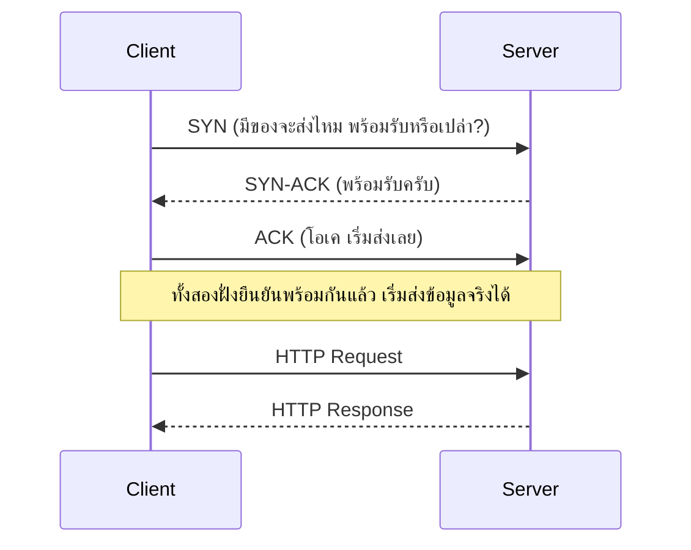
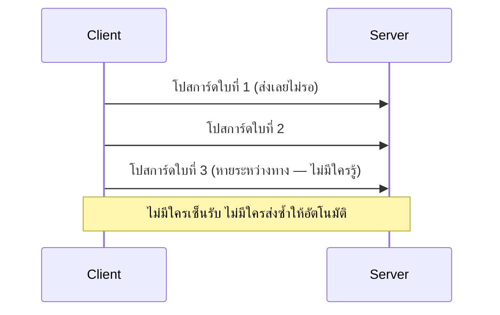

ลองนึกภาพการส่งของสองแบบ: แบบแรกคือ**จดหมายลงทะเบียน** — ต้องมีคนเซ็นรับ ถ้าไม่มีคนรับ ไปรษณีย์เก็บไว้แล้วส่งใหม่ รับรองว่าถึงมือแน่ๆ แต่ก็ใช้เวลานานหน่อยเพราะมีขั้นตอนตรวจสอบเยอะ แบบที่สองคือ**โปสการ์ด** — หย่อนตู้แล้วจบ ไม่มีใครเซ็นรับ ถ้าหายระหว่างทางก็ไม่มีใครรู้ แต่เร็วและง่ายกว่ามาก

HTTP (HyperText Transfer Protocol) ที่เรียนมาตลอด (บทที่แล้ว) ต้องวิ่งอยู่บน protocol ระดับล่างกว่าอีกชั้นหนึ่ง — ส่วนใหญ่ใช้ตัวที่เหมือนจดหมายลงทะเบียน เรียกว่า <mark class="hl-term">TCP (Transmission Control Protocol)</mark> แต่บางระบบ (เกม, video call, DNS - Domain Name System - ที่เพิ่งเรียนไป) เลือกใช้ตัวที่เหมือนโปสการ์ด เรียกว่า <mark class="hl-term">UDP (User Datagram Protocol)</mark> แทน เพราะต้องการคุณสมบัติคนละแบบ

```demo
component: ComparisonDiagram
props: {"left":{"title":"TCP (เหมือนจดหมายลงทะเบียน)","points":["ต้องเช็คว่าปลายทางพร้อมรับก่อน (handshake) ถึงส่งได้","การันตีว่าถึงครบ เรียงลำดับถูก ถ้าหายส่งซ้ำให้อัตโนมัติ","ช้ากว่า UDP เพราะมีขั้นตอนตรวจสอบเพิ่ม","ใช้กับ: เว็บไซต์, โอนไฟล์, โอนเงิน"]},"right":{"title":"UDP (เหมือนโปสการ์ด)","points":["หย่อนส่งเลย ไม่ต้องรอใครยืนยันก่อน","ไม่การันตีว่าจะถึง หรือถึงตามลำดับที่ส่ง","เร็วกว่า ไม่มีขั้นตอนตรวจสอบให้ล่าช้า","ใช้กับ: video call, เกมออนไลน์, DNS query"]},"note":"เลือกจากคำถามเดียว: ถ้าข้อมูลหายไปสักชิ้น เดือดร้อนไหม? — โอนเงินหายไม่ได้เด็ดขาด (TCP) แต่วิดีโอคอลเฟรมเดียวหาย ไม่มีใครสังเกต (UDP)"}
```

## ทำไมจดหมายลงทะเบียนต้องเช็คก่อนส่ง

```demo
component: JourneyDiagram
props: {"nodes":[{"icon":"house","label":"Client (ผู้ส่ง)"},{"icon":"gate","label":"Handshake"},{"icon":"house","label":"Server (ผู้รับ)"}],"travelerIcon":"envelope","steps":[{"activeNode":1,"caption":"Client ส่ง SYN ไปถาม \"มีของจะส่งไหม พร้อมรับหรือเปล่า?\" ที่จุดตรวจก่อน"},{"activeNode":1,"caption":"Server ตอบ SYN-ACK กลับมา \"พร้อมรับครับ\""},{"activeNode":1,"caption":"Client ส่ง ACK ยืนยัน \"โอเค เริ่มส่งเลย\" — ทั้งสองฝั่งยืนยันพร้อมกันแล้ว"},{"activeNode":2,"caption":"เริ่มส่งข้อมูลจริง (HTTP Request/Response) ผ่านจุดตรวจที่ยืนยันแล้ว ถึงปลายทาง"}]}
```



สามขั้นตอนนี้เหมือนไปรษณีย์ที่ต้องเช็คก่อนว่า "มีคนอยู่บ้านรับไหม" ก่อนจะส่งพัสดุออกไป — เป็นต้นทุนที่ต้องจ่ายทุกครั้งที่เริ่มติดต่อกันใหม่ นี่คือเหตุผลที่ HTTP ยุคใหม่มีระบบ "keep-alive" ไว้คุยกันต่อในสายเดิม ไม่ต้องเช็คใหม่ทุกครั้งที่มีของจะส่ง

## โปสการ์ดไม่ต้องเช็คอะไรก่อนเลย



> คำถามสัมภาษณ์: "ทำไม DNS ใช้ UDP ทั้งที่ก็สำคัญ" — <mark class="hl-insight">เพราะคำถาม-คำตอบสั้นมาก (แค่รอบเดียวจบ) การเช็คก่อนส่งแบบจดหมายลงทะเบียนจะช้ากว่าตัวข้อมูลจริงเสียอีก ถ้าโปสการ์ดหายไป ก็แค่ถามใหม่อีกรอบ ต้นทุนต่ำกว่าการรับประกันทุกครั้งมาก</mark>

## ขั้นสูง (สั้นๆ): ทำไม connection ใหม่รู้สึกช้ากว่าสายเดิม

TCP ไม่ส่งข้อมูลเต็มความเร็วตั้งแต่วินาทีแรก — เริ่มส่งทีละน้อยก่อน (<mark class="hl-term">slow start</mark>) แล้วค่อยๆ เพิ่มปริมาณขึ้นถ้าไม่มีของหาย เหมือนไปรษณีย์เพิ่งเปิดเส้นทางส่งของไปบ้านใหม่ ไม่กล้าส่งเต็มรถทันที ค่อยทดลองส่งเพิ่มทีละนิดจนรู้ว่าถนนสายนี้รับได้แค่ไหน (**congestion control**) ถ้าส่งชนกันจนของหาย (packet loss) ก็ลดปริมาณกลับลงมาทันที — นี่คือเหตุผลที่ connection ที่เพิ่งเปิดใหม่ (handshake เสร็จหมาดๆ) ช้ากว่าการส่งต่อในสายเดิมที่ "คุ้นทางแล้ว" (warm connection) เสมอ ไม่ใช่เพราะ network ช้ากว่ากันจริงๆ
