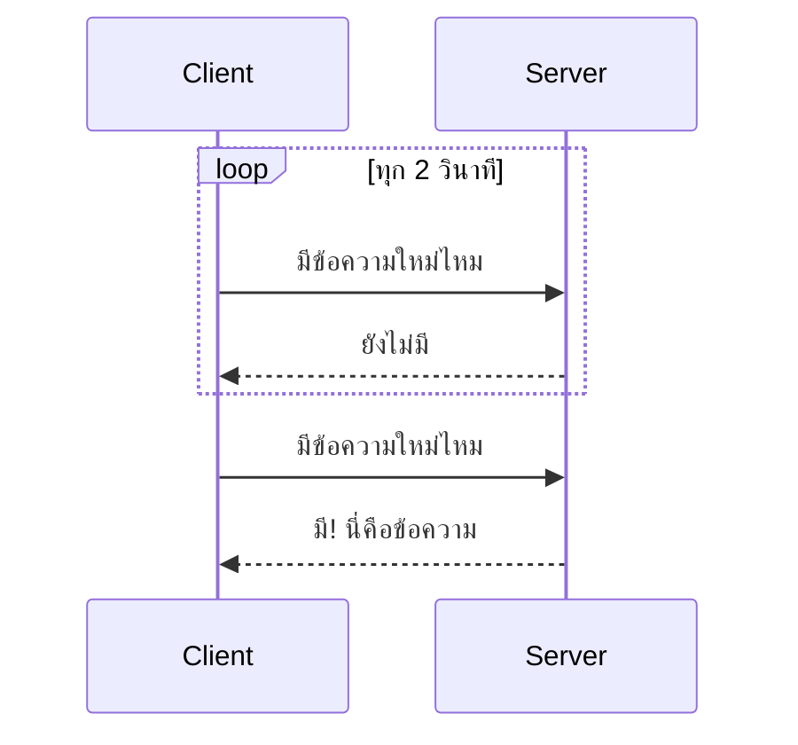
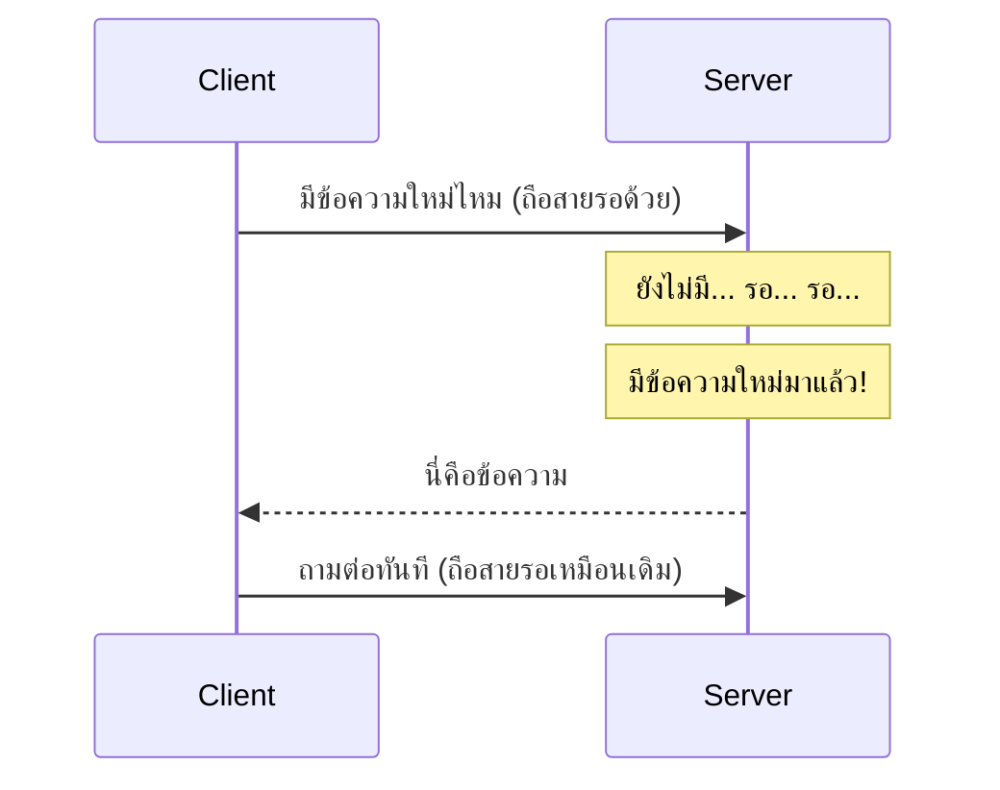
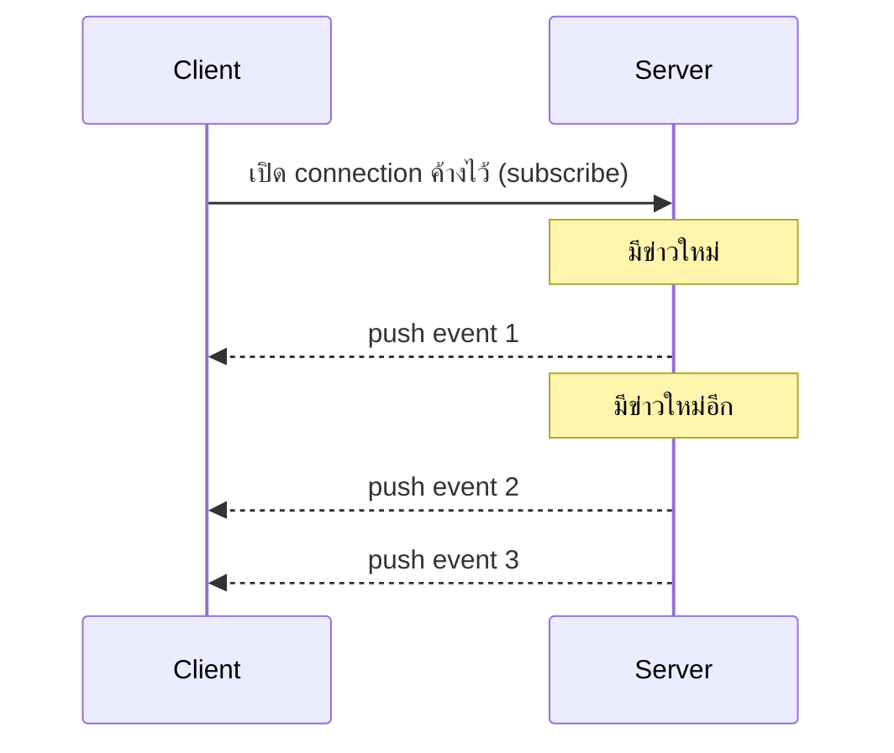

ลองนึกภาพสองวิธีรอของที่สั่งซื้อ: วิธีแรก**เดินไปเช็คตู้จดหมายหน้าบ้านทุก 10 นาที** ว่าของมาหรือยัง (ส่วนใหญ่เดินไปเช็คแล้วก็ยังไม่มา เสียเวลาเปล่า) วิธีที่สอง**ให้บุรุษไปรษณีย์กดกริ่งบอกทันทีที่ของมาถึง** — ไม่ต้องเดินไปเช็คเองเลย รอฟังกริ่งอย่างเดียวพอ

## HTTP ปกติเป็นแบบแรกเสมอ: Client ต้องถามก่อน

HTTP Request/Response Lifecycle (บทที่แล้ว) เป็นแบบ **client ถามก่อนเสมอ server พูดเองไม่ได้** — เหมือนต้องเดินไปเช็คตู้จดหมายเอง server ไม่มีทาง "กดกริ่ง" บอก client ตรงๆ แต่แอปจำนวนมาก (แชท, notification, ราคาหุ้นเรียลไทม์, คะแนนกีฬาสด) ต้องการให้รู้ทันทีที่มีอะไรใหม่ — ต้องมีเทคนิคพิเศษเพิ่มมาช่วย

## Short Polling — เดินไปเช็คตู้จดหมายเป็นระยะ



ง่ายที่สุด: client ยิง request ถามซ้ำๆ ตามช่วงเวลาที่ตั้งไว้ (เช่นทุก 2 วินาที) — ข้อเสียชัดเจน 2 อย่าง: **เสียเวลาเปล่า**ส่วนใหญ่ (ถามไปส่วนใหญ่ไม่มีอะไรใหม่) และ**ล่าช้า**เสมอ (ถ้าข้อความมาถึงตอนวินาทีที่ 1 หลังถามรอบล่าสุด ต้องรออีกเกือบ 2 วินาทีกว่าจะถามรอบถัดไปถึงจะรู้)

## Long Polling — โทรถามแล้วขอให้ถือสายรอ



Client ถามเหมือนเดิม แต่คราวนี้ **server ไม่รีบตอบทันทีถ้ายังไม่มีอะไรใหม่** — ถือ request ค้างไว้ (เหมือนบอกโทรศัพท์ "อย่าเพิ่งวางสาย รอก่อน") จนกว่าจะมีข้อมูลใหม่จริง (หรือ timeout) ถึงค่อยตอบกลับ พอ client ได้คำตอบก็ยิงถามใหม่ทันที วนแบบนี้ไปเรื่อยๆ — ดีกว่า short polling มาก (แทบไม่มีดีเลย์) แต่ server ต้อง**เปิด connection ค้างไว้เยอะพร้อมกัน** (ถ้ามี user หลักแสนคน server ต้องรับมือกับ connection ค้างหลักแสนพร้อมกัน)

## Server-Sent Events (SSE) — สมัครรับข่าวสารทางเดียว



Client เปิด connection **ครั้งเดียว** แล้วปล่อยให้ server ส่งข้อมูลมาเรื่อยๆ เองได้ตลอดโดย client ไม่ต้องถามซ้ำเลย (เหมือนสมัครสมาชิกหนังสือพิมพ์ที่ส่งมาส่งถึงบ้านเองทุกฉบับใหม่ ไม่ต้องเดินไปซื้อทีละฉบับ) — ข้อจำกัดคือเป็น**ทางเดียว** (server → client เท่านั้น) client ส่งอะไรกลับไปทาง connection เดียวกันไม่ได้ เหมาะกับ live score, stock ticker, notification ที่ client แค่ "รับฟัง" ไม่ต้องตอบกลับ

## WebSocket — สายโทรศัพท์เปิดค้างสองทาง

Connection เดียวที่**ทั้งสองฝั่งส่งหากันได้ตลอดเวลา** (ไม่ใช่แค่ server → client ทางเดียวแบบ SSE) — เหมาะกับแชทที่ทั้งสองฝั่งต้องคุยโต้ตอบกันตลอด (จะเจอรายละเอียดเต็มๆ อีกครั้งตอน case study Design: Chat App)

```demo
component: RealtimeLatencyRaceDemo
caption: กด "จำลอง event ใหม่" ดูว่าแต่ละเทคนิครู้ตัวว่ามี event ใหม่เร็ว/ช้าต่างกันแค่ไหน
```

## เทียบทั้ง 4 วิธี

| วิธี | ทิศทาง | Latency | Overhead ฝั่ง Server |
|---|---|---|---|
| Short Polling | Client ถามเอง | สูง (ขึ้นกับรอบ poll) | ต่ำต่อ request แต่ request ถี่มาก |
| Long Polling | Client ถามเอง (server ถ่วงตอบ) | ต่ำ | ต้องถือ connection ค้างจำนวนมาก |
| SSE | Server → Client ทางเดียว | ต่ำมาก | ต้องถือ connection ค้าง แต่เบากว่า WebSocket |
| WebSocket | สองทาง | ต่ำมาก | ต้องถือ connection ค้าง + จัดการ state สองทาง |

> คำถามสัมภาษณ์: "ทำไมไม่ใช้ WebSocket กับทุกอย่างไปเลยในเมื่อเร็วที่สุด" — เพราะ WebSocket มี overhead ในการดูแล connection ค้างไว้สองทางสูงกว่า (ต้องจัดการ reconnect, จัดการ state ทั้งสองฝั่ง) ถ้าแอปแค่ต้องการ "รับฟัง" ทางเดียว (เช่น notification, live score) SSE ง่ายกว่าและเบากว่ามาก ส่วนถ้าไม่ต้องการ real-time จริงจัง (อัปเดตทุกไม่กี่วินาทีก็พอ) short/long polling ยังใช้ได้และ implement ง่ายกว่ามาก — เลือกตามความต้องการจริง ไม่ใช่เลือกที่ "เร็วสุด" เสมอไป
