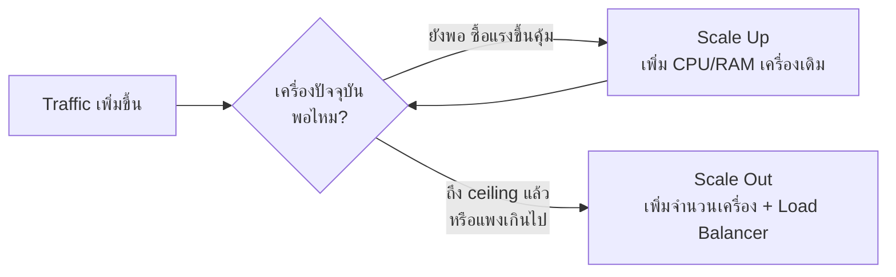

ลองนึกภาพร้านก๋วยเตี๋ยวเล็กๆ ร้านหนึ่ง เปิดมาไม่กี่เดือนแรกเงียบๆ พอเริ่มมีคนติดใจ บอกต่อกันปากต่อปาก ลูกค้าก็เยอะขึ้นเรื่อยๆ จนแม่ครัวคนเดียวทำไม่ทัน ลูกค้าต้องรอนานขึ้นทุกวัน บางวันถึงกับเดินออกเพราะรอไม่ไหว เจ้าของร้านนั่งคิดหนักว่าจะทำยังไงต่อดี — และคำถามนี้แหละที่ทุกระบบซอฟต์แวร์ต้องเจอเหมือนกันทุกตัว เมื่อ user เริ่มเยอะขึ้นจนของเดิมรับไม่ไหว

เจ้าของร้านมีทางเลือกหลักๆ อยู่สองทาง

**ทางที่หนึ่ง** — ซื้อเตาใหญ่ขึ้น ซื้อเตาแก๊สแรงขึ้น จ้างผู้ช่วยมาซอยผักหั่นเนื้อให้แม่ครัวคนเดิมทำงานได้เร็วขึ้น ร้านยังมีจุดทำอาหารแค่จุดเดียวเหมือนเดิม เพียงแต่จุดนั้น "แรงขึ้น" กว่าเดิมมาก

**ทางที่สอง** — เปิดสาขาที่สอง สาขาที่สามเพิ่มขึ้นมา แต่ละสาขาขนาดเท่าเดิม เตาเท่าเดิม แม่ครัวฝีมือระดับเดียวกัน ไม่มีสาขาไหนแรงขึ้นเป็นพิเศษ แต่จำนวนสาขาที่รับลูกค้าได้พร้อมกันมากขึ้นแทน

ในโลกซอฟต์แวร์ ทางเลือกแรกเรียกว่า <mark class="hl-term">Scale Up (Vertical Scaling)</mark> — เพิ่มกำลังให้ server เครื่องเดิม (CPU - Central Processing Unit - แรงขึ้น, RAM - Random Access Memory - เยอะขึ้น, SSD - Solid State Drive - เร็วขึ้น) ส่วนทางเลือกที่สองเรียกว่า <mark class="hl-term">Scale Out (Horizontal Scaling)</mark> — เพิ่มจำนวน server แทนที่จะทำเครื่องเดิมให้แรงขึ้น

## เหมือนซื้อเตาใหญ่ขึ้น — Scale Up

ข้อดีของการซื้อเตาใหญ่ขึ้นคือ**ร้านไม่ต้องเปลี่ยนอะไรเลย** ทุกอย่างยังทำงานแบบเดิม แค่เร็วขึ้น เจ้าของร้านไม่ต้องคิดเรื่องยุ่งยากอย่าง "จะบอกลูกค้าให้ไปสาขาไหน" เพราะมีจุดเดียวอยู่แล้ว ในทางเทคนิคก็เหมือนกัน — server ยังเป็นเครื่องเดียว ไม่มี distributed system ให้ปวดหัว ไม่มีปัญหาข้อมูลไม่ตรงกันระหว่างเครื่อง (เพราะมีเครื่องเดียวจริงๆ)

แต่ปัญหาก็ชัดเจนพอกัน — **เตาที่แรงที่สุดในโลกก็ยังมีขีดจำกัด** จะซื้อเตาแรงขึ้นเรื่อยๆ ราคาก็ไม่ได้ขึ้นเป็นเส้นตรง เตาแรงขึ้น 2 เท่า มักแพงขึ้นมากกว่า 2 เท่าเสมอ (เซิร์ฟเวอร์ก็เหมือนกัน — เครื่องที่แรงที่สุดในตลาดแพงกว่าเครื่องกลางๆ อย่างไม่สมเหตุสมผล) และที่ร้ายแรงกว่านั้นคือ ถ้าแม่ครัวคนเดียวคนนั้นป่วยกะทันหัน **ร้านทั้งร้านหยุดขายทันที** ไม่มีใครทำแทนได้เลย เพราะมีจุดทำอาหารแค่จุดเดียว — นี่คือสิ่งที่ในวงการเรียกว่า <mark class="hl-warning">single point of failure</mark>

## เหมือนเปิดหลายสาขา — Scale Out

การเปิดสาขาเพิ่มแก้ปัญหาสองข้อข้างบนได้เลย — อยากรับลูกค้าเพิ่มก็แค่เปิดสาขาใหม่ ไม่มีเพดานตายตัว (ในทางทฤษฎี) และถ้าสาขาหนึ่งต้องปิดปรับปรุงกะทันหัน สาขาอื่นก็ยังเปิดขายได้ตามปกติ ลูกค้าไม่ต้องอด

แต่ปัญหาใหม่ก็โผล่มาทันที — **ใครจะบอกลูกค้าว่าต้องไปสาขาไหน?** ถ้าลูกค้าเดินไปสาขาที่คนแน่นมาก ในขณะที่อีกสาขาว่างโล่ง ก็ยังต้องรอนานอยู่ดี ทั้งที่ร้านมีกำลังรวมพอ แค่กระจายไม่ดี — ปัญหานี้แหละที่บทถัดไป (**Load Balancer**) จะเข้ามาแก้ให้ นอกจากนี้แต่ละสาขายังต้องรู้สูตรอาหารตรงกัน วัตถุดิบต้องพร้อมเหมือนกัน — แปลเป็นภาษาเทคนิคคือต้องออกแบบให้แต่ละเครื่อง**ทำงานแบบเดียวกันได้อย่างอิสระ** ไม่พึ่งพาอะไรที่มีอยู่แค่เครื่องเดียว (เรื่องนี้จะเจอเต็มๆ ในบท Stateless Design ท้ายโมดูลนี้)

```demo
component: ScalingDiagram
```

## สรุปเป็นตาราง

| | Scale Up (เตาใหญ่ขึ้น) | Scale Out (เปิดสาขา) |
|---|---|---|
| ทำยังไง | เพิ่มกำลัง CPU/RAM เครื่องเดิม | เพิ่มจำนวนเครื่อง เท่าเดิมทุกเครื่อง |
| จุดแข็ง | ไม่ต้องแก้ระบบ, ไม่มีปัญหาข้อมูลไม่ตรงกัน | ไม่มีเพดานชัดเจน, ทนต่อความล้มเหลวดีกว่า |
| จุดอ่อน | มีเพดาน, ราคาพุ่งไม่เป็นเส้นตรง, single point of failure | ต้องมีคนกระจายงาน (Load Balancer), ระบบซับซ้อนขึ้น |
| อัปเกรดต้อง downtime ไหม | ส่วนใหญ่ต้อง restart เครื่อง | อัปเกรดทีละเครื่องได้ ไม่ต้องปิดทั้งระบบ |

## แล้วในความเป็นจริงเลือกแบบไหน

ร้านอาหารเชนใหญ่ๆ ที่เราเห็นทุกวันนี้ ไม่มีเจ้าไหนใช้แค่วิธีเดียว — เขาเลือกขนาดสาขาที่ "คุ้มค่า" ระดับหนึ่งก่อน (ไม่ใหญ่จนแพงเวอร์ ไม่เล็กจนรับลูกค้าไม่พอ) แล้วค่อยเปิดสาขาแบบนั้นซ้ำๆ ไปเรื่อยๆ ตามความต้องการ ระบบซอฟต์แวร์ระดับ production ก็ทำแบบเดียวกัน: <mark class="hl-insight">scale up จนถึงจุดที่คุ้มค่า (เครื่องขนาดกลางๆ ไม่แพงเกินไป) แล้วค่อย scale out เพิ่มจำนวนเครื่องแบบนั้นไปเรื่อยๆ</mark>



> คำถามสัมภาษณ์ที่เจอบ่อย: "ทำไมไม่ scale up ไปเรื่อยๆ ง่ายกว่าเยอะ" — ตอบด้วยภาพร้านก๋วยเตี๋ยวได้เลย: เตาที่แรงที่สุดในโลกก็ยังมีเพดาน และถ้าเตาเดียวนั้นเสีย ร้านทั้งร้านหยุดขายทันที สองเหตุผลนี้คือสิ่งที่บังคับให้ระบบใหญ่ทุกระบบต้องไปทาง scale out ในที่สุด ไม่ว่าจะอยากเลี่ยงความซับซ้อนแค่ไหนก็ตาม
