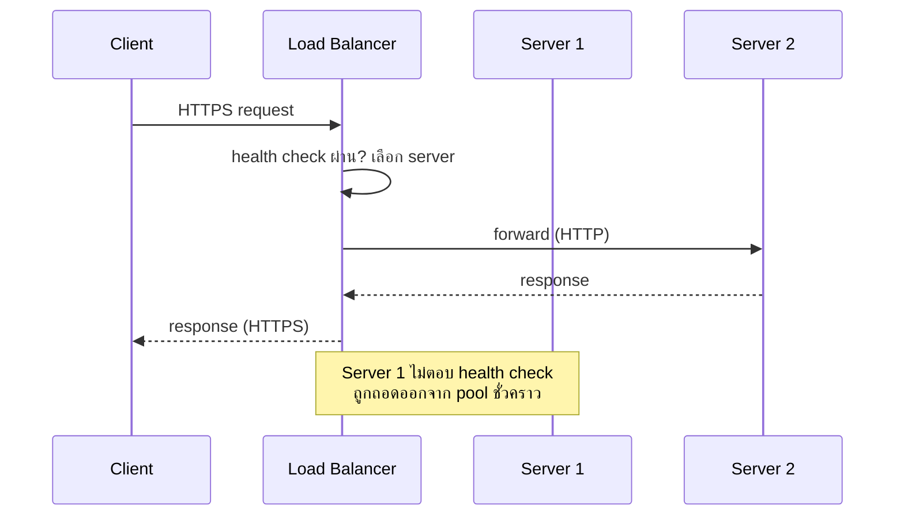

ลองนึกภาพธนาคารสาขาใหญ่แห่งหนึ่ง มีเคาน์เตอร์บริการอยู่ 5 ช่อง ถ้าไม่มีใครจัดการอะไรเลย ลูกค้าที่เดินเข้ามาต้องเดาเอาเองว่าจะไปต่อคิวช่องไหน บางคนดันไปต่อช่องที่คิวยาวเป็นหางว่าว ทั้งที่ช่องข้างๆ ว่างโล่ง หรือแย่กว่านั้น — บางคนไปยืนรอหน้าช่องที่พนักงานลาป่วยไปแล้ว รอเท่าไหร่ก็ไม่มีใครมาบริการ

ธนาคารทุกแห่งแก้ปัญหานี้ด้วยวิธีเดียวกัน: จ้าง**พนักงานต้อนรับ**ยืนอยู่หน้าประตู คอยมองว่าช่องไหนว่าง ช่องไหนคิวสั้น ช่องไหนพนักงานยังอยู่ครบ แล้วชี้บอกลูกค้าแต่ละคนว่า "เชิญไปช่องที่ 3 ครับ ว่างแล้ว" ลูกค้าไม่ต้องเดา ไม่ต้องรู้จักเลยด้วยซ้ำว่าธนาคารมีกี่ช่อง แค่เดินตามที่พนักงานต้อนรับชี้ก็พอ

ในระบบซอฟต์แวร์ที่มี server หลายเครื่อง (จากบทที่แล้ว) ก็มีปัญหาเดียวกันเป๊ะ — ใครจะเป็นคนบอก request แต่ละอันว่าต้องไปเครื่องไหน คำตอบคือเครื่องกลางที่ทำหน้าที่เหมือนพนักงานต้อนรับคนนั้น เรียกว่า <mark class="hl-term">Load Balancer (LB)</mark>

## Load Balancer ทำหน้าที่อะไรบ้าง

```demo
component: ClientServerLBDiagram
```

Client (เหมือนลูกค้าที่เดินเข้าธนาคาร) ไม่คุยกับ server ตรงๆ อีกต่อไป แต่คุยกับ Load Balancer ก่อนเสมอ แล้ว LB จะเป็นคนตัดสินใจว่าจะส่งต่อ request ไปเครื่องไหน — client ไม่จำเป็นต้องรู้เลยด้วยซ้ำว่าเบื้องหลังมีเครื่องเดียวหรือร้อยเครื่อง เหมือนที่ลูกค้าธนาคารไม่ต้องรู้ว่าธนาคารมีกี่ช่องบริการ

หน้าที่หลักของ Load Balancer มีสามอย่าง ตรงกับสิ่งที่พนักงานต้อนรับทำเป๊ะ:

1. **กระจายลูกค้าไปแต่ละช่อง** — ในทางเทคนิคเรียกว่า "algorithm" ในการเลือก server (บทถัดไปจะลงรายละเอียดเต็มๆ ว่ามีกี่แบบ)
2. **คอยสังเกตว่าช่องไหนพนักงานยังอยู่** — ในทางเทคนิคเรียกว่า **health check** LB จะ ping แต่ละ server เป็นระยะๆ ถ้าเครื่องไหนไม่ตอบ (เหมือนพนักงานลาป่วยหายไปจากเคาน์เตอร์) LB จะหยุดส่งลูกค้าไปเครื่องนั้นทันที โดยที่ client ไม่รู้สึกอะไรเลย ไม่เห็น error ใดๆ
3. **ตรวจบัตรประชาชนแทนทุกช่อง** — ธนาคารบางแห่งให้พนักงานต้อนรับตรวจเอกสารเบื้องต้นก่อนส่งเข้าคิว ไม่ต้องให้ทุกเคาน์เตอร์ตรวจซ้ำ ในทางเทคนิคเรียกว่า **SSL termination** (SSL ย่อจาก Secure Sockets Layer ต้นแบบของ TLS ที่ใช้เข้ารหัสอยู่ทุกวันนี้) — LB รับการเชื่อมต่อที่เข้ารหัส (HTTPS) จาก client แล้วคุยกับ server ข้างในด้วย HTTP ธรรมดา ลดภาระ encrypt/decrypt ให้ server แต่ละเครื่องไม่ต้องทำงานซ้ำซ้อน

## สองแบบของ Load Balancer: มองแค่คิว vs มองทั้งใบคำร้อง

พนักงานต้อนรับบางคนแค่มองว่า "คิวไหนสั้นสุด" แล้วชี้ไปเลยโดยไม่สนใจว่าลูกค้าจะมาทำธุระอะไร — นี่คือ **L4 (Transport Layer)**: มองเห็นแค่ต้นทาง-ปลายทาง (คล้าย IP + port) เร็วมาก แต่ตัดสินใจแบบหยาบๆ

พนักงานต้อนรับอีกแบบจะถามก่อนว่า "มาทำธุระอะไรครับ" ถ้ามาฝาก-ถอนเงินธรรมดาไปช่องนี้ ถ้ามาปรึกษาสินเชื่อไปอีกช่องที่มีผู้เชี่ยวชาญ — นี่คือ **L7 (Application Layer)**: อ่านเนื้อหาจริงของคำร้อง (คล้าย HTTP path, header, cookie) ตัดสินใจได้ฉลาดกว่า แต่ต้องใช้เวลาอ่านเพิ่มขึ้นนิดหน่อย

| | L4 (มองแค่คิว) | L7 (อ่านคำร้องด้วย) |
|---|---|---|
| มองเห็น | แค่ IP + port | เห็นทั้ง HTTP request — path, header, cookie |
| ความเร็ว | เร็วกว่า | ช้ากว่าเล็กน้อย |
| แยกตามประเภทงานได้ไหม | ไม่ได้ | ได้ (เช่น `/api/*` ไปกลุ่มหนึ่ง `/static/*` ไปอีกกลุ่ม) |
| ตัวอย่างจริง | AWS NLB, IPVS | Nginx, AWS ALB, Envoy |

ถ้าระบบต้องแยกงานตาม path หรือ header จริงจัง (เช่น microservices หลายตัวอยู่หลัง LB เดียว) ต้องใช้ L7 แต่ถ้าแค่กระจาย traffic ธรรมดาให้เร็วที่สุด L4 ก็เพียงพอ



## แล้วถ้าพนักงานต้อนรับลาป่วยล่ะ

สังเกตดีๆ จะเห็นว่า <mark class="hl-warning">Load Balancer เองก็กลายเป็นจุดเดียวที่ทุกคนต้องผ่านเหมือนกัน</mark> — ถ้าพนักงานต้อนรับคนเดียวนั้นลาป่วย ทั้งธนาคารก็วุ่นวายทันทีทั้งที่เคาน์เตอร์ข้างในยังทำงานได้ปกติ วิธีแก้คือมีพนักงานต้อนรับมากกว่า 1 คน (หรือมี LB มากกว่า 1 เครื่อง คอยสลับกัน) ซึ่งเป็นเรื่องที่จะเจอเต็มๆ ในโมดูล **Reliability** ถัดๆ ไปในหลักสูตรนี้ — สำหรับตอนนี้แค่จำไว้ว่า: <mark class="hl-insight">ทุกจุดที่แก้ปัญหา "จุดเดียวรับภาระทั้งหมด" มักสร้าง "จุดเดียว" ใหม่ขึ้นมาเสมอ</mark> คำถามที่ต้องถามต่อคือจะทำให้จุดใหม่นั้นไม่เดี่ยวด้วยยังไง
