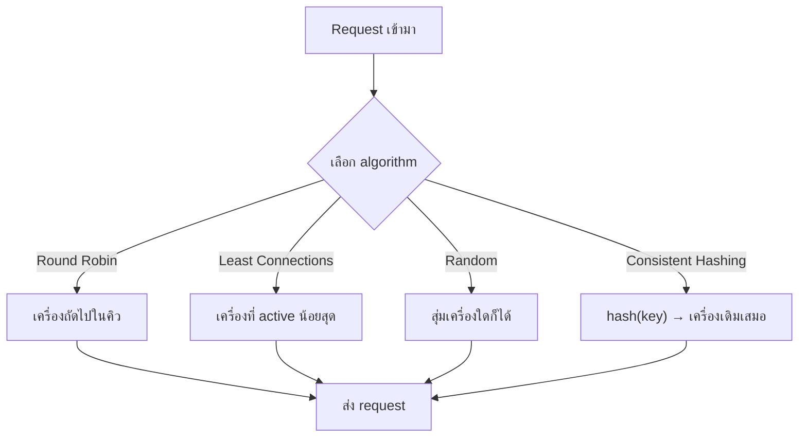

พนักงานต้อนรับธนาคาร (จากบทที่แล้ว) รู้แล้วว่าต้องกระจายลูกค้าไปแต่ละช่อง แต่ยังมีคำถามหนึ่งที่ยังไม่ได้ตอบ: **จะตัดสินใจส่งลูกค้าไปช่องไหนด้วย "กฎ" อะไร** ลองนึกดูว่าพนักงานต้อนรับแต่ละคนอาจมีวิธีคิดไม่เหมือนกันเลย

ลองเล่น demo ข้างล่างนี้ก่อน: สลับ algorithm ดูความต่าง, กด "ส่ง 1 request" หรือ "auto-send" รัวๆ, แล้วลองกดที่กล่อง server เพื่อจำลอง "พนักงานลาป่วย" (server ล่ม) ดูว่าลูกค้าหนีไปช่องอื่นทันทีไหม

```demo
component: LoadBalancerDemo
```

## Round Robin — วนตามคิวเรียงลำดับ

พนักงานต้อนรับบางคนใช้วิธีง่ายที่สุด: ส่งลูกค้าคนแรกไปช่อง 1 คนที่สองไปช่อง 2 คนที่สามไปช่อง 3 แล้ววนกลับมาช่อง 1 ใหม่ ไม่สนใจอะไรเลยนอกจากลำดับ

วิธีนี้ **ง่ายที่สุด ไม่ต้องจำอะไรเยอะ** และถ้าลูกค้าแต่ละคนใช้เวลาที่เคาน์เตอร์พอๆ กัน (ฝากเงินธรรมดาทุกคน) ก็กระจายงานได้เท่าเทียมกันจริง — แต่ถ้าลูกค้าบางคนมาขอกู้บ้าน ใช้เวลาที่เคาน์เตอร์นานกว่าคนอื่นมาก ช่องที่โดนลูกค้าประเภทนี้บ่อยๆ ก็จะยุ่งกว่าช่องอื่นทั้งที่ "ได้จำนวนลูกค้าเท่ากัน"

## Least Connections — ดูคิวจริงแล้วค่อยตัดสินใจ

พนักงานต้อนรับอีกแบบฉลาดกว่านั้นนิดหน่อย: **มองไปที่แต่ละช่องจริงๆ** ว่าตอนนี้ช่องไหนมีคนกำลังรอ/รับบริการอยู่น้อยที่สุด แล้วส่งลูกค้าคนใหม่ไปช่องนั้น

วิธีนี้เหมาะกับสถานการณ์ที่ลูกค้าแต่ละคนใช้เวลาไม่เท่ากัน (เหมือนตัวอย่างกู้บ้านข้างบน) เพราะช่องที่กำลังติดพันกับลูกค้าที่ใช้เวลานาน จะได้รับลูกค้าใหม่น้อยลงโดยอัตโนมัติ — แต่ก็ต้องแลกกับพนักงานต้อนรับต้องคอยสังเกตทุกช่องตลอดเวลา ไม่ใช่แค่จำเลขคิวเฉยๆ

## Random — สุ่มเลือกไปเลย

บางที่พนักงานต้อนรับก็ไม่คิดอะไรมาก แค่สุ่มชี้ไปช่องไหนก็ได้ที่ว่าง — ฟังดูมั่ว แต่ในทางสถิติ ถ้าลูกค้าเข้ามาเยอะมากพอ การสุ่มจะกระจายออกใกล้เคียงกับ round robin โดยไม่ต้องจำอะไรเลยด้วยซ้ำว่าส่งไปช่องไหนล่าสุด

## Consistent Hashing — ลูกค้าประจำ ไปหาคนเดิมทุกครั้ง

มีลูกค้าประเภทหนึ่งที่พนักงานต้อนรับมักจำหน้าได้ และตั้งใจส่งไปหาพนักงานคนเดิมทุกครั้งที่มา — เพราะพนักงานคนนั้นรู้ประวัติ รู้ความต้องการของลูกค้าคนนี้อยู่แล้ว ทำงานเร็วกว่าส่งไปหาคนใหม่ที่ต้องเริ่มทำความรู้จักใหม่หมด

ในทางเทคนิค เราไม่ได้ "จำหน้า" แต่ใช้การคำนวณ (hash) จากบางอย่างที่ระบุตัวลูกค้าได้ (เช่น user ID) แล้วแปลงเป็นเลขที่ชี้ไปยังเครื่องเดิมเสมอ ไม่ว่าจะมาติดต่อกี่ครั้งก็ตาม เทคนิคนี้เรียกว่า **Consistent Hashing** และจะเจออีกครั้งตอนเรียนเรื่อง **Caching** และ **Sharding** ในโมดูลถัดๆ ไป เพราะหลักการเดียวกันนี้ใช้ตัดสินใจว่า "ข้อมูลชิ้นนี้ควรอยู่เครื่องไหน" ได้ด้วย



## จำแค่คำถามเดียวก็พอ

ไม่ต้องท่องจำว่า algorithm ไหนดีที่สุด เพราะไม่มีอันไหนดีที่สุดตายตัว — สิ่งที่ควรทำคือถามตัวเองสองคำถามก่อนเลือก: **"งานแต่ละอันหนักเท่ากันไหม"** (ถ้าไม่เท่า Least Connections มักดีกว่า) และ **"ต้องการให้ลูกค้าคนเดิมกลับไปหาเครื่องเดิมไหม"** (ถ้าใช่ ต้องใช้ Consistent Hashing) คำตอบสองข้อนี้จะพาไปหา algorithm ที่เหมาะเองโดยอัตโนมัติ

> ในสัมภาษณ์ ถ้าถูกถามว่า "จะเลือก algorithm ไหน" คำตอบที่ฟังดูเข้าใจจริงไม่ใช่การท่องชื่อ algorithm ทั้งหมด แต่คือการถามกลับด้วยสองคำถามข้างบนนี้ก่อน แล้วค่อยเลือกตามนั้น
