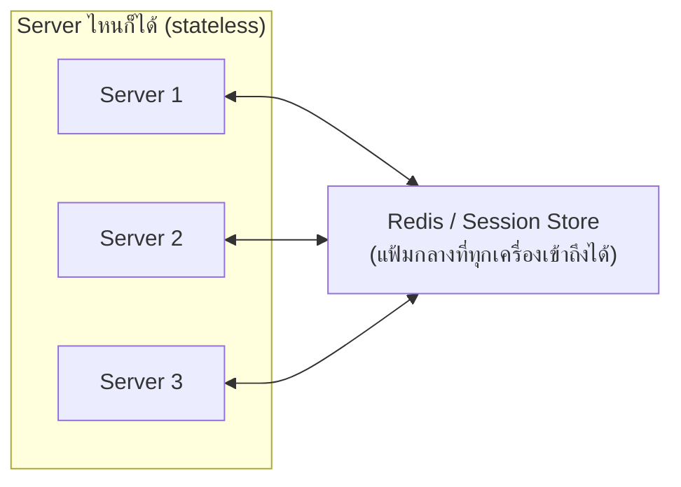

ทุก algorithm ในบทที่แล้วมีข้อสมมติร่วมกันข้อหนึ่งที่ยังไม่ได้พูดถึงตรงๆ: **ไม่ว่าลูกค้าจะถูกส่งไปช่องไหน ผลลัพธ์ต้องเหมือนกันหมด** ลองนึกภาพว่าถ้าไม่เป็นแบบนั้นจะเกิดอะไรขึ้น

## เมื่อพนักงานจำเรื่องไว้ในหัวตัวเอง

สมมติลูกค้าคนหนึ่งไปกรอกแบบฟอร์มขอสินเชื่อกับพนักงานช่อง 2 คุยกันไปครึ่งเรื่อง พนักงานจดบันทึกไว้ในสมุดโน้ตส่วนตัวของตัวเอง แล้วบอกลูกค้าว่า "พรุ่งนี้กลับมาต่อนะครับ" พอวันรุ่งขึ้นลูกค้ากลับมา แต่บังเอิญพนักงานช่อง 2 ลาป่วย ลูกค้าถูกส่งไปช่อง 5 แทน — พนักงานช่อง 5 **ไม่รู้เรื่องอะไรเลย** เพราะข้อมูลทั้งหมดอยู่ในสมุดโน้ตส่วนตัวของพนักงานช่อง 2 คนเดียว ลูกค้าต้องเริ่มกรอกฟอร์มใหม่ตั้งแต่ต้น

นี่คือปัญหาเดียวกับที่เกิดขึ้นถ้า server เก็บข้อมูลของ user ไว้ใน**ความจำของตัวเอง** (memory) — ในทางเทคนิคเรียก server แบบนี้ว่า <mark class="hl-term">stateful</mark> สิ่งที่ทำให้ server กลายเป็น stateful โดยไม่รู้ตัวมีหลายแบบ: เก็บ session ไว้ใน memory ตรงๆ, เขียนไฟล์ที่ user อัปโหลดลง disk ของเครื่องนั้นเครื่องเดียว, หรือเก็บ cache ผลลัพธ์ไว้ใน variable ของ process นั้น

```demo
component: StickySessionDiagram
```

จากภาพ: ถ้าข้อมูลของลูกค้าคนนี้ถูกเก็บไว้ที่ Server 2 เท่านั้น ระบบจึง**ต้อง**บังคับให้ลูกค้าคนนี้กลับไปหา Server 2 ทุกครั้ง (ผูกไว้ด้วย cookie) — วิธีนี้เรียกว่า **sticky session** ซึ่งมีปัญหาตามมาเพียบ: <mark class="hl-warning">ถ้า Server 2 ล่มกะทันหัน ข้อมูลทั้งหมดหายไปพร้อมกัน (ต้อง login ใหม่)</mark>, Load Balancer เลือกเครื่องได้ไม่เต็มที่เพราะต้องยึดตาม cookie ไม่ใช่ตาม algorithm ที่ดีที่สุด (ย้อนกลับไปบทที่แล้ว) และถ้า user คนนั้น active มากๆ Server 2 ก็รับภาระหนักกว่าเครื่องอื่นทั้งที่ไม่ได้ตั้งใจ

## เมื่อบันทึกไว้ในแฟ้มกลางแทน

ธนาคารที่ทำงานเป็นระบบจริงๆ ไม่ปล่อยให้พนักงานจดใส่สมุดโน้ตส่วนตัว — ทุกอย่างถูกบันทึกลง**ระบบกลาง**ที่พนักงานช่องไหนก็เปิดดูได้ ลูกค้ากลับมาวันรุ่งขึ้น ไม่ว่าจะถูกส่งไปช่องไหน พนักงานช่องนั้นก็เปิดระบบดูประวัติได้ทันที คุยต่อจากจุดเดิมได้เป๊ะ

นี่คือหลักการของ <mark class="hl-term">External Session Store</mark> — ย้ายข้อมูล session ไปเก็บไว้ที่ที่ทุก server เข้าถึงร่วมกันได้ ปกติใช้ **Redis** (เพราะเร็วมากและมี TTL ให้ข้อมูลหมดอายุอัตโนมัติในตัว) ผลลัพธ์คือ server เครื่องไหนก็ตอบ request ได้เหมือนกันหมด เพราะไม่มีเครื่องไหน "รู้อะไรที่เครื่องอื่นไม่รู้" อีกต่อไป — และนี่คือเงื่อนไขที่ทำให้ทุก algorithm ในบทที่แล้ว (round robin, least connections, random) ทำงานได้อย่างที่ตั้งใจจริงๆ


```mermaid
flowchart LR
    subgraph Servers["Server ไหนก็ได้ (stateless)"]
        S1["Server 1"]
        S2["Server 2"]
        S3["Server 3"]
    end
    S1 <--> R["Redis / Session Store\n(แฟ้มกลางที่ทุกเครื่องเข้าถึงได้)"]
    S2 <--> R
    S3 <--> R
```

## สรุปทั้งโมดูล

ร้านก๋วยเตี๋ยวเยอะลูกค้าเกินไป → ต้องเปิดหลายสาขา (Scale Out) → เปิดหลายสาขาแล้วต้องมีคนคอยชี้ทางลูกค้า → Load Balancer เข้ามาทำหน้าที่นั้น → Load Balancer ต้องมีกฎในการชี้ทาง → เลือก algorithm ตามลักษณะงาน → และทุกอย่างนี้จะทำงานได้ดีจริง ก็ต่อเมื่อแต่ละสาขา (server) ไม่ผูกติดกับความจำของตัวเอง แต่ใช้ระบบกลางร่วมกัน — นี่คือเหตุผลที่ **stateless design** เป็นรากฐานที่ทุกเรื่องในโมดูลนี้พึ่งพาอยู่

> คำถามสัมภาษณ์คลาสสิก: "ทำไม stateless ถึงสำคัญกับ horizontal scaling" — ตอบด้วยภาพธนาคารได้เลย: ถ้าพนักงานแต่ละคนจำข้อมูลไว้ในหัวตัวเอง การมีพนักงานหลายคนก็ไม่มีประโยชน์ เพราะลูกค้าต้องกลับไปหาคนเดิมเสมอ — มีสาขากี่สาขาก็ไม่ได้ช่วยอะไรจริงถ้าทุกคนต้องพึ่งพาคนคนเดียว <mark class="hl-insight">การทำให้ทุกจุดเข้าถึงข้อมูลชุดเดียวกันได้ต่างหาก คือสิ่งที่ทำให้ "เพิ่มจำนวนเครื่อง" มีความหมายจริงๆ</mark>

## ขั้นสูง: อีกวิธีที่ไม่ต้องมีแฟ้มกลางเลยด้วยซ้ำ

External Session Store (Redis) แก้ปัญหาได้จริง แต่ยังมีอีกแนวทางที่ตัด "แฟ้มกลาง" ออกไปเลย — <mark class="hl-term">JWT (JSON Web Token)</mark> คือการเก็บข้อมูล session ไว้**ใน token เองที่ client ถืออยู่** ไม่ต้องพึ่ง server กลางเก็บอะไรไว้เลย server แค่เซ็น (sign) token ตอนออกให้ แล้วตอนตรวจสอบก็แค่ verify signature ว่าไม่ได้ถูกแก้ไข — <mark class="hl-insight">server เครื่องไหนก็ตรวจ token นี้ได้ทันทีโดยไม่ต้องถาม Redis หรือเครื่องอื่นเลย เพราะข้อมูลทั้งหมดอยู่ในตัว token เอง</mark> เหมือนบัตรประจำตัวที่มีตราปั๊มรับรองมาแล้ว พนักงานช่องไหนเห็นตราก็เชื่อได้ทันทีไม่ต้องโทรถามส่วนกลาง

แต่แลกมาด้วยปัญหาใหม่: <mark class="hl-warning">ถ้าต้อง revoke (ยกเลิก) token ก่อนหมดอายุจริง (เช่น user โดน hack ต้อง force logout ทันที) ทำไม่ได้ง่ายๆ เพราะไม่มีที่ไหนเก็บสถานะ "token นี้ถูกยกเลิกแล้ว" ไว้กลาง</mark> ถ้าอยาก revoke ได้จริงต้องกลับไปมีที่เก็บกลาง (เช่น blacklist ใน Redis) ซึ่งก็เท่ากับเสียข้อดีของการไม่ต้องมีแฟ้มกลางไปครึ่งหนึ่ง ในทางปฏิบัติจึงมักตั้ง TTL ของ JWT ให้สั้น (เช่น 15 นาที) แล้วใช้ Refresh Token คู่กันแทนการ revoke ตรงๆ (รายละเอียดเต็มๆ เจอในโมดูล Security Basics)

> คำถามสัมภาษณ์: "JWT กับ External Session Store (Redis) เลือกอันไหนดี" — ถ้าต้องการ revoke session ได้ทันที (banking, ระบบที่ security เข้มงวด) External Session Store เหมาะกว่าเพราะมีจุดกลางให้ลบสถานะได้จริง ถ้าต้องการลด dependency บน storage กลางและยอมรับ trade-off เรื่อง revoke ได้ (ตั้ง TTL สั้นๆ ชดเชย) JWT เบากว่าและ scale ง่ายกว่าเพราะไม่ต้องมี network call ไปเช็คที่ไหนเลย
