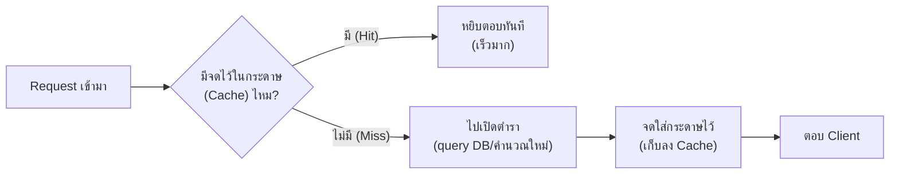

ลองนึกภาพแม่ครัวที่ทำผัดกะเพราวันละ 200 จาน ทุกครั้งที่มีออเดอร์เข้ามา แม่ครัวไม่ได้เปิดตำราอาหารหนาๆ ค้นหาสูตรใหม่ทุกรอบ — เธอจำสูตรได้ขึ้นใจ หรืออย่างน้อยก็มีกระดาษจดสูตรแปะไว้ข้างเตา หยิบดูปุ๊บทำได้เลย การเปิดตำราทุกครั้งจะทำให้ทำอาหารช้าลงมหาศาลโดยไม่จำเป็น เพราะเมนูเดิมถูกถามซ้ำวันละหลายร้อยครั้ง

Database ก็เจอปัญหาเดียวกัน — ทุกครั้งที่มี request เข้ามา ถ้าต้องไปเปิด "ตำราเล่มหนา" (query database จริงๆ) ทุกรอบ ทั้งที่คำถามเดิมถูกถามซ้ำแล้วซ้ำอีก (เช่น หน้า product ยอดนิยม) ก็จะช้าโดยไม่จำเป็นเหมือนกัน **Cache** คือ "กระดาษจดสูตรข้างเตา" ของระบบซอฟต์แวร์ — เก็บผลลัพธ์ที่คำนวณ/ค้นหามาแล้วไว้ในที่หยิบใช้ได้เร็วกว่า

## หลักการ



**Hit** คือเจอสูตรจดไว้แล้ว หยิบตอบเลย ส่วน **Miss** คือไม่มีจด ต้องเปิดตำราหาใหม่ (ช้ากว่า) แล้วค่อยจดใส่กระดาษไว้สำหรับครั้งหน้า

```demo
component: ComparisonDiagram
props: {"left":{"title":"ไม่มี Cache","points":["ทุก request ไปเปิดตำรา (query DB) ใหม่ทุกครั้ง","ช้าเท่าเดิมทุกครั้งไม่ว่าจะถามซ้ำกี่รอบ","Database รับภาระเต็มทุก request","ข้อมูลสดใหม่เป๊ะเสมอ"]},"right":{"title":"มี Cache","points":["คำถามซ้ำหยิบจากกระดาษจดได้เลย (hit)","เร็วขึ้นมากสำหรับข้อมูลที่ถามบ่อย","Database รับภาระแค่ตอน miss","ข้อมูลอาจ \"เก่า\" ไปนิดหน่อย (ต้องจัดการ invalidation)"]},"note":"cache ได้ผลดีสุดกับข้อมูลที่ถูกถามบ่อยกว่าที่เปลี่ยนแปลง"}
```

## เมนูไหนควรจดไว้ข้างเตา

ไม่ใช่ทุกเมนูที่ควรจด — ถ้าเมนูนั้นมีคนสั่งปีละครั้ง จดไว้ก็ไม่คุ้ม เปลืองที่แปะกระดาษเปล่าๆ Cache ก็เหมือนกัน ได้ผลดีที่สุดกับข้อมูลที่:

- **ถูกถามบ่อยกว่าที่เปลี่ยนแปลง** (read-heavy) — เหมือนเมนูฮิตที่สั่งทุกวัน ไม่ใช่เมนูพิเศษที่ทำนานๆ ครั้ง
- **ทำ/คำนวณใช้เวลานาน** — สูตรที่ต้องเตรียมวัตถุดิบซับซ้อน ยิ่งจดไว้ยิ่งประหยัดเวลา
- **เก่าไปนิดหน่อยยังพอรับได้** — ราคาสินค้าที่อัปเดตทุก 5 นาทีอาจโอเคกว่ายอดเงินในบัญชีธนาคารที่ต้องแม่นยำเป๊ะทุกวินาที

## ข้อควรระวัง: กระดาษจดสูตรก็ต้องอัปเดต

ถ้าร้านเปลี่ยนสูตรใหม่ (ใส่พริกน้อยลง) แต่ลืมแก้กระดาษที่แปะไว้ข้างเตา แม่ครัวกะปริมาณผิดไปเรื่อยๆ ตามกระดาษเก่า — นี่คือปัญหาเดียวกับที่ Cache เจอ เรียกว่า **cache invalidation** (จะลงรายละเอียดเต็มๆ ท้ายโมดูลนี้) มีคำกล่าวติดตลกในวงการว่า "there are only two hard things in computer science: cache invalidation and naming things" — เพราะการรู้ว่า "เมื่อไหร่ต้องแก้กระดาษ" ยากกว่าที่คิดเสมอ
