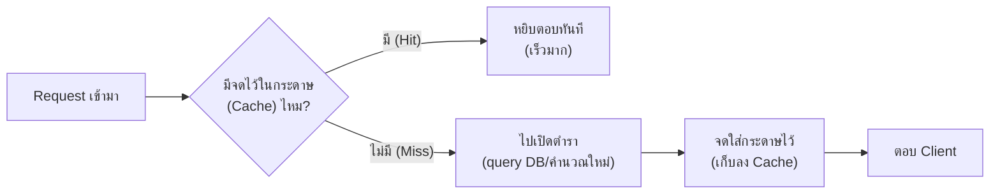

ลองนึกภาพแม่ครัวที่ทำผัดกะเพราวันละ 200 จาน ทุกครั้งที่มีออเดอร์เข้ามา แม่ครัวไม่ได้เปิดตำราอาหารหนาๆ ค้นหาสูตรใหม่ทุกรอบ — เธอจำสูตรได้ขึ้นใจ หรืออย่างน้อยก็มีกระดาษจดสูตรแปะไว้ข้างเตา หยิบดูปุ๊บทำได้เลย การเปิดตำราทุกครั้งจะทำให้ทำอาหารช้าลงมหาศาลโดยไม่จำเป็น เพราะเมนูเดิมถูกถามซ้ำวันละหลายร้อยครั้ง

Database ก็เจอปัญหาเดียวกัน — ทุกครั้งที่มี request เข้ามา ถ้าต้องไปเปิด "ตำราเล่มหนา" (query database จริงๆ) ทุกรอบ ทั้งที่คำถามเดิมถูกถามซ้ำแล้วซ้ำอีก (เช่น หน้า product ยอดนิยม) ก็จะช้าโดยไม่จำเป็นเหมือนกัน <mark class="hl-term">Cache</mark> คือ "กระดาษจดสูตรข้างเตา" ของระบบซอฟต์แวร์ — เก็บผลลัพธ์ที่คำนวณ/ค้นหามาแล้วไว้ในที่หยิบใช้ได้เร็วกว่า

## หลักการ


```mermaid
flowchart LR
    A["Request เข้ามา"] --> B{"มีจดไว้ในกระดาษ\n(Cache) ไหม?"}
    B -->|"มี (Hit)"| C["หยิบตอบทันที\n(เร็วมาก)"]
    B -->|"ไม่มี (Miss)"| D["ไปเปิดตำรา\n(query DB/คำนวณใหม่)"]
    D --> E["จดใส่กระดาษไว้\n(เก็บลง Cache)"]
    E --> F["ตอบ Client"]
```

**Hit** คือเจอสูตรจดไว้แล้ว หยิบตอบเลย ส่วน **Miss** คือไม่มีจด ต้องเปิดตำราหาใหม่ (ช้ากว่า) แล้วค่อยจดใส่กระดาษไว้สำหรับครั้งหน้า

```demo
component: JourneyDiagram
props: {"nodes":[{"icon":"person","label":"Client"},{"icon":"notebook","label":"Cache"},{"icon":"building","label":"Database"}],"travelerIcon":"envelope","steps":[{"activeNode":1,"caption":"Request มาถึง เช็ค Cache ก่อน (จดไว้ในกระดาษข้างเตาหรือยัง)"},{"activeNode":2,"caption":"ไม่เจอ (Miss) — ต้องไปเปิดตำรา คำนวณ/query Database ใหม่"},{"activeNode":1,"caption":"ได้คำตอบแล้ว จดใส่ Cache ไว้ เผื่อมีคนถามซ้ำ"},{"activeNode":0,"caption":"ส่งคำตอบกลับ Client — ครั้งหน้าถ้าถามซ้ำ Cache จะ Hit ทันที ไม่ต้องเดินไป Database อีก"}]}
```

```demo
component: ComparisonDiagram
props: {"left":{"title":"ไม่มี Cache","points":["ทุก request ไปเปิดตำรา (query DB) ใหม่ทุกครั้ง","ช้าเท่าเดิมทุกครั้งไม่ว่าจะถามซ้ำกี่รอบ","Database รับภาระเต็มทุก request","ข้อมูลสดใหม่เป๊ะเสมอ"]},"right":{"title":"มี Cache","points":["คำถามซ้ำหยิบจากกระดาษจดได้เลย (hit)","เร็วขึ้นมากสำหรับข้อมูลที่ถามบ่อย","Database รับภาระแค่ตอน miss","ข้อมูลอาจ \"เก่า\" ไปนิดหน่อย (ต้องจัดการ invalidation)"]},"note":"cache ได้ผลดีสุดกับข้อมูลที่ถูกถามบ่อยกว่าที่เปลี่ยนแปลง"}
```

## เมนูไหนควรจดไว้ข้างเตา

ไม่ใช่ทุกเมนูที่ควรจด — ถ้าเมนูนั้นมีคนสั่งปีละครั้ง จดไว้ก็ไม่คุ้ม เปลืองที่แปะกระดาษเปล่าๆ Cache ก็เหมือนกัน ได้ผลดีที่สุดกับข้อมูลที่:

- <mark class="hl-insight">ถูกถามบ่อยกว่าที่เปลี่ยนแปลง (read-heavy)</mark> — เหมือนเมนูฮิตที่สั่งทุกวัน ไม่ใช่เมนูพิเศษที่ทำนานๆ ครั้ง
- **ทำ/คำนวณใช้เวลานาน** — สูตรที่ต้องเตรียมวัตถุดิบซับซ้อน ยิ่งจดไว้ยิ่งประหยัดเวลา
- **เก่าไปนิดหน่อยยังพอรับได้** — ราคาสินค้าที่อัปเดตทุก 5 นาทีอาจโอเคกว่ายอดเงินในบัญชีธนาคารที่ต้องแม่นยำเป๊ะทุกวินาที

## ข้อควรระวัง: กระดาษจดสูตรก็ต้องอัปเดต

ถ้าร้านเปลี่ยนสูตรใหม่ (ใส่พริกน้อยลง) แต่ลืมแก้กระดาษที่แปะไว้ข้างเตา แม่ครัวกะปริมาณผิดไปเรื่อยๆ ตามกระดาษเก่า — นี่คือปัญหาเดียวกับที่ Cache เจอ เรียกว่า **cache invalidation** (จะลงรายละเอียดเต็มๆ ท้ายโมดูลนี้) <mark class="hl-warning">มีคำกล่าวติดตลกในวงการว่า "there are only two hard things in computer science: cache invalidation and naming things" — เพราะการรู้ว่า "เมื่อไหร่ต้องแก้กระดาษ" ยากกว่าที่คิดเสมอ</mark>

## ขั้นสูง: จดสูตรตอนไหน — ก่อนขาย หลังขาย หรือแค่จดแล้วไม่รีบส่งเข้าคลัง

บทนี้พูดถึงแค่ตอน**อ่าน** (Cache Miss แล้วค่อยจด) แต่ยังมีคำถามที่สำคัญไม่แพ้กัน: ตอน**เขียน**ข้อมูลใหม่ จะอัปเดต Cache กับ Database ตอนไหน?

- <mark class="hl-term">Write-Through</mark> — เขียน Cache กับ Database **พร้อมกันทุกครั้ง** ก่อนตอบว่าสำเร็จ เหมือนแม่ครัวแก้กระดาษข้างเตาทันทีที่เปลี่ยนสูตร ไม่มีช่วงที่ข้อมูลสองที่ไม่ตรงกันเลย แต่ทุกครั้งที่เขียนต้องรอทั้งสองที่เสร็จ **ช้ากว่า** เพราะรอ 2 operation
- <mark class="hl-term">Write-Back (Write-Behind)</mark> — เขียน Cache ก่อนแล้วตอบว่าสำเร็จทันที ส่วน Database ค่อย sync ตามหลังแบบ async เหมือนจดกระดาษไว้ก่อน แล้วค่อยเอาไปลงบัญชีจริงทีหลัง **เร็วกว่ามาก** แต่ <mark class="hl-warning">ถ้า Cache ล่มก่อน sync เสร็จ ข้อมูลที่ยังไม่ทัน sync จะหายไปเลย</mark> เหมาะกับข้อมูลที่ทนการหายได้บ้าง ไม่ใช่ข้อมูลสำคัญระดับธุรกรรมการเงิน
- <mark class="hl-term">Write-Around</mark> — เขียนตรงไป Database เท่านั้น ไม่แตะ Cache เลย ข้อมูลนั้นจะเข้า Cache ก็ต่อเมื่อมีคน**อ่าน**ทีหลัง (เหมือนที่บทนี้อธิบายไว้) เหมาะกับข้อมูลที่เขียนแล้วไม่ค่อยมีคนอ่านซ้ำทันที (เขียนแล้ว cache ไว้ก่อนก็เปลืองเปล่า)

> คำถามสัมภาษณ์: "ระบบธนาคารควรใช้ Write-Through หรือ Write-Back" — Write-Through เพราะยอมรับ latency ที่สูงขึ้นเล็กน้อยเพื่อการันตีว่า Cache กับ Database ตรงกันเสมอ ไม่มีช่วงที่ข้อมูลหายได้แม้ระบบล่มกลางทาง ต่างจาก Write-Back ที่เร็วกว่าแต่เสี่ยงข้อมูลหายถ้า Cache ล่มก่อน sync — เหมาะกับ use case ที่ทนการหายได้มากกว่า เช่น view count หรือ analytics เบาๆ
