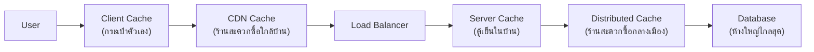

ลองนึกภาพเวลาอยากกินขนมสักชิ้น — ก่อนอื่นล้วงกระเป๋าตัวเองดูก่อน (เร็วที่สุด) ถ้าไม่มีก็เดินไปเปิดตู้เย็นที่บ้าน (ยังเร็วอยู่) ถ้ายังไม่มีก็เดินไปร้านสะดวกซื้อปากซอย (ไกลขึ้นหน่อย) ถ้าร้านนั้นก็ไม่มีของที่อยากได้ ก็ต้องขับรถไปห้างใหญ่ที่อยู่ไกลสุด (ช้าที่สุด แต่มีของครบ) — สังเกตว่าคุณไม่ได้ขับรถไปห้างทุกครั้งที่อยากกินขนม คุณเช็คจากใกล้ไปไกลตามลำดับ

ระบบซอฟต์แวร์ก็มี "ชั้นของความใกล้-ไกล" แบบเดียวกันเป๊ะ ลองกดปุ่มด้านล่างสลับดูว่าแต่ละชั้น "มีของ" (hit) หรือ "ไม่มี" (miss) แล้วกด "ส่ง request" ดูว่า request ต้องเดินทางไกลแค่ไหนกว่าจะเจอ

```demo
component: CacheLayersDemo
```

## ไล่ดูทีละชั้น

1. **Browser Cache (กระเป๋าตัวเอง)** — เก็บรูป, CSS, JS ไว้ในเครื่อง user เอง ผ่าน HTTP header `Cache-Control` เร็วที่สุดเพราะไม่ต้องเดินทางออกจากเครื่องเลยด้วยซ้ำ
2. **CDN Cache (ร้านสะดวกซื้อใกล้บ้าน)** — เซิร์ฟเวอร์ edge กระจายอยู่ทั่วโลก ใกล้ user มากกว่า origin server มาก เก็บของที่คนแถวนั้นน่าจะอยากได้ไว้ล่วงหน้า
3. **Server-side / In-memory Cache (ตู้เย็นในบ้าน)** — เก็บอยู่ใน memory ของ process server เอง เร็วมาก แต่ปัญหาคือ<mark class="hl-warning">ไม่แชร์กับบ้านอื่น (server เครื่องอื่น)</mark> — คล้ายปัญหา sticky session ที่เจอในโมดูล Scalability
4. <mark class="hl-term">Distributed Cache: Redis</mark> (ร้านสะดวกซื้อกลางเมืองที่ทุกบ้านไปซื้อได้) — cache กลางที่ทุก server เข้าถึงร่วมกันได้ แก้ปัญหาข้อ 3 แต่ต้องเดินทาง (network call) เพิ่มขึ้นนิดหน่อย
5. **Database (ห้างใหญ่ไกลสุด)** — มีของครบทุกอย่างแน่นอน แต่ไกลสุดและช้าสุด เป็นจุดสุดท้ายที่ต้องไปถ้าทุกที่ก่อนหน้าไม่มี



## กฎง่ายๆ ในการเลือก

<mark class="hl-insight">ยิ่ง cache อยู่ใกล้ user เท่าไหร่ ยิ่งเร็ว แต่ยิ่งยาก sync ให้ตรงกันทุกที่</mark> (กระเป๋าคุณกับตู้เย็นที่บ้านอาจมีขนมคนละยี่ห้อ) ระบบใหญ่มักใช้**ทุกชั้นพร้อมกัน**: static asset ให้ CDN จัดการ, ข้อมูลที่เปลี่ยนบ่อยแต่ต้อง share ข้ามเครื่องใช้ Redis, ข้อมูลที่คำนวณหนักเฉพาะ request นั้นๆ อาจ cache ใน memory ระยะสั้นเท่านั้น
