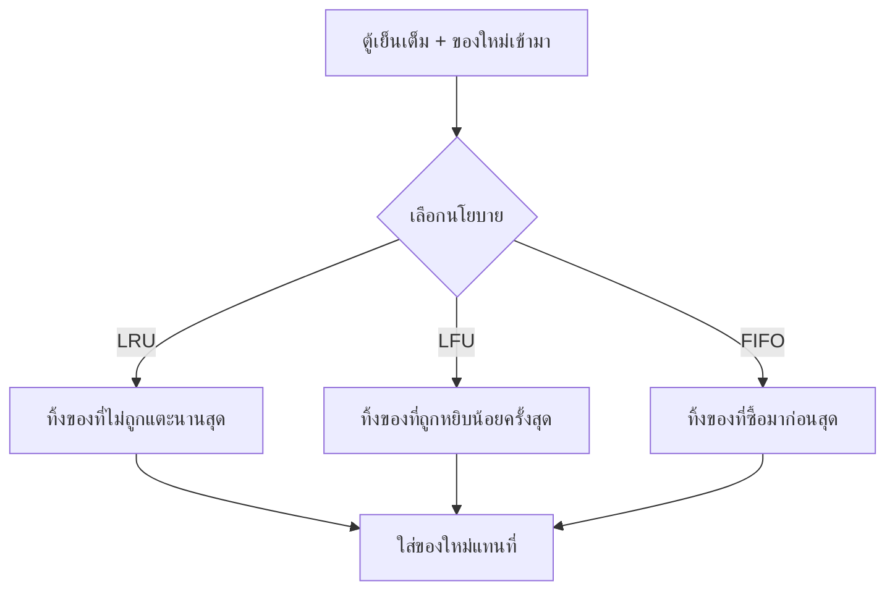

ลองนึกภาพตู้เย็นเล็กๆ ในหอพักที่จุของได้แค่ 4 ช่อง — ถ้าซื้อของใหม่มาแล้วตู้เย็นเต็มพอดี ต้อง**เอาของเก่าออกสักอย่าง**ถึงจะยัดของใหม่เข้าไปได้ คำถามคือจะเลือกทิ้งอะไร? Cache ก็เจอปัญหาเดียวกัน — มีขนาดจำกัด (memory ไม่ใช่ของไม่มีที่สิ้นสุด) เมื่อเต็มแล้วมี key ใหม่เข้ามา ต้อง**ไล่บางอันออก** กฎที่ใช้ตัดสินใจว่าไล่อะไรออกเรียกว่า <mark class="hl-term">eviction policy</mark>

ลองเล่น demo ข้างล่าง: ขอ key A, B, C, D (เต็มพอดี 4 slot เหมือนตู้เย็น 4 ช่อง) แล้วขอ E ดูว่าตัวไหนโดนไล่ออก

```demo
component: CacheDemo
```

## LRU — ทิ้งของที่ไม่มีใครแตะนานสุด

นโยบายที่นิยมที่สุดคือแบบเดียวกับที่คนส่วนใหญ่ทำกับตู้เย็นจริงๆ โดยไม่รู้ตัว: **มองไปที่ของที่ไม่มีใครหยิบมานานที่สุด แล้วทิ้งอันนั้นก่อน** <mark class="hl-insight">สมมติฐานคือ ถ้าไม่มีใครแตะมันมานานแล้ว มีโอกาสสูงว่าจะไม่มีใครอยากกินมันในเร็วๆ นี้เช่นกัน</mark> — ในทางเทคนิคเรียกว่า <mark class="hl-term">LRU (Least Recently Used)</mark>

## นโยบายอื่นที่ควรรู้จัก

| นโยบาย | หลักการ | เหมือนตู้เย็นแบบไหน |
|---|---|---|
| **LRU** | ทิ้งของที่ไม่ถูกหยิบนานสุด | คนทั่วไปส่วนใหญ่ทำแบบนี้โดยไม่รู้ตัว |
| **LFU** (Least Frequently Used) | ทิ้งของที่ถูกหยิบน้อยครั้งสุด | ของบางอย่างถูกหยิบบ่อยมาก (นมที่กินทุกเช้า) บางอย่างแทบไม่แตะเลย |
| **FIFO** (First In, First Out) | ทิ้งของที่ซื้อมาก่อนสุด (ไม่สนว่าหยิบบ่อยแค่ไหน) | ง่ายสุด — ของเก่าสุดออกก่อนเสมอ ไม่ต้องจำว่าใครหยิบบ่อย |
| **TTL-based** | ทิ้งตามวันหมดอายุที่กำหนดไว้ล่วงหน้า | เหมือนดูฉลาก "ควรบริโภคก่อน" แล้วทิ้งเมื่อถึงกำหนด ไม่ต้องดูว่าหยิบบ่อยแค่ไหน |



> Redis รองรับหลายนโยบายในตัว (ตั้งค่า `maxmemory-policy` เช่น `allkeys-lru`, `allkeys-lfu`) — ในทางปฏิบัติแทบไม่ต้องเขียน eviction logic เองเลย แค่เข้าใจว่าแต่ละแบบเหมาะกับของแบบไหนเวลาต้องเลือกตั้งค่า
