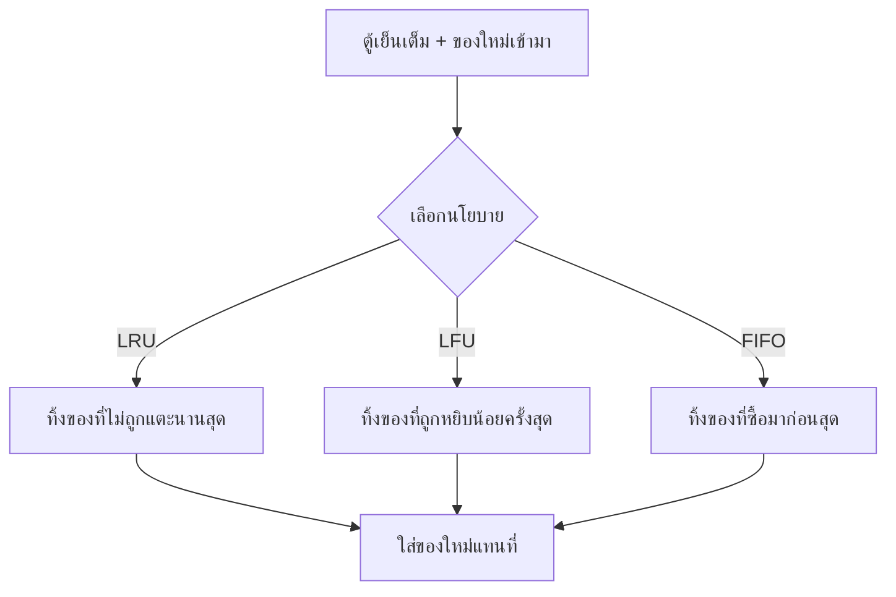

ลองนึกภาพตู้เย็นเล็กๆ ในหอพักที่จุของได้แค่ 4 ช่อง — ถ้าซื้อของใหม่มาแล้วตู้เย็นเต็มพอดี ต้อง**เอาของเก่าออกสักอย่าง**ถึงจะยัดของใหม่เข้าไปได้ คำถามคือจะเลือกทิ้งอะไร? Cache ก็เจอปัญหาเดียวกัน — มีขนาดจำกัด (memory ไม่ใช่ของไม่มีที่สิ้นสุด) เมื่อเต็มแล้วมี key ใหม่เข้ามา ต้อง**ไล่บางอันออก** กฎที่ใช้ตัดสินใจว่าไล่อะไรออกเรียกว่า <mark class="hl-term">eviction policy</mark>

ลองเล่น demo ข้างล่าง: ขอ key A, B, C, D (เต็มพอดี 4 slot เหมือนตู้เย็น 4 ช่อง) แล้วขอ E ดูว่าตัวไหนโดนไล่ออก

```demo
component: CacheDemo
```

## LRU — ทิ้งของที่ไม่มีใครแตะนานสุด

นโยบายที่นิยมที่สุดคือแบบเดียวกับที่คนส่วนใหญ่ทำกับตู้เย็นจริงๆ โดยไม่รู้ตัว: **มองไปที่ของที่ไม่มีใครหยิบมานานที่สุด แล้วทิ้งอันนั้นก่อน** <mark class="hl-insight">สมมติฐานคือ ถ้าไม่มีใครแตะมันมานานแล้ว มีโอกาสสูงว่าจะไม่มีใครอยากกินมันในเร็วๆ นี้เช่นกัน</mark> — ในทางเทคนิคเรียกว่า <mark class="hl-term">LRU (Least Recently Used)</mark>

## นโยบายอื่นที่ควรรู้จัก

| นโยบาย | หลักการ | เหมือนตู้เย็นแบบไหน |
|---|---|---|
| **LRU** | ทิ้งของที่ไม่ถูกหยิบนานสุด | คนทั่วไปส่วนใหญ่ทำแบบนี้โดยไม่รู้ตัว |
| **LFU** (Least Frequently Used) | ทิ้งของที่ถูกหยิบน้อยครั้งสุด | ของบางอย่างถูกหยิบบ่อยมาก (นมที่กินทุกเช้า) บางอย่างแทบไม่แตะเลย |
| **FIFO** (First In, First Out) | ทิ้งของที่ซื้อมาก่อนสุด (ไม่สนว่าหยิบบ่อยแค่ไหน) | ง่ายสุด — ของเก่าสุดออกก่อนเสมอ ไม่ต้องจำว่าใครหยิบบ่อย |
| **TTL-based** | ทิ้งตามวันหมดอายุที่กำหนดไว้ล่วงหน้า | เหมือนดูฉลาก "ควรบริโภคก่อน" แล้วทิ้งเมื่อถึงกำหนด ไม่ต้องดูว่าหยิบบ่อยแค่ไหน |


```mermaid
flowchart TD
    A["ตู้เย็นเต็ม + ของใหม่เข้ามา"] --> B{"เลือกนโยบาย"}
    B -->|LRU| C["ทิ้งของที่ไม่ถูกแตะนานสุด"]
    B -->|LFU| D["ทิ้งของที่ถูกหยิบน้อยครั้งสุด"]
    B -->|FIFO| E["ทิ้งของที่ซื้อมาก่อนสุด"]
    C --> F["ใส่ของใหม่แทนที่"]
    D --> F
    E --> F
```

> Redis รองรับหลายนโยบายในตัว (ตั้งค่า `maxmemory-policy` เช่น `allkeys-lru`, `allkeys-lfu`) — ในทางปฏิบัติแทบไม่ต้องเขียน eviction logic เองเลย แค่เข้าใจว่าแต่ละแบบเหมาะกับของแบบไหนเวลาต้องเลือกตั้งค่า

## ขั้นสูง: Redis ไม่ได้ทำ LRU แบบเป๊ะๆ จริง และปัญหา "สแกนรอบเดียวเกลี้ยงตู้เย็น"

LRU แบบ "เป๊ะ" (true LRU) ต้องรู้ลำดับการเข้าถึงของทุก key แบบแม่นยำ 100% — ในทางปฏิบัติ <mark class="hl-warning">Redis ไม่ได้ทำแบบนั้นเพราะมี overhead สูงเกินไปเมื่อ key มีจำนวนมาก แต่ใช้วิธีสุ่มตัวอย่าง (sample) key จำนวนหนึ่ง (default 5 key) มาเทียบกัน แล้วไล่ตัวที่ "ไม่ถูกแตะนานสุดในกลุ่มตัวอย่างนั้น" ออกไป</mark> — เป็น **Approximate LRU** ไม่ใช่ของจริงเป๊ะ แต่แลกความแม่นยำเล็กน้อยกับความเร็วที่เร็วกว่ามาก (เพิ่ม sample size ได้ถ้าอยากแม่นขึ้น แต่ก็แลกกับ CPU ที่ใช้มากขึ้นตาม)

อีกปัญหาที่ LRU ล้วนๆ เจอคือ <mark class="hl-term">Cache Pollution จากการสแกนรอบเดียว</mark> — สมมติมี job หนึ่งที่ไล่อ่านข้อมูลทั้งหมดในระบบครั้งเดียว (เช่น export รายงานประจำเดือน หรือ backup job) แต่ละ key ที่ job นี้แตะจะถูกนับเป็น "เพิ่งถูกใช้ล่าสุด" ทั้งที่จริงๆ ไม่มีใครต้องการ key พวกนั้นซ้ำอีกในเร็วๆ นี้ — <mark class="hl-insight">ผลคือ key ที่ hot จริงๆ (ถูกเรียกใช้บ่อยตามปกติ) ถูกไล่ออกจาก cache ไปแทนที่ ทั้งที่ไม่ควรโดนแตะเลย เพราะ job สแกนครั้งเดียวนั้นมาแทรกคิวจนดันของเก่าที่ hot จริงออกไปหมด</mark> ระบบที่ป้องกันปัญหานี้มักใช้ **Segmented LRU / LRU-2** — แบ่ง cache เป็นสองโซน (โซนที่ถูกแตะแค่ครั้งเดียว กับโซนที่ถูกแตะซ้ำหลายครั้งแล้ว) key ที่อยู่ในโซน "แตะซ้ำแล้ว" ทนต่อการถูกไล่ออกมากกว่า ป้องกัน job สแกนรอบเดียวมาทำลาย hit rate ของ key ที่ hot จริงในระยะยาว

> คำถามสัมภาษณ์: "รัน job export ข้อมูลทั้งหมดออกมาครั้งเดียวแล้ว hit rate ของ cache ตกลงทันที เกิดจากอะไร" — เพราะ LRU แบบพื้นฐานนับทุก key ที่ถูกแตะว่า "เพิ่งใช้ล่าสุด" ไม่ว่าจะถูกแตะเพราะมีคนใช้งานจริงหรือแค่ถูก job สแกนผ่านไปครั้งเดียว ทำให้ key ที่ hot จริงถูกไล่ออกไปแทนที่ด้วย key จาก job ที่ไม่มีใครต้องการซ้ำ ทางแก้คือใช้ Segmented LRU หรือแยก cache instance ของ job แบบนี้ออกจาก cache หลักที่ serve user จริง
