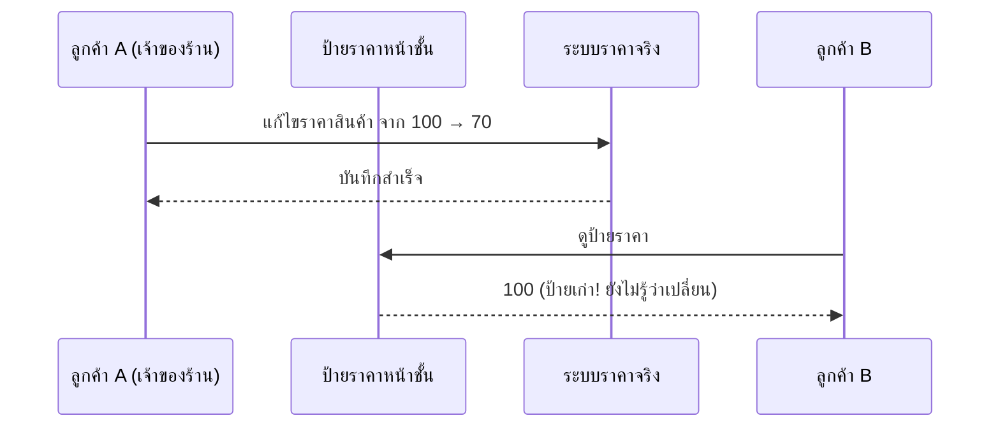
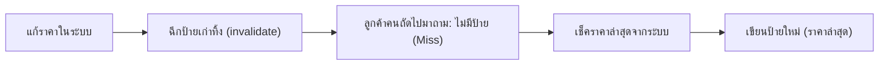

ลองนึกภาพร้านค้าที่มีป้ายราคาแปะหน้าชั้นวางของ — เจ้าของร้านเปลี่ยนราคาจริงในคอมพิวเตอร์แล้ว (ลดราคาจาก 100 เหลือ 70 บาท) แต่**ลืมเปลี่ยนป้ายกระดาษหน้าชั้น** ลูกค้าที่เดินมาดูป้าย ยังเห็นราคาเก่าอยู่ดี ทั้งที่ระบบข้างในรู้ราคาใหม่แล้ว — Eviction policy (บทที่แล้ว) จัดการว่า "จะไล่อะไรออกเมื่อที่เต็ม" แต่ปัญหานี้ต่างกัน: <mark class="hl-warning">ข้อมูลจริงเปลี่ยนไปแล้ว แต่ป้าย (cache) ยังเก็บของเก่าอยู่</mark>

## ปัญหา: เห็นราคาเก่าโดยไม่รู้ตัว



ถ้าไม่มีใครไปเปลี่ยนป้าย ลูกค้า B จะเห็นราคาผิดไปเรื่อยๆ จนกว่าจะมีคนเดินมาเปลี่ยนป้ายจริงๆ (หรือป้ายมี "วันหมดอายุ" ในตัวที่บอกให้พนักงานมาเช็คใหม่)

```demo
component: JourneyDiagram
props: {"nodes":[{"icon":"building","label":"ระบบราคาจริง (DB)"},{"icon":"notebook","label":"ป้ายราคา (Cache)"},{"icon":"person","label":"ลูกค้า B"}],"travelerIcon":"envelope","steps":[{"activeNode":0,"caption":"เจ้าของร้านแก้ราคาในระบบ (DB) จาก 100 → 70"},{"activeNode":1,"caption":"แต่ป้ายหน้าชั้น (Cache) ยังไม่ถูกอัปเดต ยังเขียนราคาเดิมอยู่"},{"activeNode":2,"caption":"ลูกค้า B เดินมาดูป้าย เห็นราคา 100 (ผิด!) เพราะ Cache ยังไม่รู้ว่าเปลี่ยนไปแล้ว"}]}
```

## กลยุทธ์หลัก 3 แบบ

**1. ตั้งวันหมดอายุป้าย (TTL)** — เขียนกำกับไว้ว่าป้ายนี้ใช้ได้ 5 นาที ครบเวลาแล้วต้องเช็คราคาใหม่เสมอ ง่ายสุด แต่ระหว่างรอหมดอายุ ราคาอาจผิดได้

**2. เปลี่ยนป้ายทันทีที่เปลี่ยนราคาจริง (Write-through)** — ทุกครั้งที่แก้ราคาในระบบ ให้เปลี่ยนป้ายหน้าชั้นพร้อมกันเลย ราคาตรงกันเสมอ แต่ทุกครั้งที่แก้ไขจะช้าลงนิดหน่อย (ต้องทำสองที่พร้อมกัน)

**3. ฉีกป้ายทิ้งเฉยๆ แล้วค่อยทำใหม่ (Cache-aside + explicit invalidate)** — แก้ราคาในระบบ แล้ว**ฉีกป้ายเก่าทิ้งไปเลย**ไม่ต้องรีบเขียนป้ายใหม่ทันที รอลูกค้าคนถัดไปมาถาม ค่อยเขียนป้ายใหม่ตามราคาล่าสุด



```demo
component: StepThroughDiagram
props: {"steps":[{"label":"1. ตั้งวันหมดอายุป้าย (TTL)","detail":"เขียนกำกับไว้ว่าป้ายนี้ใช้ได้ 5 นาที ครบเวลาแล้วต้องเช็คราคาใหม่เสมอ ง่ายสุด แต่ระหว่างรอหมดอายุ ราคาอาจผิดได้"},{"label":"2. เปลี่ยนป้ายทันที (Write-through)","detail":"ทุกครั้งที่แก้ราคาในระบบ ให้เปลี่ยนป้ายหน้าชั้นพร้อมกันเลย ราคาตรงกันเสมอ แต่ทุกครั้งที่แก้ไขจะช้าลงนิดหน่อย (ต้องทำสองที่พร้อมกัน)"},{"label":"3. ฉีกป้ายทิ้งเฉยๆ (Cache-aside invalidate)","detail":"แก้ราคาในระบบ แล้วฉีกป้ายเก่าทิ้งไปเลย ไม่ต้องรีบเขียนป้ายใหม่ทันที รอลูกค้าคนถัดไปมาถามค่อยเขียนป้ายใหม่ตามราคาล่าสุด"}]}
```

## ทำไมถึงเรียกว่า "ปัญหายาก"

ความยากอยู่ที่ร้านใหญ่ๆ มีป้ายราคาหลายจุด (จากบทที่แล้ว: กระเป๋าตัวเอง, ตู้เย็น, ร้านสะดวกซื้อ, Redis) — เปลี่ยนราคาที่เดียว แต่ต้องไล่เปลี่ยนป้ายให้ครบทุกจุดที่เกี่ยวข้อง ถ้าลืมจุดไหนไป ลูกค้าบางกลุ่มจะเห็นราคาผิดโดยไม่รู้สาเหตุ ยิ่งร้านมีสาขาเยอะ ยิ่งจัดการยาก — <mark class="hl-insight">นี่คือเหตุผลที่การตั้งวันหมดอายุแบบสั้นๆ (TTL) ยังเป็นเซฟตี้เน็ตสำคัญเสมอ แม้จะมีวิธีฉีกป้ายทิ้งทันทีอยู่แล้วก็ตาม เผื่อมีจุดไหนหลุดรอดไป อย่างน้อยก็ไม่ผิดค้างอยู่ตลอดไป</mark>

## ขั้นสูง: 2 ปัญหาที่ตำราเบื้องต้นไม่ค่อยพูดถึง

**Cache Stampede (แห่กันมาถามพร้อมกัน)** — สินค้าขายดีที่สุดในร้าน ป้ายราคาหมดอายุตอน 12:00:00 เป๊ะ พอดีเป็นตอนคนแห่มาซื้อพร้อมกันหลักพันคน <mark class="hl-warning">ทุกคนเห็นป้ายหมดอายุพร้อมกัน แล้ววิ่งไปถามระบบราคาจริง (DB) พร้อมกันหมดในวินาทีเดียว</mark> ทั้งที่คำตอบจะออกมาเหมือนกันทุกคน — DB ที่ปกติรับไหว กลับโดนถล่มเหมือนมีคนพันคนโทรศัพท์มาถามพร้อมกันตอนสายเดียวรับได้ทีละคน ป้องกันได้ 2 ทาง: **lock ตอน miss** (ให้คนแรกที่มาถามไปเช็ค DB จริง ส่วนคนที่มาถามพร้อมกันรอคิวรับคำตอบเดียวกัน ไม่ต้องยิง DB ซ้ำ) หรือ **stagger TTL** (สุ่มเวลาหมดอายุป้ายให้เหลื่อมกันเล็กน้อย ไม่ให้ป้ายทั้งหมดหมดอายุพร้อมกันเป๊ะ)

**Cache Penetration (ถามหาของที่ไม่มีอยู่จริง)** — ถ้ามีคนถามหาสินค้าที่**ไม่มีอยู่ในระบบเลย** (รหัสสินค้าผิด หรือคนร้ายจงใจยิง request สุ่มๆ) คำตอบคือ "ไม่มี" ทุกครั้ง — แต่เพราะไม่เคย cache คำตอบ "ไม่มี" ไว้ ทุก request แบบนี้จะ miss cache แล้ววิ่งไปเช็ค DB ตรงๆ ทุกครั้งไม่เว้นเลย เหมือนมีคนมาถามหาสินค้าที่ร้านไม่เคยขายซ้ำๆ ไม่รู้จบ พนักงานต้องเดินไปเช็คคลังทุกครั้งไม่ได้จำไว้เลย ป้องกันได้ด้วย **negative caching** (cache คำตอบ "ไม่มี" ไว้สั้นๆ ด้วย ไม่ใช่ cache แค่กรณีที่เจอ) หรือ **Bloom filter** (โครงสร้างข้อมูลเล็กๆ เช็คคร่าวๆ ก่อนว่า key นี้*มีโอกาส*อยู่จริงไหม ก่อนจะปล่อยให้ไปแตะ DB เลย)

> คำถามสัมภาษณ์: "ระบบ cache ที่ดูดีบน paper ล้มยังไงได้จริง" — คำตอบมาตรฐานคือ**สองปัญหานี้เป๊ะ**: TTL/invalidation แก้แค่ "ข้อมูลตรงกันไหม" แต่ไม่ได้แก้ "จะเกิดอะไรขึ้นตอน cache miss พร้อมกันจำนวนมาก" ซึ่งเป็นจุดที่ระบบจริงพังบ่อยที่สุดตอน traffic สูง ไม่ใช่ตอน traffic ปกติ
