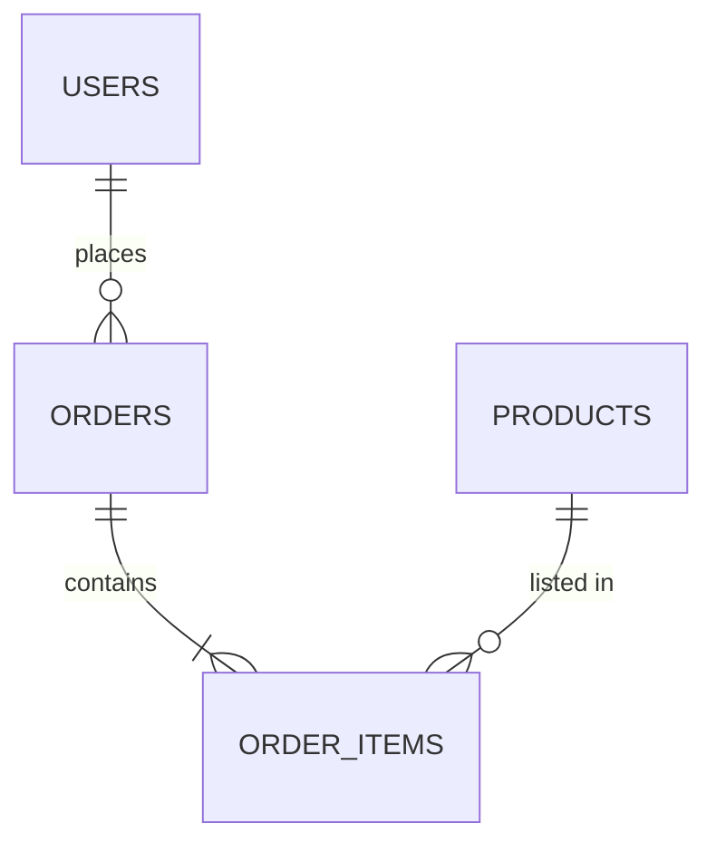

ลองนึกภาพสองวิธีเก็บเอกสารในบ้าน — วิธีแรกคือ**ตู้เอกสารที่มีช่องแบ่งเป็นระเบียบ** ทุกใบต้องเข้าฟอร์มเดียวกัน มีป้ายกำกับชัดเจนว่าใบนี้ต้องอยู่ช่องไหน หมวดไหน หาอะไรก็เจอเร็วเพราะทุกอย่างเป็นระบบ วิธีที่สองคือ**กล่องเก็บของอเนกประสงค์** ใส่อะไรก็ได้ลงไป ไม่ต้องจัดหมวดหมู่ล่วงหน้า สะดวกเวลาต้องรีบเก็บของแปลกๆ ที่ไม่เข้าฟอร์มไหนเลย แต่พอของเยอะขึ้นจะเริ่มหายากขึ้นเรื่อยๆ

ทุกระบบต้องเก็บข้อมูลถาวรที่ไหนสักที่ — สองทางเลือกหลักคือ **SQL (Structured Query Language, relational)** ซึ่งเหมือนตู้เอกสารมีระเบียบ กับ <mark class="hl-term">NoSQL</mark> ซึ่งเหมือนกล่องอเนกประสงค์ <mark class="hl-insight">ไม่ใช่ว่าอันไหนดีกว่าเสมอ แต่เหมาะกับรูปแบบข้อมูล/การใช้งานต่างกัน</mark>

```demo
component: ComparisonDiagram
props: {"left":{"title":"SQL — เหมือนตู้เอกสารมีระเบียบ","points":["ข้อมูลเป็นตาราง มี schema (แบบฟอร์ม) ตายตัว","หาความเชื่อมโยงข้ามตารางได้ดี (JOIN)","ACID (Atomicity, Consistency, Isolation, Durability) transaction เข้มงวด (สอดคล้องเสมอ)","ตัวอย่าง: PostgreSQL, MySQL"]},"right":{"title":"NoSQL — เหมือนกล่องอเนกประสงค์","points":["ยืดหยุ่นเรื่อง schema ใส่อะไรก็ได้ (document/key-value/graph)","scale แนวนอนง่ายกว่าโดยธรรมชาติ","มักยอม eventual consistency แลกความเร็ว/scale","ตัวอย่าง: MongoDB, DynamoDB, Redis, Cassandra"]},"note":"เลือกจากคำถาม: ข้อมูลมีความสัมพันธ์ซับซ้อนที่ต้องเชื่อมโยงกันไหม? ต้องการ scale เขียนมหาศาลไหม?"}
```

```demo
component: JourneyDiagram
props: {"nodes":[{"icon":"person","label":"Client"},{"icon":"building","label":"Orders Table"},{"icon":"building","label":"Users Table"},{"icon":"building","label":"Products Table"}],"travelerIcon":"envelope","steps":[{"activeNode":1,"caption":"Query สั่งซื้อ (order) เริ่มที่ตาราง Orders"},{"activeNode":2,"caption":"SQL ทำ JOIN ไปหาตาราง Users เพื่อดึงชื่อลูกค้า"},{"activeNode":3,"caption":"JOIN ต่อไปตาราง Products เพื่อดึงชื่อสินค้า"},{"activeNode":0,"caption":"รวมผลลัพธ์ทั้งหมดเป็นแถวเดียว ส่งกลับ Client — นี่คือจุดแข็งของ SQL: เชื่อมโยงข้ามตารางได้ในคำสั่งเดียว"}]}
```

## ตัวอย่างที่เหมาะกับตู้เอกสาร (SQL)



ระบบแบบ e-commerce ที่ order ต้องเชื่อมกับ user, product, payment ชัดเจน — เหมือนใบเสร็จที่ต้องอ้างอิงกลับไปที่ใบสั่งซื้อ อ้างอิงไปที่สินค้า อ้างอิงไปที่ลูกค้า ทุกอย่างเชื่อมโยงกันแน่นหนา ตู้เอกสารที่มีระบบ (SQL) เหมาะกว่าเพราะการันตีว่าเอกสารทุกใบสอดคล้องกัน

## ตัวอย่างที่เหมาะกับกล่องอเนกประสงค์ (NoSQL)

เช่น log เหตุการณ์, ข้อความแชท, ข้อมูล sensor จาก IoT (Internet of Things — อุปกรณ์ที่เชื่อมเน็ตได้ เช่น เซนเซอร์อุณหภูมิ, กล้องวงจรปิด) — เขียนถี่มาก ข้อมูลแต่ละชิ้นไม่ต้องเชื่อมกับอะไร (โยนใส่กล่องแล้วจบ ไม่ต้องหาว่าใบนี้เข้าฟอร์มไหน) NoSQL scale การเขียนแนวนอนได้ง่ายกว่าตู้เอกสารที่มีระบบมาก เพราะไม่ต้องคอยรักษาความสัมพันธ์ระหว่างข้อมูล

## ในทางปฏิบัติ

ระบบใหญ่มัก**ใช้ทั้งคู่พร้อมกัน** — เอกสารสำคัญที่ต้องเชื่อมโยงกันแน่นหนา (user, order, payment) เก็บในตู้เอกสารมีระบบ (SQL) ส่วนของที่เก็บเร็วๆ ไม่ต้องจัดระเบียบมาก (log, session cache, chat history) โยนใส่กล่องอเนกประสงค์ (NoSQL) — เรียกแนวทางนี้ว่า <mark class="hl-term">polyglot persistence</mark>
