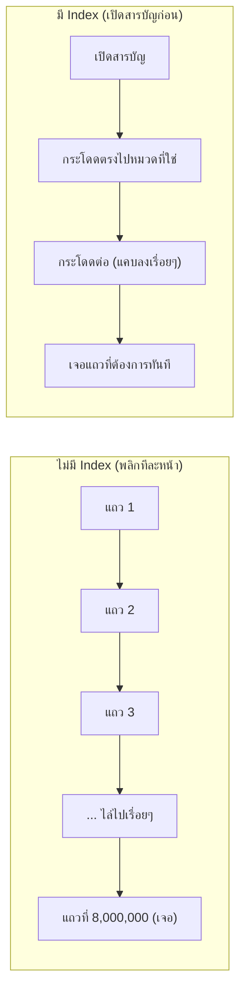

ลองนึกภาพหนังสือหนา 1,000 หน้าที่**ไม่มีสารบัญ**เลย — อยากหาคำว่า "ระบบนิเวศ" ต้องพลิกอ่านทีละหน้าตั้งแต่หน้าแรกจนกว่าจะเจอ ถ้าคำนั้นอยู่หน้า 850 ก็ต้องพลิกไปเกือบทั้งเล่ม แต่ถ้าหนังสือมี**ดัชนีท้ายเล่ม** (index) ที่บอกว่า "ระบบนิเวศ — หน้า 850" ก็เปิดตรงไปหน้านั้นได้เลยทันที

ตาราง `users` ในฐานข้อมูลที่มี 10 ล้านแถวก็เจอปัญหาเดียวกัน — query `WHERE email = 'x@example.com'` ถ้าไม่มี index ต้องไล่อ่านทีละแถวจนกว่าจะเจอ (**full table scan** — เหมือนพลิกหนังสือทีละหน้า) ช้ามาก <mark class="hl-term">Index</mark> คือดัชนีท้ายเล่มของฐานข้อมูล — โครงสร้างเสริมที่บอกว่า "ข้อมูลที่ต้องการอยู่ตรงไหน" โดยไม่ต้องไล่ทั้งตาราง

## แต่ดัชนีของฐานข้อมูลฉลาดกว่านั้นอีก



Index ส่วนใหญ่ใช้โครงสร้างเรียกว่า **B-Tree** — คิดง่ายๆ ว่าเป็นสารบัญที่แบ่งเป็นชั้นๆ (หมวดใหญ่ → หมวดย่อย → หน้าที่แน่นอน) แทนที่จะมีดัชนีแบนราบเรียงตามตัวอักษรเฉยๆ การค้นหาผ่าน B-Tree จึงเร็วกว่าการไล่ทีละแถวมาก โดยเฉพาะเมื่อข้อมูลมีจำนวนมาก

```demo
component: ComparisonDiagram
props: {"left":{"title":"ไม่มี Index (Full Table Scan)","points":["ไล่อ่านทีละแถวจนกว่าจะเจอ","เวลาแปรผันตรงกับจำนวนแถว (ยิ่งข้อมูลเยอะยิ่งช้า)","ไม่เสียพื้นที่เก็บโครงสร้างเสริม","เขียน (insert/update) เร็ว ไม่ต้องอัปเดตอะไรเพิ่ม"]},"right":{"title":"มี Index (B-Tree Lookup)","points":["กระโดดหาได้ทันทีแบบเปิดสารบัญ","เวลาแทบไม่ขึ้นกับจำนวนแถว","กิน storage เพิ่มสำหรับโครงสร้าง index","เขียนช้าลงเล็กน้อย เพราะต้องอัปเดต index ด้วยทุกครั้ง"]},"note":"เลือก index เฉพาะ column ที่ query บ่อย — ไม่ใช่ยิ่งเยอะยิ่งดี"}
```

## ดัชนีก็มีต้นทุน ไม่ใช่ของฟรี

```demo
component: JourneyDiagram
props: {"nodes":[{"icon":"person","label":"Query"},{"icon":"notebook","label":"Index (B-Tree)"},{"icon":"building","label":"Table (10 ล้านแถว)"}],"travelerIcon":"envelope","steps":[{"activeNode":1,"caption":"มี Index ไหม? เช็คก่อน — ถ้ามี กระโดดไปหน้าที่ใช่ได้เลย (เหมือนเปิดสารบัญ)"},{"activeNode":2,"caption":"Index ชี้ตำแหน่งแถวที่ต้องการแม่นยำ — ไม่ต้องไล่อ่านทั้ง 10 ล้านแถว"},{"activeNode":0,"caption":"ได้คำตอบเร็วมาก แม้ตารางจะใหญ่แค่ไหนก็ตาม (เวลาแทบไม่ขึ้นกับจำนวนแถว)"}]}
```

การมีสารบัญในหนังสือก็ต้องเสียพื้นที่กระดาษเพิ่ม และถ้าแก้ไขเนื้อหาในเล่ม (เพิ่ม/ลบหน้า) ก็ต้องแก้สารบัญตามด้วย — index ในฐานข้อมูลก็เหมือนกัน:

- <mark class="hl-warning">อ่านเร็วขึ้นมาก แต่เขียนช้าลง</mark> — ทุกครั้งที่ insert/update/delete ต้องอัปเดต index ด้วย ไม่ใช่แค่ตารางข้อมูลเฉยๆ
- **กิน storage เพิ่ม** — index คือโครงสร้างข้อมูลแยกต่างหาก ยิ่งมี index เยอะ ยิ่งกินพื้นที่มากขึ้น
- **เลือก column ให้ index อย่างเลือกสรร** — ไม่ใช่ทุก column ต้อง index เหมือนไม่ใช่ทุกคำในหนังสือต้องอยู่ในสารบัญ <mark class="hl-insight">ควร index เฉพาะ column ที่ใช้ query บ่อย (โดยเฉพาะใน `WHERE`, `JOIN`, `ORDER BY`)</mark>

## Composite Index — สารบัญที่ผสมหลายหัวข้อ

ถ้า query บ่อยๆ กรองด้วยหลาย column พร้อมกัน (เช่น `WHERE country = 'TH' AND status = 'active'`) การทำ **composite index** (สารบัญที่รวมสอง keyword เข้าด้วยกันไว้เลย เช่น "ประเทศไทย + สถานะ active — หน้า X") มักเร็วกว่าทำ index แยกทีละ column

> คำถามสัมภาษณ์: "ทำไมไม่ index ทุก column ไปเลย" — คำตอบคือ trade-off ข้างบน: เขียนช้าลง + storage เพิ่ม ถ้า table เขียนถี่มาก (เช่น log table ที่เขียนทุกวินาที) index เยอะเกินจะกลายเป็นคอขวดฝั่งเขียนแทน เหมือนสารบัญที่ยาวเกินไปจนแก้ไขทุกครั้งกลายเป็นภาระ
