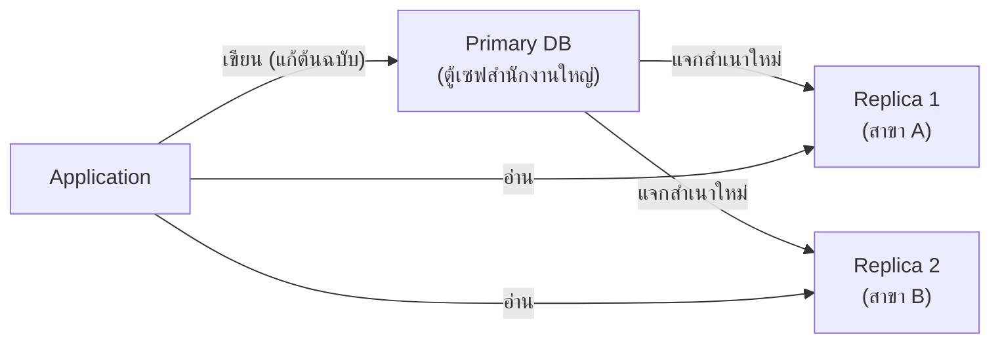
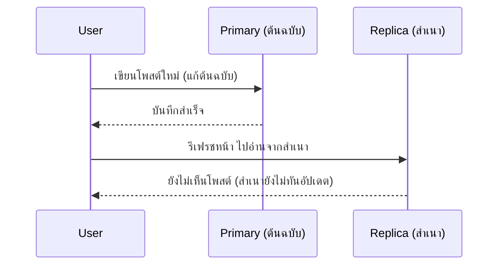

ลองนึกภาพเอกสารสำคัญของบริษัทฉบับเดียว เก็บไว้ในตู้เซฟที่สำนักงานใหญ่ — ถ้าใครก็ตามในบริษัทอยากอ่าน ต้องเดินทางมาที่สำนักงานใหญ่ทุกครั้ง แถมถ้าตู้เซฟนั้นถูกไฟไหม้ เอกสารก็หายไปตลอดกาล วิธีแก้ที่ทำกันทั่วไปคือ**ถ่ายเอกสารแจกไปตามสาขาต่างๆ** ให้พนักงานอ่านจากสำเนาใกล้บ้านได้เลย ไม่ต้องเดินทางไกล แต่ถ้าจะ**แก้ไข**เนื้อหา ต้องแก้ที่ต้นฉบับที่สำนักงานใหญ่เท่านั้น แล้วค่อยแจกสำเนาใหม่ไปทีหลัง

Database เครื่องเดียวมีปัญหาเดียวกับต้นฉบับเดี่ยวในตู้เซฟ: **single point of failure** และ**รับคนมาอ่านพร้อมกันได้จำกัด** ทางแก้คือทำสำเนาข้อมูลไว้หลายเครื่อง — เรียกว่า **replication**

## Primary-Replica (ต้นฉบับ-สำเนา)



รูปแบบที่นิยมที่สุด: มี **Primary** เครื่องเดียวรับการแก้ไขทั้งหมด (เหมือนต้นฉบับที่สำนักงานใหญ่) แล้วส่งสำเนาการเปลี่ยนแปลงไปยัง **Replica** หลายเครื่อง (เหมือนสำเนาแจกตามสาขา) — การอ่านกระจายไปที่ replica ได้ (คล้าย load balancing ฝั่ง database) ส่วนการเขียนยังไปที่ primary เครื่องเดียวเพื่อป้องกันไม่ให้มีคนแก้เอกสารคนละฉบับพร้อมกันจนขัดแย้งกัน

**ข้อดี**: อ่านได้เยอะขึ้นมาก (เพิ่มสำเนาได้เรื่อยๆ), ถ้าต้นฉบับหาย ยกสำเนาขึ้นมาเป็นต้นฉบับแทนได้ (failover)
**ข้อเสีย**: เขียนยัง scale ไม่ได้ (แก้ต้นฉบับได้ที่เดียว), สำเนาอาจ**ตามหลังต้นฉบับ** (replication lag) — อ่านจากสำเนาอาจได้ข้อมูลที่ยังไม่อัปเดตสดสุด

## Replication Lag คือปัญหาจริง



เหมือนแก้เอกสารต้นฉบับเสร็จ แต่ยังไม่ทันถ่ายเอกสารแจกสาขา — ใครไปอ่านที่สาขาตอนนั้นพอดีก็ยังเห็นของเก่าอยู่ นี่คือเหตุผลที่ระบบสำคัญมักให้ **user อ่านค่าของตัวเองจากต้นฉบับเสมอ** (read-your-own-writes) แต่ให้ user อื่นอ่านจากสำเนาได้ตามปกติ — trade-off ระหว่างความสดของข้อมูล กับ load ที่กระจายได้

ลองกด "เขียนค่าใหม่" ดูว่าแต่ละ replica sync ไม่พร้อมกันจริงๆ กว่าจะ "ตรงกันแล้ว" ทั้งหมดใช้เวลาต่างกัน:

```demo
component: EventualConsistencyDemo
caption: Replica แต่ละตัว sync ค่าใหม่ไม่พร้อมกัน — ช่วงเวลาก่อนตรงกันหมดคือ replication lag window
```

## Multi-Leader — แก้ต้นฉบับได้หลายที่ (แนวคิดเพิ่มเติม)

บางระบบให้แก้ไขได้จากหลายสำนักงานใหญ่พร้อมกัน (เช่น คนละประเทศ) เพื่อลดเวลาเดินทางในการแก้ไขแต่ละพื้นที่ แต่ต้องแก้ปัญหา**สองสำนักงานแก้เอกสารฉบับเดียวกันชนกันพอดี**ได้ยังไง — ซับซ้อนกว่ามาก มักใช้เฉพาะกรณีจำเป็นจริงๆ
