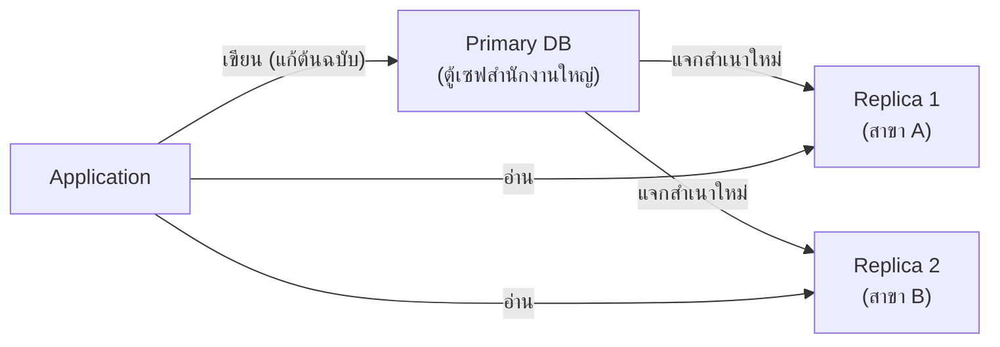
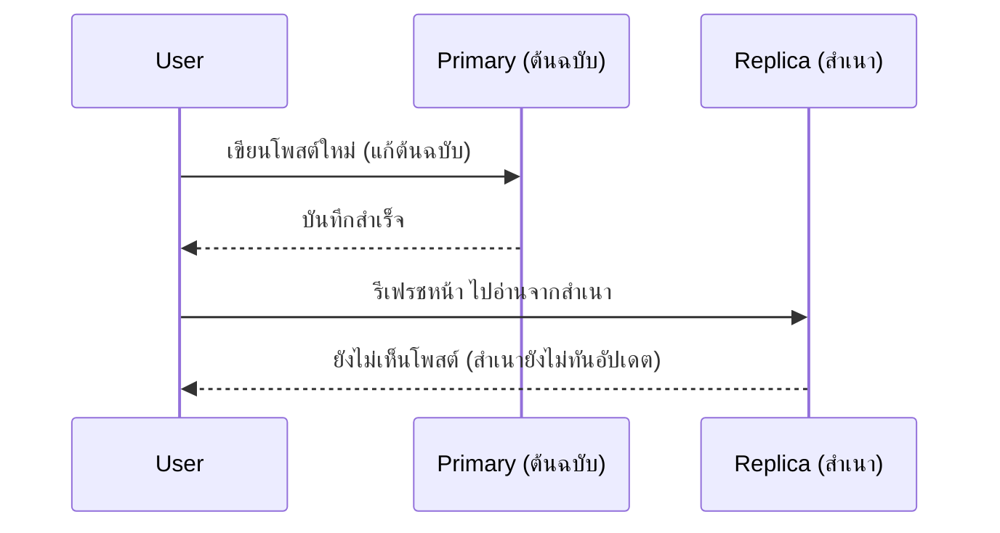

ลองนึกภาพเอกสารสำคัญของบริษัทฉบับเดียว เก็บไว้ในตู้เซฟที่สำนักงานใหญ่ — ถ้าใครก็ตามในบริษัทอยากอ่าน ต้องเดินทางมาที่สำนักงานใหญ่ทุกครั้ง แถมถ้าตู้เซฟนั้นถูกไฟไหม้ เอกสารก็หายไปตลอดกาล วิธีแก้ที่ทำกันทั่วไปคือ**ถ่ายเอกสารแจกไปตามสาขาต่างๆ** ให้พนักงานอ่านจากสำเนาใกล้บ้านได้เลย ไม่ต้องเดินทางไกล แต่ถ้าจะ**แก้ไข**เนื้อหา ต้องแก้ที่ต้นฉบับที่สำนักงานใหญ่เท่านั้น แล้วค่อยแจกสำเนาใหม่ไปทีหลัง

Database เครื่องเดียวมีปัญหาเดียวกับต้นฉบับเดี่ยวในตู้เซฟ: **single point of failure** และ**รับคนมาอ่านพร้อมกันได้จำกัด** ทางแก้คือทำสำเนาข้อมูลไว้หลายเครื่อง — เรียกว่า <mark class="hl-term">replication</mark>

## Primary-Replica (ต้นฉบับ-สำเนา)


```mermaid
flowchart LR
    App["Application"] -->|"เขียน (แก้ต้นฉบับ)"| Primary["Primary DB\n(ตู้เซฟสำนักงานใหญ่)"]
    Primary -->|"แจกสำเนาใหม่"| R1["Replica 1\n(สาขา A)"]
    Primary -->|"แจกสำเนาใหม่"| R2["Replica 2\n(สาขา B)"]
    App -->|"อ่าน"| R1
    App -->|"อ่าน"| R2
```

รูปแบบที่นิยมที่สุด: มี **Primary** เครื่องเดียวรับการแก้ไขทั้งหมด (เหมือนต้นฉบับที่สำนักงานใหญ่) แล้วส่งสำเนาการเปลี่ยนแปลงไปยัง **Replica** หลายเครื่อง (เหมือนสำเนาแจกตามสาขา) — การอ่านกระจายไปที่ replica ได้ (คล้าย load balancing ฝั่ง database) ส่วนการเขียนยังไปที่ primary เครื่องเดียวเพื่อป้องกันไม่ให้มีคนแก้เอกสารคนละฉบับพร้อมกันจนขัดแย้งกัน

**ข้อดี**: อ่านได้เยอะขึ้นมาก (เพิ่มสำเนาได้เรื่อยๆ), ถ้าต้นฉบับหาย ยกสำเนาขึ้นมาเป็นต้นฉบับแทนได้ (failover)
**ข้อเสีย**: เขียนยัง scale ไม่ได้ (แก้ต้นฉบับได้ที่เดียว), <mark class="hl-warning">สำเนาอาจตามหลังต้นฉบับ (replication lag) — อ่านจากสำเนาอาจได้ข้อมูลที่ยังไม่อัปเดตสดสุด</mark>

## Replication Lag คือปัญหาจริง


```mermaid
sequenceDiagram
    participant U as User
    participant P as Primary (ต้นฉบับ)
    participant R as Replica (สำเนา)
    U->>P: เขียนโพสต์ใหม่ (แก้ต้นฉบับ)
    P-->>U: บันทึกสำเร็จ
    U->>R: รีเฟรชหน้า ไปอ่านจากสำเนา
    R-->>U: ยังไม่เห็นโพสต์ (สำเนายังไม่ทันอัปเดต)
```

เหมือนแก้เอกสารต้นฉบับเสร็จ แต่ยังไม่ทันถ่ายเอกสารแจกสาขา — ใครไปอ่านที่สาขาตอนนั้นพอดีก็ยังเห็นของเก่าอยู่ นี่คือเหตุผลที่ระบบสำคัญมักให้ <mark class="hl-insight">user อ่านค่าของตัวเองจากต้นฉบับเสมอ (read-your-own-writes)</mark> แต่ให้ user อื่นอ่านจากสำเนาได้ตามปกติ — trade-off ระหว่างความสดของข้อมูล กับ load ที่กระจายได้

ลองกด "เขียนค่าใหม่" ดูว่าแต่ละ replica sync ไม่พร้อมกันจริงๆ กว่าจะ "ตรงกันแล้ว" ทั้งหมดใช้เวลาต่างกัน:

```demo
component: EventualConsistencyDemo
caption: Replica แต่ละตัว sync ค่าใหม่ไม่พร้อมกัน — ช่วงเวลาก่อนตรงกันหมดคือ replication lag window
```

## Multi-Leader — แก้ต้นฉบับได้หลายที่ (แนวคิดเพิ่มเติม)

บางระบบให้แก้ไขได้จากหลายสำนักงานใหญ่พร้อมกัน (เช่น คนละประเทศ) เพื่อลดเวลาเดินทางในการแก้ไขแต่ละพื้นที่ แต่ต้องแก้ปัญหา**สองสำนักงานแก้เอกสารฉบับเดียวกันชนกันพอดี**ได้ยังไง — ซับซ้อนกว่ามาก มักใช้เฉพาะกรณีจำเป็นจริงๆ

## ขั้นสูง: "แจกสำเนา" ต้องรอให้แจกเสร็จก่อนไหม ถึงจะบอกว่าเขียนสำเร็จ

บทนี้อธิบายว่า Primary บันทึกสำเร็จแล้วค่อยแจกสำเนาไป replica — แต่ไม่ได้บอกว่า Primary ต้อง**รอ**ให้แจกสำเร็จก่อนไหมถึงจะตอบ user ว่า "บันทึกแล้ว" คำตอบคือมีทั้งสองแบบ:

- <mark class="hl-term">Asynchronous Replication</mark> (ที่อธิบายมาตลอดในบทนี้) — Primary บันทึกเสร็จ ตอบ user ทันที แล้วค่อยแจกสำเนาไป replica แบบ background เร็วที่สุด แต่ <mark class="hl-warning">ถ้า Primary ล่มพอดีตอนที่ยังแจกสำเนาไม่ทัน ข้อมูลที่เพิ่งเขียนอาจหายไปเลย เพราะ replica ที่ถูกยกขึ้นมาแทนยังไม่ทันได้รับข้อมูลนั้น</mark>
- <mark class="hl-term">Synchronous Replication</mark> — Primary ต้องรอให้ replica อย่างน้อย 1 ตัวยืนยันว่าได้รับสำเนาแล้ว **ถึงจะตอบ user ว่าสำเร็จ** การันตีว่าข้อมูลไม่หายแม้ Primary ล่มทันทีหลังจากนั้น แต่ <mark class="hl-insight">latency ของทุก write เพิ่มขึ้นตามเวลาที่ต้องรอ network round-trip ไป replica — ถ้า replica อยู่คนละภูมิภาค (เช่น เพื่อทนภัยพิบัติระดับภูมิภาค) อาจเพิ่ม latency หลัก 50-200ms ต่อการเขียนทุกครั้ง</mark>

ระบบจริงจำนวนมากเลือกจุดกึ่งกลางคือ <mark class="hl-term">Semi-Synchronous Replication</mark> — รอแค่ replica ตัวเดียว (ไม่ใช่ทุกตัว) ยืนยันก่อนตอบ user ส่วนที่เหลือค่อยตามหลังแบบ async ได้ผลลัพธ์ที่ปลอดภัยกว่า async ล้วนๆ โดยไม่ต้องจ่าย latency เต็มแบบ sync ทุก replica

> คำถามสัมภาษณ์: "ทำไมไม่ใช้ Synchronous Replication ทุกระบบไปเลยในเมื่อปลอดภัยกว่า" — เพราะแลกมาด้วย latency ที่เพิ่มขึ้นทุก write โดยเฉพาะถ้า replica อยู่ไกล (คนละ data center/ภูมิภาค) ระบบที่ต้องการความเร็วสูงและทนรับความเสี่ยงข้อมูลหายเล็กน้อยได้ (เช่น social media like count) มักเลือก async ส่วนระบบที่ข้อมูลหายไม่ได้เด็ดขาด (เช่น ธุรกรรมทางการเงิน) ยอมจ่าย latency เพิ่มเพื่อใช้ sync หรือ semi-sync แทน
