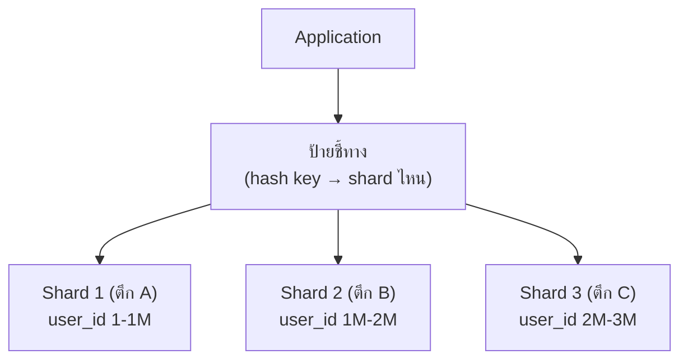
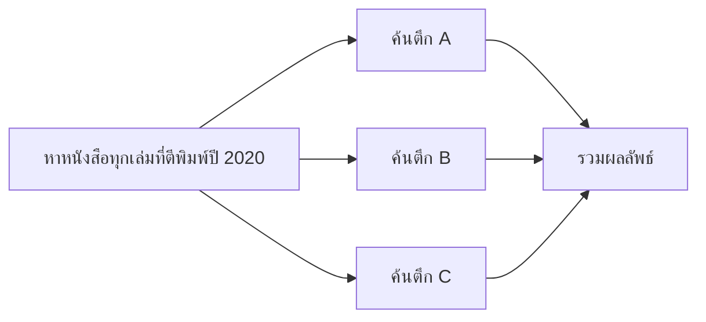

ลองนึกภาพห้องสมุดใหญ่ที่มีหนังสือหลายล้านเล่ม — ถ้ายัดทุกเล่มไว้ในตึกเดียว ตึกนั้นจะต้องใหญ่มหาศาลและหาหนังสือยากมาก วิธีแก้ที่ห้องสมุดใหญ่ๆ ทำจริงคือ**แบ่งหนังสือเป็นหลายตึกตามหมวดหมู่** — ตึก A เก็บหนังสือ A-M ตึก B เก็บ N-Z แต่ละตึกเก็บแค่ "ส่วนหนึ่ง" ไม่ใช่ทุกเล่ม รวมกันแล้วครบทั้งหมด

Replication (บทที่แล้ว) แก้ปัญหา**อ่าน**ได้ แต่ถ้าหนังสือเยอะเกินกว่าตึกเดียวจะเก็บไหว หรือมีคนมายืม-คืนเยอะเกินกว่าตึกเดียวรับไหว replication ช่วยไม่ได้ (เพราะทุกสำเนาต้องมีหนังสือ**ครบชุด**เหมือนกันหมด) ทางแก้คือ <mark class="hl-term">sharding</mark> — แบ่งข้อมูลออกเป็นส่วนๆ ไปอยู่คนละเครื่อง เหมือนแบ่งหนังสือไปคนละตึก

## แนวคิด



แต่ละ **shard** (ตึก) เก็บข้อมูลแค่ "ส่วนหนึ่ง" ของทั้งหมด — ทำให้ทั้ง**อ่านและเขียน**กระจายไปหลายเครื่องได้จริง ไม่เหมือน replication ที่ทุกสำเนาต้องมีของครบเหมือนกันหมด

## จะแบ่งหนังสือไปตึกไหนดี (Sharding Key)

- **Range-based (แบ่งตามช่วงตัวอักษร)** — A-M ไปตึก 1, N-Z ไปตึก 2 ง่าย แต่เสี่ยง**ตึกใดตึกหนึ่งแน่นเกินไป** ถ้าหนังสือใหม่ๆ ที่เข้ามากระจุกตัวอยู่ช่วงเดียว (เหมือน user ใหม่ id สูงขึ้นเรื่อยๆ ไปกอง shard เดียวกันหมด)
- **Hash-based (สุ่มกระจายตามสูตรคำนวณ)** — คำนวณจากชื่อเรื่องแล้วกระจายไปตึกต่างๆ สม่ำเสมอกว่า แต่ถ้าจะ**เพิ่ม/ลดจำนวนตึกทีหลัง**จะยุ่งยาก (สูตรคำนวณเปลี่ยน หนังสือเกือบทั้งหมดต้องย้ายตึกใหม่หมด) — แก้ด้วย **consistent hashing** (เจอแนวคิดนี้แล้วตอนเรียน load balancing ในโมดูล Scalability)

## ลองเพิ่ม shard ดูว่าเกิดอะไรขึ้น

```demo
component: ShardRouterDemo
caption: กด "เพิ่ม shard" ดูว่ากี่ key ต้องย้ายที่อยู่ใหม่ — นี่คือปัญหาจริงของ hash-based ที่บอกไว้ข้างบน
```

โมเดล hash ง่ายๆ แบบนี้ (mod จำนวน shard ตรงๆ) พอเพิ่ม/ลด shard ครั้งเดียว <mark class="hl-warning">key เกือบทั้งหมดย้ายตึกใหม่</mark> ทั้งที่หลายตัวไม่จำเป็นต้องย้ายเลย — เหมือนย้ายห้องสมุดใหม่ทั้งหมดทั้งที่แค่เพิ่มตึกมา 1 หลัง นี่คือเหตุผลที่ระบบจริงใช้ **consistent hashing** แทน mod ตรงๆ (ทำให้ตอนเพิ่ม/ลด node กระทบแค่ส่วนน้อยที่ควรย้ายจริงๆ)

## Trade-off ใหญ่ที่สุด: หาหนังสือข้ามตึก



ถ้าต้องการข้อมูลที่กระจายอยู่หลายตึก (เช่น "หาทุกเล่มที่ตีพิมพ์ปี 2020" โดยไม่รู้ว่าอยู่ตึกไหน) ต้องเดินไปค้นทุกตึกแล้วรวมผลเอง — ช้ากว่าค้นในตึกเดียวมาก และ **การเชื่อมโยงข้อมูลข้าม shard (JOIN)** แทบทำไม่ได้ในทางปฏิบัติ <mark class="hl-insight">นี่คือเหตุผลที่การเลือก sharding key ต้องคิดล่วงหน้าให้ดีว่า คำถามส่วนใหญ่ที่ระบบต้องตอบคืออะไร (เลือก key ที่ query ส่วนใหญ่กรองด้วย key นั้นอยู่แล้ว เช่น user_id)</mark>

> คำถามสัมภาษณ์: "sharding กับ replication ต่างกันยังไง" — replication คือสำเนาข้อมูล**เดียวกัน**ไว้หลายที่ (เหมือนถ่ายเอกสารแจกหลายสาขา แก้ปัญหาอ่าน/ทนล่ม) ส่วน sharding คือแบ่งข้อมูล**คนละส่วน**ไปหลายที่ (เหมือนแบ่งหนังสือไปคนละตึก แก้ปัญหาข้อมูล/เขียนเกินความจุเครื่องเดียว) — ระบบใหญ่จริงมักใช้**ทั้งคู่พร้อมกัน**: แบ่งเป็น shard แล้วแต่ละ shard ก็ยัง replicate อีกที (แต่ละตึกก็มีสำเนาสำรองของตัวเองอีกชั้น)
