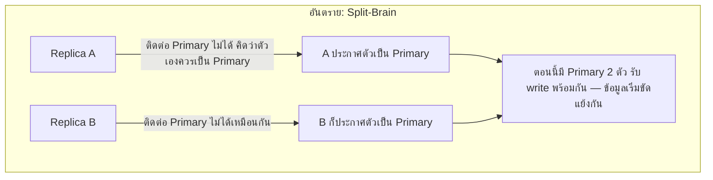

ลองนึกภาพทีมสำรวจป่าที่หัวหน้าทีมเดินนำหน้าไปไกล แล้ว**สัญญาณวิทยุขาดหายไปกะทันหัน** ทีมที่เหลือต้อง**เลือกหัวหน้าคนใหม่**ให้เร็วที่สุดโดยไม่มีใครสั่งจากส่วนกลาง — แต่ถ้าทำไม่ดี อาจเกิดเรื่องแย่กว่าเดิม: **สมาชิก 2 คนต่างประกาศตัวเป็นหัวหน้าพร้อมกัน** โดยไม่รู้ว่าอีกคนก็ทำเหมือนกัน ทีมแตกเป็นสองฝ่ายเดินคนละทิศทาง

## ปัญหา: Primary หายไป แล้วใครมาแทน

Replication (module ก่อนหน้า) พูดถึง Primary-Replica แต่ไม่ได้บอกว่า**ถ้า Primary ตายกะทันหัน ใครจะเป็น Primary คนใหม่** — และ Failover (โมดูล Reliability) พูดถึง "ยกสำเนาขึ้นมาเป็นต้นฉบับแทน" แต่ไม่ได้บอกกลไกจริงว่าเลือกยังไง



ถ้าปล่อยให้แต่ละ replica ตัดสินใจเองอย่างอิสระว่า "ฉันควรเป็น Primary" โดยไม่มีกติกาป้องกัน อาจเกิด **split-brain** — Primary มากกว่า 1 ตัวรับ write พร้อมกัน ข้อมูลแตกแยกกันจนซ่อมยาก (เชื่อมกับ Consistency & CAP)

## ทางแก้: ต้องได้ "เสียงข้างมาก" เท่านั้นถึงเป็นผู้นำได้

กติกาสำคัญที่ทีมสำรวจ (หรือระบบ distributed) ใช้ป้องกัน split-brain: **ใครจะเป็นหัวหน้าได้ ต้องได้เสียงโหวตเกินครึ่งของสมาชิกทั้งหมด (majority/quorum)** ไม่ใช่แค่ประกาศตัวเองเฉยๆ

ลองกดให้ Leader หายไปดู ระบบข้างล่างมี 5 node — ต้องได้เสียงอย่างน้อย 3 จาก 5 ถึงจะเป็น leader ได้:

```demo
component: LeaderElectionDemo
caption: กด "ทำให้ Leader หายไปกะทันหัน" ซ้ำๆ ดูว่าเลือก leader ใหม่ยังไง และเกิดอะไรขึ้นเมื่อเสียงไม่ถึงข้างมาก
```

กติกานี้สำคัญทางคณิตศาสตร์: **ในกลุ่มเดียวกัน จะมีคนที่ได้เสียงเกินครึ่งพร้อมกันได้แค่คนเดียวเท่านั้น** (ถ้า A ได้เสียงเกินครึ่งไปแล้ว จะไม่มีทางเหลือเสียงพอให้ B ได้เกินครึ่งอีกในรอบเดียวกัน) — นี่คือเหตุผลที่ majority vote ป้องกัน split-brain ได้จริงทางคณิตศาสตร์ ไม่ใช่แค่ "หวังว่าจะไม่ชนกัน"

## Term — เลขรอบเลือกตั้ง กันสับสน

ทุกครั้งที่มีการเลือกตั้งใหม่ ตัวเลข **term** จะเพิ่มขึ้น 1 — ถ้า Primary เก่าที่หายไปกลับมาเชื่อมต่อได้อีกครั้ง (สัญญาณวิทยุกลับมา) มันจะเห็นว่า term ปัจจุบันสูงกว่าที่ตัวเองจำได้ จึงรู้ทันทีว่า**ตัวเองเป็น Primary เก่าที่ตกยุคไปแล้ว** ต้องกลับไปเป็น follower แทน ไม่ใช่สู้แย่งตำแหน่งคืน (เหมือนหัวหน้าเก่าที่เพิ่งกลับมาเจอทีมเลือกหัวหน้าใหม่ไปแล้ว ก็ต้องยอมรับ ไม่ใช่แย่งสั่งการซ้อนกัน)

## ทำไมเสียงไม่ถึงข้างมากถึง "หยุดทำงาน" แทนที่จะฝืนเลือกต่อ

ลองกดให้ node หายไปเรื่อยๆ ในตัวอย่างข้างบนจนเหลือไม่ถึง 3 — ระบบจะ**ปฏิเสธไม่เลือก leader ใหม่เลย** แทนที่จะฝืนเลือกจากเสียงข้างน้อย นี่คือการเลือก**ยอม unavailable (หยุดรับ write ชั่วคราว) แทนที่จะเสี่ยง inconsistent (ข้อมูลขัดแย้งกันจาก split-brain)** — สอดคล้องกับ **CAP theorem (Consistency, Availability, Partition Tolerance)** ที่จะเรียนละเอียดในโมดูล Consistency & CAP ถัดไป: ตอนเครือข่ายมีปัญหาจริง ระบบเหล่านี้เลือก **C (Consistency) เหนือ A (Availability)** โดยตั้งใจ

> คำถามสัมภาษณ์: "ทำไม quorum ต้องเป็นเลขคี่ (เช่น 3 หรือ 5 node ไม่ใช่ 4 หรือ 6)" — เพราะ node จำนวนคู่ไม่ได้ช่วยเพิ่มความทนทานขึ้นเลยเมื่อเทียบกับเลขคี่ที่ต่ำกว่า (4 node ต้องการเสียง 3 เท่ากับ 5 node ที่ต้องการ 3 เหมือนกัน แต่ 5 node ทนทานต่อการเสีย node ได้มากกว่า 4 node โดยใช้ quorum เท่ากัน) ระบบจริงอย่าง ZooKeeper, etcd, Kubernetes control plane จึงมักตั้ง 3 หรือ 5 node ไม่ใช่เลขคู่
