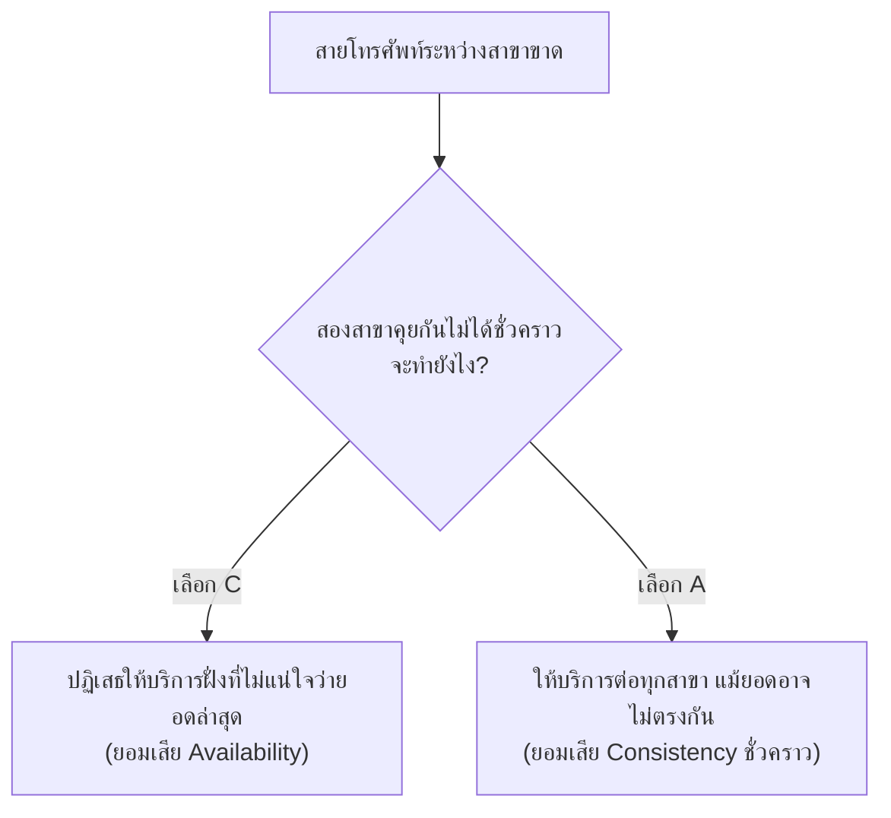

ลองนึกภาพธนาคารสองสาขาที่คุยกันทางโทรศัพท์ตลอดเวลาเพื่อเช็คยอดบัญชีลูกค้าให้ตรงกัน — จู่ๆ สายโทรศัพท์หลุด (เหมือนสายไฟถูกตัด) ทั้งสองสาขายังต้องให้บริการลูกค้าต่อไป แต่ตอนนี้**คุยกันไม่ได้แล้ว** แต่ละสาขาต้องตัดสินใจเองว่าจะทำยังไงกับลูกค้าที่เดินเข้ามาถอนเงินตอนนี้

Sharding และ replication (module ที่แล้ว) ทำให้ข้อมูลกระจายอยู่หลายเครื่องเหมือนธนาคารหลายสาขา — คำถามที่ตามมาคือ **ถ้าสายที่เชื่อมระหว่างสาขาขาดตอน แต่ละสาขาควรทำยังไง** นี่คือสิ่งที่ CAP theorem อธิบาย

ลองคลิกเล่น diagram ข้างล่าง เลือกคู่ที่คิดว่าระบบควรเลือก แล้วดูคำอธิบาย

```demo
component: CapTheoremDiagram
```

## สามตัวอักษรคืออะไร

- **C — Consistency**: ทุกสาขาที่ถูกถามพร้อมกัน ต้องบอกยอดเงิน**ตรงกันเป๊ะ**เสมอ
- **A — Availability**: ลูกค้าที่เดินเข้าไปหาสาขาที่ยังเปิดอยู่ ต้อง**ได้รับบริการเสมอ** (ไม่ปฏิเสธ)
- **P — Partition Tolerance**: ระบบยังทำงานต่อได้แม้สายเชื่อมระหว่างสาขาขาดตอน

## ทำไมเลือกได้แค่ 2 ใน 3

ในระบบที่มีหลายสาขาจริงๆ **สายขาดเกิดขึ้นได้เสมอ** (สายไฟมีปัญหา, เน็ตล่ม, สาขาหนึ่งไฟดับ) เพราะฉะนั้นในทางปฏิบัติ**ไม่ใช่ทางเลือก**ที่จะไม่มี P — ต้องมี P เสมอ คำถามจริงจึงเหลือแค่: **เมื่อสายขาดแล้ว จะเลือก C หรือ A**



ถ้าเลือก **C**: สาขาที่ไม่แน่ใจว่ายอดล่าสุดจะปฏิเสธให้บริการชั่วคราว ("ระบบขัดข้อง กรุณาลองใหม่") ดีกว่าเสี่ยงให้ยอดผิด ถ้าเลือก **A**: ทุกสาขายังให้บริการต่อ แต่ยอดเงินที่เห็นอาจไม่ตรงกันชั่วขณะ (เช่น ถอนเงินจากสองสาขาพร้อมกันโดยไม่รู้ยอดจริงของกันและกัน)

## ทำไมสำคัญกับ system design

ทุกครั้งที่เลือก database/ระบบ distributed ใดๆ กำลังเลือก CP หรือ AP อยู่โดยไม่รู้ตัว — ระบบธนาคารมักเอียงไป CP (ยอดผิดอันตรายกว่าให้บริการช้า) ส่วนระบบ social media feed มักเอียงไป AP (เห็นยอด like ช้าไปนิดหน่อยไม่เป็นไร แต่แอปต้องใช้งานได้ตลอดเวลา)
