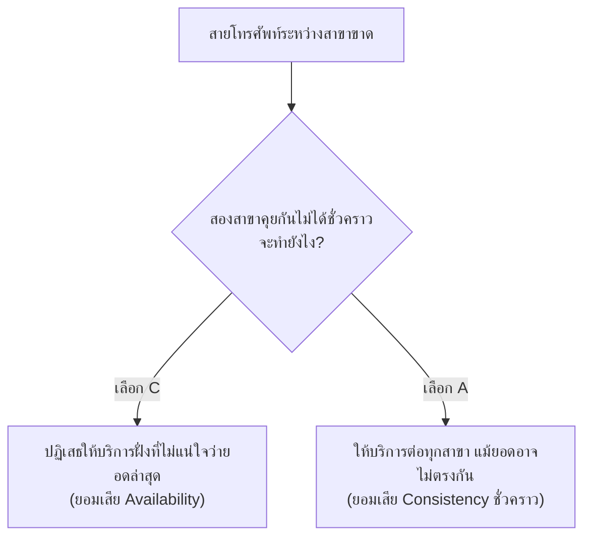

ลองนึกภาพธนาคารสองสาขาที่คุยกันทางโทรศัพท์ตลอดเวลาเพื่อเช็คยอดบัญชีลูกค้าให้ตรงกัน — จู่ๆ สายโทรศัพท์หลุด (เหมือนสายไฟถูกตัด) ทั้งสองสาขายังต้องให้บริการลูกค้าต่อไป แต่ตอนนี้**คุยกันไม่ได้แล้ว** แต่ละสาขาต้องตัดสินใจเองว่าจะทำยังไงกับลูกค้าที่เดินเข้ามาถอนเงินตอนนี้

Sharding และ replication (module ที่แล้ว) ทำให้ข้อมูลกระจายอยู่หลายเครื่องเหมือนธนาคารหลายสาขา — คำถามที่ตามมาคือ **ถ้าสายที่เชื่อมระหว่างสาขาขาดตอน แต่ละสาขาควรทำยังไง** นี่คือสิ่งที่ CAP theorem อธิบาย

ลองคลิกเล่น diagram ข้างล่าง เลือกคู่ที่คิดว่าระบบควรเลือก แล้วดูคำอธิบาย

```demo
component: CapTheoremDiagram
```

## สามตัวอักษรคืออะไร

- <mark class="hl-term">C — Consistency</mark>: ทุกสาขาที่ถูกถามพร้อมกัน ต้องบอกยอดเงิน**ตรงกันเป๊ะ**เสมอ
- <mark class="hl-term">A — Availability</mark>: ลูกค้าที่เดินเข้าไปหาสาขาที่ยังเปิดอยู่ ต้อง**ได้รับบริการเสมอ** (ไม่ปฏิเสธ)
- <mark class="hl-term">P — Partition Tolerance</mark>: ระบบยังทำงานต่อได้แม้สายเชื่อมระหว่างสาขาขาดตอน

## ทำไมเลือกได้แค่ 2 ใน 3

ในระบบที่มีหลายสาขาจริงๆ **สายขาดเกิดขึ้นได้เสมอ** (สายไฟมีปัญหา, เน็ตล่ม, สาขาหนึ่งไฟดับ) เพราะฉะนั้นในทางปฏิบัติไม่ใช่ทางเลือกที่จะไม่มี P — ต้องมี P เสมอ <mark class="hl-insight">คำถามจริงจึงเหลือแค่: เมื่อสายขาดแล้ว จะเลือก C หรือ A</mark>


```mermaid
flowchart TD
    P["สายโทรศัพท์ระหว่างสาขาขาด"] --> Choice{"สองสาขาคุยกันไม่ได้ชั่วคราว<br/>จะทำยังไง?"}
    Choice -->|"เลือก C"| CP["ปฏิเสธให้บริการฝั่งที่ไม่แน่ใจว่ายอดล่าสุด<br/>(ยอมเสีย Availability)"]
    Choice -->|"เลือก A"| AP["ให้บริการต่อทุกสาขา แม้ยอดอาจไม่ตรงกัน<br/>(ยอมเสีย Consistency ชั่วคราว)"]
```

ถ้าเลือก **C**: สาขาที่ไม่แน่ใจว่ายอดล่าสุดจะปฏิเสธให้บริการชั่วคราว ("ระบบขัดข้อง กรุณาลองใหม่") ดีกว่าเสี่ยงให้ยอดผิด ถ้าเลือก **A**: ทุกสาขายังให้บริการต่อ แต่ยอดเงินที่เห็นอาจไม่ตรงกันชั่วขณะ (เช่น ถอนเงินจากสองสาขาพร้อมกันโดยไม่รู้ยอดจริงของกันและกัน)

## ทำไมสำคัญกับ system design

ทุกครั้งที่เลือก database/ระบบ distributed ใดๆ กำลังเลือก CP หรือ AP อยู่โดยไม่รู้ตัว — ระบบธนาคารมักเอียงไป CP (ยอดผิดอันตรายกว่าให้บริการช้า) ส่วนระบบ social media feed มักเอียงไป AP (เห็นยอด like ช้าไปนิดหน่อยไม่เป็นไร แต่แอปต้องใช้งานได้ตลอดเวลา)

## ขั้นสูง: "C" ใน CAP ไม่ใช่ "C" ตัวเดียวกับใน ACID

ข้อผิดพลาดที่พบบ่อยที่สุดตอนพูดถึง CAP คือเอาไปปนกับ ACID เพราะทั้งคู่มีตัว C เหมือนกัน — <mark class="hl-warning">Consistency ใน CAP หมายถึง "ทุกเครื่องที่ถูกถามพร้อมกัน เห็นข้อมูลชุดเดียวกันตรงกันไหม" (linearizability ระหว่างเครื่อง) ส่วน Consistency ใน ACID หมายถึง "ข้อมูลไม่ละเมิดกฎ/constraint ที่ตั้งไว้ภายใน transaction เดียว" (เช่น ยอดเงินรวมต้องไม่ติดลบ) เป็นคนละมิติกันเลย</mark> ระบบหนึ่งอาจ ACID เข้มงวดมาก (transaction ไม่ละเมิด constraint แน่นอน) แต่ยัง AP ในเชิง CAP ได้ (แต่ละเครื่องเห็นข้อมูลคนละเวลากันได้ชั่วขณะ)

อีกความเข้าใจผิดที่พบบ่อยคือคิดว่า CP/AP เป็น**ป้ายติดทั้งระบบตายตัว** — ในทางปฏิบัติ <mark class="hl-insight">ระบบเดียวกันเลือก CP หรือ AP ได้ต่างกันในแต่ละ operation หรือแต่ละชุดข้อมูล ไม่ต้องเลือกแบบเดียวทั้งระบบ</mark> เช่น ระบบ e-commerce อาจเลือก CP สำหรับข้อมูล inventory/สต็อก (ห้ามขายเกิน) แต่เลือก AP สำหรับข้อมูล product review (รีวิวช้าไปนิดหน่อยไม่กระทบอะไร) — คำถามที่ควรถามจริงๆ ไม่ใช่ "ระบบนี้เป็น CP หรือ AP" แต่คือ "ข้อมูลชุดนี้ ตอนสายขาด ควรเลือกอะไร"

> คำถามสัมภาษณ์: "ระบบหนึ่งใช้ ACID transaction เต็มรูปแบบ แต่ทำไมยังถูกเรียกว่า AP ในเชิง CAP ได้" — เพราะ ACID พูดถึงความถูกต้องของข้อมูล**ภายใน transaction เดียว** (ไม่ละเมิด constraint) ส่วน CAP พูดถึงว่าหลายเครื่อง**เห็นข้อมูลตรงกันไหม ณ เวลาเดียวกัน** สองเรื่องนี้แยกกันได้อย่างสิ้นเชิง ระบบสามารถ ACID เข้มงวดในแต่ละเครื่อง แต่ยังยอมให้เครื่องต่างๆ เห็นข้อมูลคนละเวอร์ชันชั่วขณะได้ (AP) พร้อมกัน
