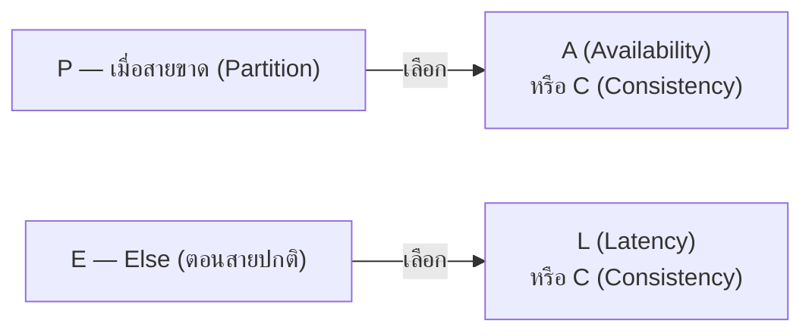

CAP theorem (บทที่แล้ว) พูดถึงแค่ "ตอนสายโทรศัพท์ระหว่างสาขาขาด จะเลือก C หรือ A" — แต่ไม่ได้พูดถึง**ตอนที่สายโทรศัพท์ปกติดี** ซึ่งเป็นสถานการณ์ส่วนใหญ่ในชีวิตจริง (สายไม่ได้ขาดตลอดเวลา) **PACELC** (ย่อจาก "if **P**artition then **A**vailability-or-**C**onsistency, **E**lse **L**atency-or-**C**onsistency") เป็นส่วนขยายที่ตอบคำถามนี้

## อ่านสูตรทีละท่อน



อ่านเป็นประโยคเดียว: **"ถ้าสายขาด เลือก Availability หรือ Consistency, ถ้าสายปกติ เลือก Latency หรือ Consistency"**

- ท่อนแรก (**PAC**) คือ CAP theorem เดิม — สายขาดแล้วเลือก A หรือ C
- ท่อนหลัง (**ELC**) คือส่วนเพิ่มเติม — **แม้สายโทรศัพท์ปกติดี ไม่มีปัญหาเลย** สองสาขาก็ยังต้องเลือกระหว่าง**ตอบลูกค้าเร็ว (ไม่รอเช็คกับสาขาอื่นก่อน)** กับ**โทรเช็คยอดกับสาขาอื่นให้ชัวร์ก่อนค่อยตอบ (ช้ากว่า แต่ชัวร์กว่า)**

```demo
component: ComparisonDiagram
props: {"left":{"title":"ตอนสายขาด (PAC — เหมือน CAP เดิม)","points":["เลือก Availability (ตอบเร็ว จากข้อมูลที่มี)","หรือเลือก Consistency (รอเช็คให้ชัวร์ก่อนตอบ)"]},"right":{"title":"ตอนสายปกติ (ELC — ส่วนขยายใหม่)","points":["เลือก Latency (ตอบเร็ว ไม่รอเช็คซ้ำ)","หรือเลือก Consistency (รอเช็คกับสาขาอื่นให้ชัวร์ก่อนตอบ)"]},"note":"ระบบส่วนใหญ่เจอสถานการณ์ ELC (สายปกติ) บ่อยกว่า PAC (สายขาด) มาก"}
```

```demo
component: JourneyDiagram
props: {"nodes":[{"icon":"person","label":"Client"},{"icon":"building","label":"Node ใกล้สุด"},{"icon":"building","label":"Node อื่นๆ"}],"travelerIcon":"envelope","steps":[{"activeNode":1,"caption":"สายเชื่อมระหว่าง node ปกติดี (ไม่มี partition) — นี่คือสถานการณ์ส่วนใหญ่ในชีวิตจริง (Else)"},{"activeNode":1,"caption":"ถ้าเลือก Latency (L): ตอบทันทีจากข้อมูลที่ Node นี้มีอยู่แล้ว — เร็ว แต่อาจไม่สดสุด"},{"activeNode":2,"caption":"ถ้าเลือก Consistency (C) แทน: ต้องเช็คกับ Node อื่นก่อนค่อยตอบ — ช้ากว่า แต่ชัวร์กว่า"},{"activeNode":0,"caption":"ส่งคำตอบกลับ Client — ระบบส่วนใหญ่ต้องเจอ trade-off นี้ (L vs C) บ่อยกว่าตอนสายขาดมาก"}]}
```

## ทำไมท่อนหลังถึงสำคัญ

สายขาดเป็นเหตุการณ์ที่นานๆ เกิดที (หวังว่านะ) แต่**ทุกลูกค้าทุกคนที่เดินเข้ามา**ต้องเจอ trade-off ท่อนหลังนี้อยู่ตลอด: จะรอโทรเช็คกับทุกสาขาก่อนค่อยบอกยอด (Consistency สูง, รอนานหน่อย) หรือบอกยอดจากข้อมูลที่สาขานี้มีอยู่แล้วทันที (เร็ว, อาจไม่ใช่ยอดล่าสุดเป๊ะ)

## ตัวอย่างระบบ

| ระบบ | ตอนสายขาด | ตอนสายปกติ | สรุป |
|---|---|---|---|
| DynamoDB | เลือก A | เลือก L (เน้นเร็ว) | เร็วก่อน, ยอมข้อมูลไม่สดสุดได้ |
| MongoDB (ค่าเริ่มต้น) | เลือก C | เลือก C (เน้นตรง) | ตรงก่อน, ยอมช้าได้ |
| Cassandra | ปรับได้ | ปรับได้ | เลือกได้เป็นรายคำถามเลยว่าจะเน้นด้านไหน |

> คำถามสัมภาษณ์: "ระบบ X เหมาะกับ use case ไหน" — ถ้าตอบแค่ CAP ยังไม่ครบ ต้องพูดถึง PACELC ด้วยว่า**ตอนปกติ**ระบบนั้นเลือกเน้นความเร็วหรือความตรงกัน เพราะนั่นคือพฤติกรรมที่เจอบ่อยกว่าตอนสายขาดมาก
