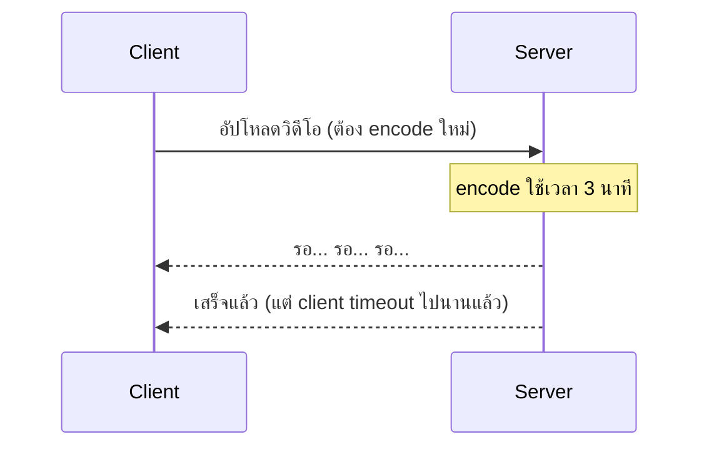
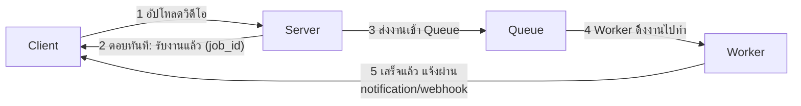

ลองนึกภาพการฝากผ้าที่ร้านซักรีด — คุณเดินเข้าไป ยื่นผ้าให้ พนักงานให้ใบเสร็จมาใบหนึ่ง แล้วคุณก็เดินกลับบ้านได้เลย **ไม่ต้องนั่งรอหน้าร้าน**จนกว่าผ้าจะซักเสร็จ พอถึงเวลานัด ค่อยกลับมารับผ้าที่ซักเสร็จแล้ว ลองเทียบกับถ้าต้องนั่งรอหน้าร้านจนซักเสร็จจริงๆ (อาจ 2-3 ชั่วโมง) — เสียเวลามหาศาลโดยไม่จำเป็น

ทุก request จนถึงตอนนี้ในหลักสูตรนี้เป็นแบบ <mark class="hl-term">synchronous</mark> — เหมือนนั่งรอหน้าร้านซักรีด: client ส่ง request แล้ว**รอ**จนกว่า server จะประมวลผลเสร็จถึงจะได้ response กลับมา ใช้ได้ดีกับงานเร็ว (สั่งเมนูธรรมดา) แต่ถ้างานหนัก (ส่งอีเมล, ประมวลผลวิดีโอ, สร้างรายงาน) การรอแบบนี้เริ่มมีปัญหา

## ปัญหาของการนั่งรอหน้าร้าน



Client (โดยเฉพาะ browser) มัก<mark class="hl-warning">timeout ถ้ารอนานเกินไป (เช่น 30 วินาที) ทั้งที่งานจริงยังทำอยู่</mark> — เหมือนลูกค้ายืนรอหน้าร้านจนเมื่อยขาแล้วเดินกลับก่อนที่ผ้าจะซักเสร็จ ทั้งที่ร้านก็ยังซักต่อไปอยู่ดี นอกจากนี้ระหว่างรอ server เครื่องนั้นก็**ถูกกั๊กไว้ทำงานเดียว** รับ request อื่นไม่ได้เต็มที่ (เหมือนพนักงานคนเดียวยืนเฝ้าเครื่องซัก ไม่ได้ไปรับผ้าคนอื่นต่อ)

## ทางแก้: ให้ใบเสร็จแล้วให้กลับบ้านก่อน



แนวคิดหลัก: <mark class="hl-insight">แยกงาน "รับเรื่อง" ออกจากงาน "ทำจริง"</mark> เหมือนร้านซักรีดที่แยกคนรับผ้าหน้าเคาน์เตอร์ ออกจากเครื่องซักที่ทำงานอยู่ข้างหลัง — server ตอบ client ทันทีว่า "รับเรื่องแล้ว" (ให้ job ID เหมือนใบเสร็จ) ส่วนงานหนักจริงไปทำเบื้องหลัง (background) แล้วแจ้งผลทีหลัง (poll สถานะ, webhook, หรือ push notification)

```demo
component: StepThroughDiagram
props: {"steps":[{"label":"1. Client อัปโหลดวิดีโอ","detail":"ยื่นผ้าให้พนักงานหน้าเคาน์เตอร์ — ส่งไฟล์วิดีโอไปที่ server"},{"label":"2. Server ตอบทันที (job_id)","detail":"พนักงานให้ใบเสร็จมาใบหนึ่งทันที ไม่ต้องรอ — client ได้ job_id กลับไปเลยโดยไม่ต้องรอ encode เสร็จ"},{"label":"3. ส่งงานเข้า Queue","detail":"ใบสั่งงานถูกวางเข้าคิวรอเครื่องซักที่ว่างอยู่หยิบไปทำ (เชื่อมกับ Message Queue บทถัดไป)"},{"label":"4. Worker ดึงงานไปทำ","detail":"เครื่องซักตัวหนึ่งว่าง หยิบงานจากคิวไปประมวลผล (encode วิดีโอ) โดยไม่กระทบ client ที่กลับบ้านไปแล้ว"},{"label":"5. แจ้งผลเมื่อเสร็จ","detail":"งานเสร็จแล้ว แจ้ง client ผ่าน notification/webhook หรือ client กลับมาถามสถานะเองทีหลัง — เหมือนกลับมารับผ้าตามเวลานัด"}]}
```

```demo
component: JourneyDiagram
props: {"nodes":[{"icon":"person","label":"Client"},{"icon":"building","label":"Server"},{"icon":"building","label":"Worker"}],"travelerIcon":"envelope","steps":[{"activeNode":1,"caption":"Client อัปโหลดวิดีโอ ส่งไปที่ Server"},{"activeNode":0,"caption":"Server ตอบทันที \"รับเรื่องแล้ว\" (job_id) — ไม่ต้องรอ encode เสร็จ"},{"activeNode":2,"caption":"งานถูกส่งเข้า Queue ให้ Worker หยิบไปทำเบื้องหลัง"},{"activeNode":0,"caption":"Worker ทำเสร็จ แจ้งกลับ Client ผ่าน notification/webhook"}]}
```

## เมื่อไหร่ควรใช้วิธีนี้

- งานใช้เวลานาน (วินาทีขึ้นไป) ที่ client ไม่จำเป็นต้องรอผลทันที — เหมือนผ้าที่ต้องใช้เวลาซัก ไม่ใช่แค่รีดด่วน
- อยาก **แยกคนส่งงานออกจากคนทำงาน** ให้เป็นอิสระต่อกัน (ผู้ส่งไม่ต้องรู้ว่าใครทำ ทำเสร็จเมื่อไหร่) — เหมือนลูกค้าไม่ต้องรู้ว่าเครื่องซักตัวไหนซักผ้าให้
- ต้องการ **รับงานเข้าคิวไว้ก่อนช่วงพีค** — ร้านซักรีดรับผ้าเข้ามาเก็บไว้ก่อนได้ ค่อยๆ ทยอยซักตามกำลังเครื่องที่มี แทนที่จะปฏิเสธไม่รับผ้าเมื่อคนแน่น

module นี้ที่เหลือจะลงรายละเอียด **Message Queue** (คิวรับผ้า), **Pub/Sub** (ประกาศเสียงตามสาย), และ **Event-Driven Architecture** (ระบบแจ้งเตือนอัตโนมัติ) — สามวิธีหลักในการทำให้ระบบทำงานแบบ "ให้ใบเสร็จแล้วค่อยทำทีหลัง" นี้เกิดขึ้นจริง
