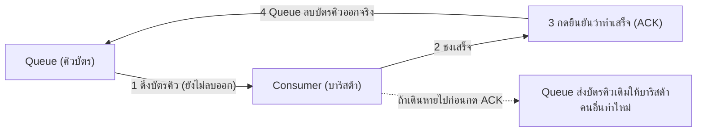

ลองนึกภาพร้านกาแฟตอนเช้าที่คนแน่นมาก — แทนที่จะให้ทุกคนยืนออกันหน้าเคาน์เตอร์รอดูว่ากาแฟตัวเองเสร็จหรือยัง ร้านให้**บัตรคิว**ไปแทน คุณกดบัตร วางไว้กับตัว แล้วไปนั่งรอที่โต๊ะได้เลย บาริสต้าชงกาแฟตามลำดับบัตรคิว เสร็จแล้วเรียกเลขคิว — คุณไม่ต้องยืนจ้องเคาน์เตอร์ตลอดเวลา

**Message Queue** คือโครงสร้างข้อมูลกลาง (มักเป็น FIFO - First In, First Out - เข้าก่อนออกก่อน เหมือนบัตรคิว) ที่ producer (คนกดบัตรคิว) ส่งงานเข้าไปเก็บไว้ แล้ว consumer (บาริสต้า) ค่อยๆ ดึงออกไปทำทีละงานตามลำดับ

ลองเล่น demo: กด "ผลิต message" รัวๆ (เหมือนกดบัตรคิวรัวๆ) ดู queue สะสม แล้วลองเพิ่ม consumer (เพิ่มบาริสต้า) ดูว่า queue ลดเร็วขึ้นแค่ไหน

```demo
component: QueueDemo
```

## ทำไม Queue ถึงช่วยเรื่อง Scale

Queue ทำหน้าที่เป็น<mark class="hl-insight">บัฟเฟอร์ระหว่างฝั่งสั่งงาน (producer) กับฝั่งทำงาน (consumer) — ทั้งสองฝั่งไม่ต้องเร็วเท่ากัน</mark> เหมือนบัตรคิวที่ทำให้คนสั่งกาแฟกับบาริสต้าไม่ต้องซิงค์จังหวะกันแบบเรียลไทม์:

- Producer (คนสั่ง) กดบัตรคิวเร็วแค่ไหนก็ได้ ไม่ต้องรอบาริสต้าทำเสร็จก่อน
- Consumer (บาริสต้า) ทำงานตามจังหวะของตัวเอง ถ้าคนแน่นเกิน**เพิ่มบาริสต้า**ได้ (horizontal scaling แบบเดียวกับโมดูล Scalability แต่ใช้กับ "งาน" แทน "request")
- ถ้าบาริสต้าคนหนึ่งลาป่วยกะทันหัน บัตรคิวไม่หาย — ยังรออยู่ในคิว พอมีบาริสต้าคนอื่นมาทำต่อได้

## At-least-once — บัตรคิวอาจถูกเรียกซ้ำได้

จุดที่ทำให้ queue ซับซ้อนกว่าที่คิด: ถ้าบาริสต้าดึงบัตรคิวไปทำแล้ว**เดินหายไปกลางคัน**ก่อนบอกร้านว่า "ทำเสร็จแล้ว" บัตรคิวนั้นควรถูกส่งให้บาริสต้าคนอื่นทำใหม่ — นี่คือ <mark class="hl-term">at-least-once delivery</mark> (อาจทำงานซ้ำได้ถ้าบาริสต้าคนเดิมจริงๆ ทำเสร็จแต่แค่ลืมบอก)



เพราะแบบนี้ <mark class="hl-warning">งานที่ทำผ่าน queue ควรออกแบบให้ทำซ้ำแล้วผลลัพธ์เหมือนเดิม (idempotent)</mark> เช่น "ตั้งสถานะเป็น paid" ทำซ้ำกี่ครั้งก็ยังเป็น paid เหมือนชงกาแฟแก้วเดิมซ้ำไม่เสียหาย ไม่ใช่ "บวกเงินเพิ่ม" ที่ถ้าชงซ้ำ (ทำงานซ้ำ) จะผิดพลาดทันที (ลูกค้าได้กาแฟสองแก้วทั้งที่สั่งแค่แก้วเดียว)

> ตัวอย่างจริง: RabbitMQ, AWS SQS, Redis Streams — ต่างกันในรายละเอียด แต่หลักการ "กดบัตรคิว → เข้าคิว → บาริสต้าดึงไปทำทีละใบ" เหมือนกันหมด
