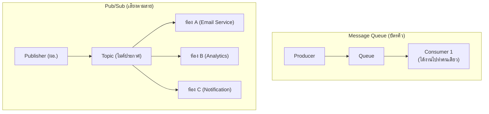

ลองนึกภาพเสียงตามสายในโรงเรียน — ผู้อำนวยการประกาศครั้งเดียวผ่านไมค์ ทุกห้องเรียนที่เปิดลำโพงอยู่ได้ยินพร้อมกันหมด ไม่ต้องเดินไปบอกทีละห้อง และแต่ละห้องก็ทำอะไรกับประกาศนั้นไม่เหมือนกัน — ห้องหนึ่งอาจส่งตัวแทนไปที่ประชุม อีกห้องอาจแค่จดบันทึกไว้ ผู้อำนวยการไม่ต้องรู้เลยด้วยซ้ำว่าห้องไหนจะทำอะไรกับประกาศนั้น

Message Queue (บทที่แล้ว) มีสมมติฐานว่า **1 บัตรคิวควรถูกทำโดยบาริสต้าแค่ 1 คน** (พอคนหนึ่งดึงไปทำ คนอื่นดึงซ้ำไม่ได้) แต่บางสถานการณ์ต้องการให้ **ประกาศเดียวกันไปถึงหลายฝ่ายพร้อมกัน** — นี่คือที่มาของ <mark class="hl-term">Pub/Sub</mark>

## Queue vs Pub/Sub



<mark class="hl-insight">ความต่างสำคัญ: บัตรคิวถูกบาริสต้าคนใดคนหนึ่งหยิบไปแล้วหายจากคิว (คนอื่นไม่เห็นอีก) แต่ประกาศเสียงตามสายถูกส่งไปหาทุกห้องที่เปิดลำโพงรับฟังพร้อมกัน</mark> แต่ละห้องทำงานของตัวเองอย่างอิสระ

## ลองดูการกระจายเสียงจริง

ลองกด Publish แล้วสลับโหมดดู — ถ้าประกาศทีละห้อง (sequential) ต้องรอห้องแรกจัดการเสร็จก่อนถึงจะประกาศห้องถัดไป เทียบกับประกาศพร้อมกันทุกห้องในทีเดียว (parallel) ดูว่าเวลารวมต่างกันแค่ไหน

```demo
component: PubSubFanoutDemo
```

## ตัวอย่าง: User สมัครสมาชิกใหม่

ประกาศเดียว "`user.registered`" อาจต้องกระตุ้นหลายระบบพร้อมกัน:
- ส่งอีเมลต้อนรับ
- บันทึก analytics event
- สร้าง default settings ให้ user
- แจ้งทีม marketing (ถ้าเป็น business account)

ถ้าเขียนโค้ดเรียกทุกระบบตรงๆ ใน function เดียว (เหมือนผู้อำนวยการต้องเดินไปบอกทีละห้องเอง) โค้ดจะพันกันยุ่งเหยิง และถ้าอนาคตมีระบบที่ 5 มาสนใจ ต้องแก้โค้ดจุดเดิมซ้ำอีก — Pub/Sub แก้ปัญหานี้: **publisher แค่ประกาศผ่านไมค์** ไม่ต้องรู้จักหรือสนใจว่าใครฟังอยู่บ้าง ระบบใหม่แค่ "เปิดลำโพง" (subscribe topic เดิม) เพิ่ม ไม่ต้องแก้โค้ดผู้ประกาศเลย

> ตัวอย่างจริง: Kafka, Google Pub/Sub, AWS SNS — นี่คือรากฐานของ **Event-Driven Architecture** (หัวข้อถัดไป)
