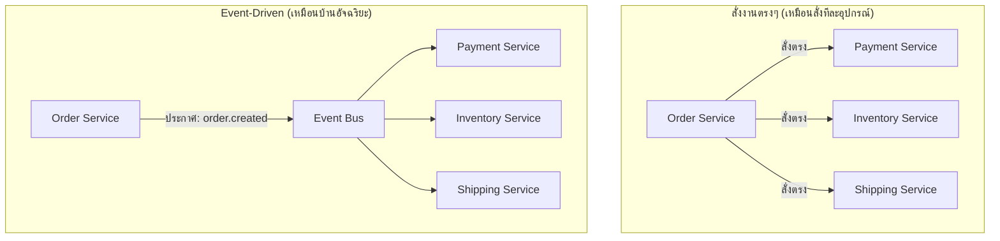

ลองนึกภาพบ้านอัจฉริยะ (smart home) — พอเซนเซอร์ประตูตรวจจับว่ามีคนเปิดประตูเข้าบ้าน มันไม่ได้เดินไปสั่งไฟให้เปิด สั่งกล้องให้บันทึก สั่งมือถือให้แจ้งเตือนทีละอย่างเอง เซนเซอร์แค่ **"ประกาศ" ว่าประตูเปิดแล้ว** จากนั้นไฟ, กล้อง, และแอปมือถือต่างคนต่างรับรู้เหตุการณ์นี้แล้วทำงานของตัวเองอย่างอิสระ — ไฟเปิดเอง กล้องเริ่มบันทึกเอง มือถือแจ้งเตือนเอง ไม่มีใครสั่งใครตรงๆ เลย

Pub/Sub (บทที่แล้ว) เป็นกลไกส่งประกาศ — **Event-Driven Architecture (EDA)** คือการเอากลไกนี้มาเป็น**แกนหลักในการออกแบบทั้งระบบ** แทนที่ service ต่างๆ จะเรียกกันตรงๆ (เหมือนสั่งงานทีละคน) ให้สื่อสารกันผ่านการ "ประกาศเหตุการณ์" แทน (เหมือนบ้านอัจฉริยะ)

## สั่งงานตรงๆ vs ประกาศเหตุการณ์



แบบสั่งงานตรงๆ, **Order Service ต้องรู้จักทุก service** ที่เกี่ยวข้อง เหมือนต้องรู้ว่าบ้านมีอุปกรณ์อะไรบ้างแล้วสั่งทีละตัว และถ้า service ไหนช้า/ล่ม การสร้าง order ทั้งก้อนอาจค้างตาม (tight coupling) แบบ event-driven, Order Service **แค่ประกาศเหตุการณ์** ไม่ต้องรู้ว่าใครฟังอยู่บ้าง แต่ละ service ทำงานเป็นอิสระ ล่มไปก็ไม่กระทบ service อื่น (loose coupling)

```demo
component: ComparisonDiagram
props: {"left":{"title":"Request-Driven (สั่งงานตรงๆ)","points":["Order Service ต้องรู้จักทุก service ปลายทาง","Tight coupling — service ไหนช้า/ล่ม กระทบทั้ง chain","เพิ่ม service ใหม่ต้องแก้โค้ดฝั่งเรียก"]},"right":{"title":"Event-Driven (ประกาศเหตุการณ์)","points":["Order Service แค่ประกาศ ไม่ต้องรู้ว่าใครฟัง","Loose coupling — service ล่มชั่วคราวไม่บล็อกทั้งระบบ","เพิ่ม service ใหม่แค่ subscribe event เดิม ไม่ต้องแก้ตัวประกาศ"]},"note":"ระบบใหญ่มักผสมทั้งสองแบบตามความจำเป็นจริง"}
```

## ข้อดี

- **Decoupling** — เพิ่ม/ลบ service ที่ subscribe event ได้โดยไม่ต้องแก้ตัวที่ประกาศ (เพิ่มอุปกรณ์ใหม่ในบ้าน แค่ให้มันฟังเหตุการณ์เดิม ไม่ต้องแก้เซนเซอร์ประตู)
- **Resilience** — service หนึ่งล่มชั่วคราว ไม่บล็อกทั้งระบบ (กล้องเสีย ไฟก็ยังเปิดได้ปกติ)
- **Scalability** — แต่ละ service scale อิสระตามโหลดของตัวเอง

## ข้อเสีย (สิ่งที่ต้องแลก)

- **Debug ยากขึ้น** — flow ของงานหนึ่งกระจายไปหลาย service เหมือนตามหาว่าทำไมไฟดวงหนึ่งไม่ติดทั้งที่เซนเซอร์ทำงานปกติ ต้องมี distributed tracing ช่วยตามรอย
- **Eventual consistency โดยธรรมชาติ** — order สร้างเสร็จ แต่ inventory อาจหักสต๊อกช้ากว่าสองสามวินาที (เชื่อมกับโมดูล Consistency & CAP)
- **ต้องคิดเรื่อง event ordering / duplicate** — event มาไม่เรียงลำดับ หรือมาซ้ำได้ (เหมือนปัญหา at-least-once ใน queue)

> ในทางปฏิบัติ ระบบใหญ่มัก**ผสมทั้งสองแบบ**: อะไรที่ต้องได้คำตอบทันที (เช่น "บัตรเครดิตนี้ผ่านไหม") ใช้การสั่งงานตรงๆ ส่วนอะไรที่เป็น "แจ้งให้ทราบ ไม่ต้องรอผล" (เช่น "order นี้สร้างแล้ว ไปทำ fulfillment ต่อ") ใช้ event-driven
