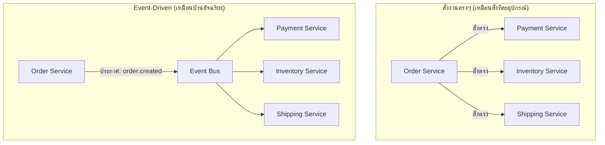

ลองนึกภาพบ้านอัจฉริยะ (smart home) — พอเซนเซอร์ประตูตรวจจับว่ามีคนเปิดประตูเข้าบ้าน มันไม่ได้เดินไปสั่งไฟให้เปิด สั่งกล้องให้บันทึก สั่งมือถือให้แจ้งเตือนทีละอย่างเอง เซนเซอร์แค่ **"ประกาศ" ว่าประตูเปิดแล้ว** จากนั้นไฟ, กล้อง, และแอปมือถือต่างคนต่างรับรู้เหตุการณ์นี้แล้วทำงานของตัวเองอย่างอิสระ — ไฟเปิดเอง กล้องเริ่มบันทึกเอง มือถือแจ้งเตือนเอง ไม่มีใครสั่งใครตรงๆ เลย

Pub/Sub (บทที่แล้ว) เป็นกลไกส่งประกาศ — <mark class="hl-term">Event-Driven Architecture (EDA)</mark> คือการเอากลไกนี้มาเป็น**แกนหลักในการออกแบบทั้งระบบ** แทนที่ service ต่างๆ จะเรียกกันตรงๆ (เหมือนสั่งงานทีละคน) ให้สื่อสารกันผ่านการ "ประกาศเหตุการณ์" แทน (เหมือนบ้านอัจฉริยะ)

## สั่งงานตรงๆ vs ประกาศเหตุการณ์


```mermaid
flowchart TB
    subgraph RequestDriven["สั่งงานตรงๆ (เหมือนสั่งทีละอุปกรณ์)"]
        Order1["Order Service"] -->|"สั่งตรง"| Payment1["Payment Service"]
        Order1 -->|"สั่งตรง"| Inventory1["Inventory Service"]
        Order1 -->|"สั่งตรง"| Shipping1["Shipping Service"]
    end
    subgraph EventDriven["Event-Driven (เหมือนบ้านอัจฉริยะ)"]
        Order2["Order Service"] -->|"ประกาศ: order.created"| Bus["Event Bus"]
        Bus --> Payment2["Payment Service"]
        Bus --> Inventory2["Inventory Service"]
        Bus --> Shipping2["Shipping Service"]
    end
```

แบบสั่งงานตรงๆ, **Order Service ต้องรู้จักทุก service** ที่เกี่ยวข้อง เหมือนต้องรู้ว่าบ้านมีอุปกรณ์อะไรบ้างแล้วสั่งทีละตัว และถ้า service ไหนช้า/ล่ม การสร้าง order ทั้งก้อนอาจค้างตาม (tight coupling) แบบ event-driven, Order Service <mark class="hl-insight">แค่ประกาศเหตุการณ์ ไม่ต้องรู้ว่าใครฟังอยู่บ้าง แต่ละ service ทำงานเป็นอิสระ ล่มไปก็ไม่กระทบ service อื่น (loose coupling)</mark>

```demo
component: ComparisonDiagram
props: {"left":{"title":"Request-Driven (สั่งงานตรงๆ)","points":["Order Service ต้องรู้จักทุก service ปลายทาง","Tight coupling — service ไหนช้า/ล่ม กระทบทั้ง chain","เพิ่ม service ใหม่ต้องแก้โค้ดฝั่งเรียก"]},"right":{"title":"Event-Driven (ประกาศเหตุการณ์)","points":["Order Service แค่ประกาศ ไม่ต้องรู้ว่าใครฟัง","Loose coupling — service ล่มชั่วคราวไม่บล็อกทั้งระบบ","เพิ่ม service ใหม่แค่ subscribe event เดิม ไม่ต้องแก้ตัวประกาศ"]},"note":"ระบบใหญ่มักผสมทั้งสองแบบตามความจำเป็นจริง"}
```

```demo
component: JourneyDiagram
props: {"nodes":[{"icon":"house","label":"เซนเซอร์ประตู"},{"icon":"building","label":"Event Bus"},{"icon":"building","label":"ไฟ/กล้อง/มือถือ"}],"travelerIcon":"envelope","steps":[{"activeNode":0,"caption":"เซนเซอร์ประตูตรวจจับว่ามีคนเปิดประตูเข้าบ้าน"},{"activeNode":1,"caption":"ประกาศ event \"door.opened\" ผ่าน Event Bus — ไม่ได้สั่งใครตรงๆ"},{"activeNode":2,"caption":"ไฟ กล้อง และมือถือ ต่างคนต่างรับรู้ event นี้ แล้วทำงานของตัวเองอย่างอิสระพร้อมกัน"}]}
```

## ข้อดี

- **Decoupling** — เพิ่ม/ลบ service ที่ subscribe event ได้โดยไม่ต้องแก้ตัวที่ประกาศ (เพิ่มอุปกรณ์ใหม่ในบ้าน แค่ให้มันฟังเหตุการณ์เดิม ไม่ต้องแก้เซนเซอร์ประตู)
- **Resilience** — service หนึ่งล่มชั่วคราว ไม่บล็อกทั้งระบบ (กล้องเสีย ไฟก็ยังเปิดได้ปกติ)
- **Scalability** — แต่ละ service scale อิสระตามโหลดของตัวเอง

## ข้อเสีย (สิ่งที่ต้องแลก)

- <mark class="hl-warning">Debug ยากขึ้น</mark> — flow ของงานหนึ่งกระจายไปหลาย service เหมือนตามหาว่าทำไมไฟดวงหนึ่งไม่ติดทั้งที่เซนเซอร์ทำงานปกติ ต้องมี distributed tracing ช่วยตามรอย
- **Eventual consistency โดยธรรมชาติ** — order สร้างเสร็จ แต่ inventory อาจหักสต๊อกช้ากว่าสองสามวินาที (เชื่อมกับโมดูล Consistency & CAP)
- **ต้องคิดเรื่อง event ordering / duplicate** — event มาไม่เรียงลำดับ หรือมาซ้ำได้ (เหมือนปัญหา at-least-once ใน queue)

> ในทางปฏิบัติ ระบบใหญ่มัก**ผสมทั้งสองแบบ**: อะไรที่ต้องได้คำตอบทันที (เช่น "บัตรเครดิตนี้ผ่านไหม") ใช้การสั่งงานตรงๆ ส่วนอะไรที่เป็น "แจ้งให้ทราบ ไม่ต้องรอผล" (เช่น "order นี้สร้างแล้ว ไปทำ fulfillment ต่อ") ใช้ event-driven

## ขั้นสูง: ประกาศเปลี่ยนรูปแบบ แล้วอุปกรณ์เก่าที่ยังไม่อัปเดตจะเข้าใจไหม

ระบบรันไปนานๆ event เดียวกัน (เช่น `order.created`) มักต้องเพิ่ม field ใหม่ตามความต้องการทางธุรกิจที่เปลี่ยนไป — <mark class="hl-warning">ปัญหาคือ service ที่ subscribe event นี้อยู่ อาจ deploy เวอร์ชันใหม่ไม่พร้อมกันทั้งหมด (คล้ายปัญหาแอปมือถือเวอร์ชันเก่าจากโมดูล Fundamentals แต่เกิดกับ event schema แทน) ถ้า service เก่าเจอ field ที่ไม่รู้จัก หรือ field ที่คาดหวังไว้หายไปกะทันหัน อาจ error หรือแปลผลผิดเงียบๆ</mark>

ทางแก้คือกำหนด **กฎการเปลี่ยน schema แบบไม่ทำลายของเก่า (backward/forward compatible)**:

- **เพิ่ม field ใหม่ได้เสมอ** ตราบใดที่เป็น optional (service เก่าไม่รู้จัก field นี้ก็แค่มองไม่เห็น ไม่ error)
- **ห้ามลบหรือเปลี่ยนชื่อ field เดิม** ถ้ายังมี service ที่พึ่งพา field นั้นอยู่ — ถ้าจำเป็นต้องเลิกใช้จริง ต้องประกาศ deprecate ล่วงหน้าแล้วรอให้ทุก service ย้ายออกก่อน
- ใช้ <mark class="hl-term">Schema Registry</mark> — ที่เก็บกลางที่บันทึกทุกเวอร์ชันของ schema แต่ละ event ไว้ และคอยเช็คอัตโนมัติว่า schema ใหม่ที่จะ publish ยัง compatible กับเวอร์ชันเก่าอยู่ไหม ก่อนจะยอมให้ publish จริง (กันไม่ให้ทีมใดทีมหนึ่งเปลี่ยน schema แบบทำลายของเก่าโดยไม่รู้ตัว)

> คำถามสัมภาษณ์: "ทีมหนึ่งอยากเปลี่ยนชื่อ field ใน event ที่มีทีมอื่น subscribe อยู่ ทำได้ทันทีไหม" — ไม่ควรทำทันที เพราะ service ที่ subscribe event นั้นอาจยัง deploy เวอร์ชันเก่าที่พึ่งพา field ชื่อเดิมอยู่ วิธีที่ถูกคือเพิ่ม field ใหม่ควบคู่กับของเดิมก่อน (ไม่ลบของเก่าทันที) ประกาศ deprecate field เก่าให้ทุกทีมย้ายออกตามจังหวะของตัวเอง แล้วค่อยลบ field เก่าทิ้งจริงเมื่อไม่มีใครใช้แล้ว — เหมือนหลักการ API versioning แต่ใช้กับ event schema แทน
