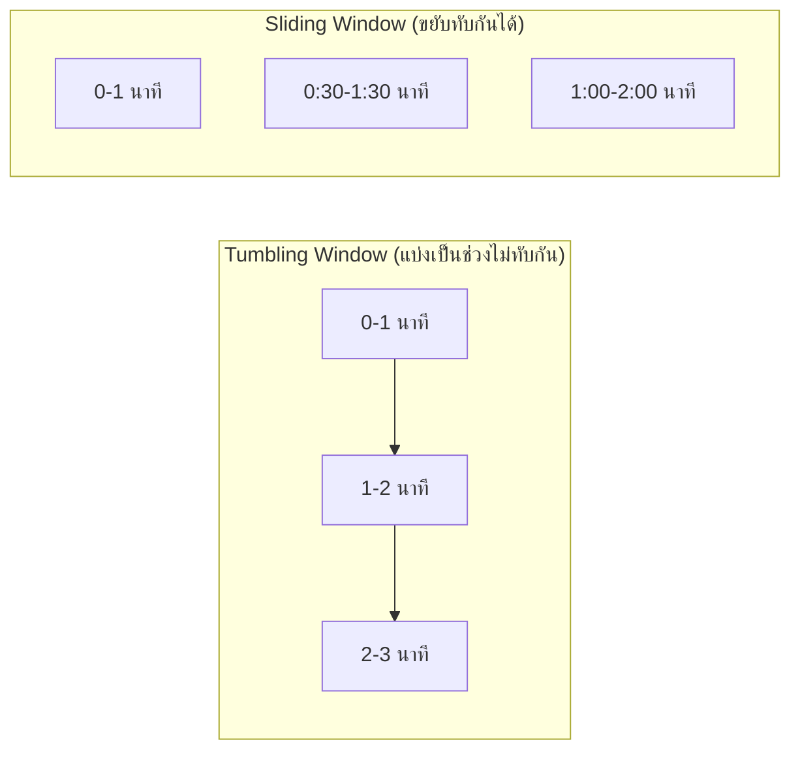

ลองนึกภาพสองวิธีตรวจคุณภาพน้ำในแม่น้ำ — วิธีแรกคือ**ตักน้ำมาเป็นถังทุกเที่ยง แล้ววิเคราะห์ทั้งถังทีเดียว** ได้ผลแม่นยำแต่รู้ผลช้า (กว่าจะวิเคราะห์เสร็จก็ผ่านไปหลายชั่วโมง) วิธีที่สองคือ**ติดเซนเซอร์วัดคุณภาพน้ำที่ไหลผ่านตลอดเวลา** รู้ผลทันทีที่น้ำไหลผ่าน ไม่ต้องรอตักเป็นถัง

Pub/Sub และ Message Queue (บทก่อนหน้า) พูดถึงการส่ง-รับข้อความทีละชิ้น — <mark class="hl-term">Stream Processing</mark> คือการเอา**การคำนวณต่อเนื่อง**มาทำกับข้อความที่ไหลผ่านตลอดเวลา (เหมือนเซนเซอร์วัดน้ำ) แทนที่จะรอเก็บเป็นก้อนใหญ่แล้วมาคำนวณทีเดียวแบบ<mark class="hl-term">Batch Processing</mark> (เหมือนตักน้ำเป็นถัง)

## Batch vs Stream

```demo
component: ComparisonDiagram
props: {"left":{"title":"Batch Processing (ตักน้ำเป็นถัง)","points":["รอสะสมข้อมูลเป็นก้อนก่อน (เช่น ข้อมูลทั้งวัน) แล้วคำนวณทีเดียว","ผลลัพธ์แม่นยำ ครบถ้วน แต่รู้ผลช้า (เป็นชั่วโมง/วัน)","เหมาะกับรายงานสรุป ที่ไม่ต้องรู้ผลทันที","ตัวอย่าง: สรุปยอดขายประจำวัน, ETL เข้า data warehouse ตอนกลางคืน"]},"right":{"title":"Stream Processing (เซนเซอร์วัดน้ำต่อเนื่อง)","points":["คำนวณทันทีที่ข้อมูลไหลผ่าน ไม่ต้องรอสะสม","รู้ผลเร็ว (วินาที/มิลลิวินาที) แต่ผลลัพธ์อาจต้องปรับแก้ทีหลังถ้าข้อมูลมาช้า","เหมาะกับงานที่ต้องรู้ผลสดๆ","ตัวอย่าง: นับ view สด, ตรวจจับ fraud แบบเรียลไทม์, dashboard เรียลไทม์"]},"note":"ระบบใหญ่มักมีทั้งคู่: stream สำหรับสิ่งที่ต้องรู้ผลทันที, batch สำหรับรายงานที่ต้องแม่นยำครบถ้วน"}
```

## Windowing — จะสรุปผลทุกๆ ช่วงไหน

ข้อมูลที่ไหลมาไม่มีวันสิ้นสุด (unbounded) — จะบอก "ยอด view ตอนนี้เท่าไหร่" ต้องกำหนด**กรอบเวลา**ก่อนว่าจะสรุปทุกกี่นาที ไม่ใช่รอให้ stream จบ (เพราะมันไม่จบ)



- <mark class="hl-term">Tumbling Window</mark> — แบ่งเวลาเป็นช่วงเท่าๆ กัน ไม่ทับกันเลย (เหมือนแบ่งกะทำงาน 8 โมง-เที่ยง, เที่ยง-4 โมง) แต้ละ event อยู่แค่ 1 window เท่านั้น เหมาะกับสรุปยอดต่อช่วง (เช่น "ยอดขายทุก 1 นาที")
- <mark class="hl-term">Sliding Window</mark> — window ขยับต่อเนื่องและทับกันได้ (เหมือน "เฉลี่ยย้อนหลัง 5 นาทีที่ผ่านมา" ที่อัปเดตทุกวินาที) เหมาะกับ moving average หรือ trend ที่ต้องเนียนต่อเนื่อง ไม่กระโดดเป็นขั้นบันไดแบบ tumbling

## ปัญหาที่ Stream Processing ต้องแก้: ข้อมูลมาไม่เรียงลำดับ

```demo
component: JourneyDiagram
props: {"nodes":[{"icon":"person","label":"Event เกิดจริง"},{"icon":"gate","label":"Network (ล่าช้าไม่เท่ากัน)"},{"icon":"building","label":"Stream Processor"}],"travelerIcon":"envelope","steps":[{"activeNode":0,"caption":"Event A เกิดก่อน Event B จริงๆ ในโลกจริง"},{"activeNode":1,"caption":"Event A เจอ network ช้ากว่า Event B มาถึง Stream Processor ก่อน — ลำดับที่มาถึงสลับกับลำดับที่เกิดจริง"},{"activeNode":2,"caption":"Stream Processor ต้องรอสักพัก (watermark) ก่อนปิด window เพื่อให้ event ที่มาช้ามีโอกาสมาถึงก่อนสรุปผล"}]}
```

<mark class="hl-warning">Event ที่เกิดขึ้นก่อนในโลกจริง อาจมาถึง stream processor ทีหลังก็ได้ (network ล่าช้าไม่เท่ากัน) ถ้าปิด window แล้วสรุปผลทันทีที่ครบเวลา อาจตัดข้อมูลที่มาช้าทิ้งไปโดยไม่ตั้งใจ</mark> ทางแก้คือใช้ <mark class="hl-term">Watermark</mark> — เผื่อเวลารอสักระยะก่อนปิด window จริง ให้ event ที่มาช้ามีโอกาสไล่ตามมาทันก่อนสรุปผลสุดท้าย (แลกกับความสด: รอนานขึ้น = ผลแม่นขึ้นแต่ช้าขึ้น)

## ขั้นสูง: Exactly-Once ทำได้จริงแค่ไหน และเครื่องมือที่ใช้จริง

Message Queue สอนไปแล้วว่าคิวส่วนใหญ่การันตีแค่ at-least-once (อาจส่งซ้ำได้) — <mark class="hl-warning">Stream Processing ที่ทำ stateful aggregation (เช่น นับยอดสะสม) ถ้า event เดิมถูกประมวลผลซ้ำโดยไม่ป้องกัน ยอดสะสมจะเพี้ยนไปเรื่อยๆ ยิ่งนานยิ่งคลาดเคลื่อนมากขึ้น ไม่ใช่แค่ผิดครั้งเดียวจบแบบ API ปกติ</mark> เพราะ state สะสมต่อเนื่องไปตลอด stream

เครื่องมือ stream processing สมัยใหม่ (Kafka Streams, Apache Flink) แก้ด้วย <mark class="hl-term">Exactly-Once Semantics</mark> ผ่านเทคนิคผสมกัน: เก็บ offset ที่ประมวลผลแล้วคู่กับผลลัพธ์ใน transaction เดียวกัน (atomic) และทำ **checkpoint** สถานะ (state) เป็นระยะ ถ้า worker ล่มกลางทาง กู้กลับมาจาก checkpoint ล่าสุดแทนที่จะเริ่มนับใหม่จากศูนย์หรือประมวลผลซ้ำจากจุดเดิม <mark class="hl-insight">"Exactly-once" ในทางปฏิบัติหมายถึง "ผลลัพธ์เหมือนกับถูกประมวลผลแค่ครั้งเดียว" ไม่ใช่การันตีว่า network จะไม่ส่งข้อมูลซ้ำเลย (ยังส่งซ้ำได้ตามปกติ) แค่ทำให้ผลลัพธ์สุดท้ายไม่เพี้ยนจากการซ้ำนั้น</mark>

> คำถามสัมภาษณ์: "ทำไม Stream Processing ใส่ใจเรื่อง exactly-once มากกว่า REST API ทั่วไป" — เพราะ REST API ส่วนใหญ่แต่ละ request แยกจากกันเป็นอิสระ (idempotency key แก้ที่จุดเดียวพอ) แต่ stream processing สะสม state ต่อเนื่องยาวนาน ถ้า event ซ้ำหลุดเข้าไปโดยไม่ป้องกัน ความเพี้ยนจะสะสมเพิ่มขึ้นเรื่อยๆ ตามเวลา ไม่ใช่ผิดแค่จุดเดียวแล้วจบ ต้องมี checkpoint + atomic offset commit เพื่อกู้สถานะได้แม่นยำหลัง worker ล่ม
