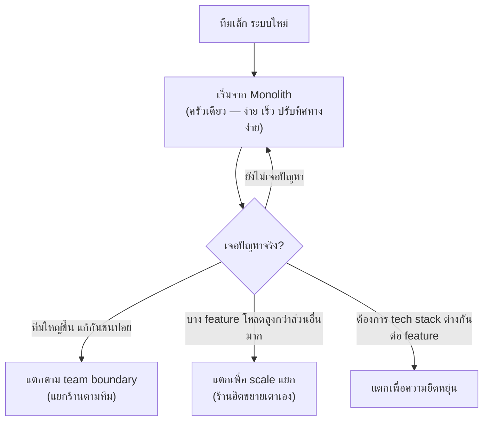

ลองนึกภาพสองรูปแบบร้านอาหาร — แบบแรกคือ**ครัวเดียวทำทุกอย่าง** ตั้งแต่ก๋วยเตี๋ยว ส้มตำ ไปจนถึงของหวาน แม่ครัวคนเดียวหรือทีมเดียวรับผิดชอบทั้งหมด แบบที่สองคือ**ฟู้ดคอร์ท** ที่แต่ละร้านทำเมนูเฉพาะทางของตัวเอง ร้านก๋วยเตี๋ยวก็มีทีมของตัวเอง ร้านส้มตำก็มีทีมของตัวเอง แยกกันทำงานอิสระ แต่รวมกันอยู่ในห้างเดียวกัน

ทุกอย่างที่เรียนมา (load balancer, cache, database, queue) ใช้ได้ทั้งกับระบบที่เป็น**ครัวเดียว** (Monolith) และระบบที่**แตกเป็นฟู้ดคอร์ท** (Microservices) — คำถามคือควรแตกเมื่อไหร่ และแตกแล้วได้อะไร เสียอะไร

```demo
component: ComparisonDiagram
props: {"left":{"title":"Monolith (ครัวเดียวทำทุกอย่าง)","points":["โค้ดทั้งหมดอยู่ codebase เดียว deploy พร้อมกัน","เรียกฟังก์ชันกันตรงๆ ในโปรเซสเดียว เร็ว ไม่มี network call","ง่ายต่อการเริ่มต้น, debug, test ข้าม module","scale ได้แค่ทั้งก้อน แม้ต้องการ scale แค่ส่วนเดียว"]},"right":{"title":"Microservices (ฟู้ดคอร์ท แยกร้าน)","points":["แต่ละ service แยก codebase, deploy อิสระ","เรียกกันผ่าน network (REST/gRPC) มี latency เพิ่ม","scale แต่ละ service ตามโหลดจริงของมันได้","ทีมแยกกันดูแลแต่ละ service ได้ขนานกัน แต่ operation ซับซ้อนขึ้นมาก"]},"note":"ไม่มีใครแนะนำให้เปิดฟู้ดคอร์ทตั้งแต่วันแรก — ร้านส่วนใหญ่เริ่มจากครัวเดียวก่อน แล้วค่อยแตกทีหลังตามจุดที่เจ็บจริง"}
```

## เมื่อไหร่ควรแตกเป็นฟู้ดคอร์ท



สัญญาณที่บอกว่าถึงเวลาแตกจริงๆ: **deploy ช้าลงเรื่อยๆ** (ทีมรอคิว deploy กัน เหมือนครัวคับแคบจนทีมเดินชนกัน), **เปลี่ยนโค้ดจุดหนึ่งกระทบจุดอื่นโดยไม่คาดคิด** (แก้สูตรก๋วยเตี๋ยวแล้วส้มตำพลอยเสียรสไปด้วย), หรือ**บาง feature ต้องการ scale ที่ต่างจากส่วนอื่นมาก** (ร้านหนึ่งคนต่อคิวยาวมาก ในขณะที่ร้านอื่นโล่ง)

```demo
component: JourneyDiagram
props: {"nodes":[{"icon":"person","label":"Client"},{"icon":"building","label":"Order"},{"icon":"building","label":"Payment"},{"icon":"building","label":"Inventory"}],"travelerIcon":"envelope","steps":[{"activeNode":1,"caption":"Client สั่งซื้อ — Order Service รับเรื่อง (เหมือนร้านแรกในฟู้ดคอร์ท)"},{"activeNode":2,"caption":"Order เรียกไปหา Payment Service ผ่าน network — เดินข้ามร้าน มี latency เพิ่มขึ้น"},{"activeNode":3,"caption":"เรียกต่อไปหา Inventory Service เพื่อเช็ค/หักสต๊อก — อีกหนึ่ง network hop"},{"activeNode":0,"caption":"รวมผลลัพธ์ทั้งหมด ส่งกลับ Client — งานเดียวที่ monolith ทำในโปรเซสเดียว ตอนนี้ต้องเดินข้าม 3 ร้าน"}]}
```

## ต้นทุนที่มองไม่เห็นทันที

แตกเป็นฟู้ดคอร์ทแล้วเรื่องที่เคยฟรี (เดินคุยกันในครัวเดียวกัน) กลายเป็นต้องจ่ายทุกครั้ง: ต้องเดินไปมาระหว่างร้าน (network latency), จัดการเวลาร้านหนึ่งขายหมดแต่อีกร้านยังขายอยู่ (partial failure), ทำบัญชีรวมข้ามหลายร้านยากกว่าบัญชีเดียว (distributed transaction), และ**ต้องดูแลหลายร้านพร้อมกัน** (operational overhead) — สิ่งเหล่านี้คือเหตุผลที่ทีมเล็กมักเจ็บตัวถ้ารีบเปิดฟู้ดคอร์ทเร็วเกินไปทั้งที่ยังไม่มีลูกค้าพอจะเลี้ยงหลายร้าน
