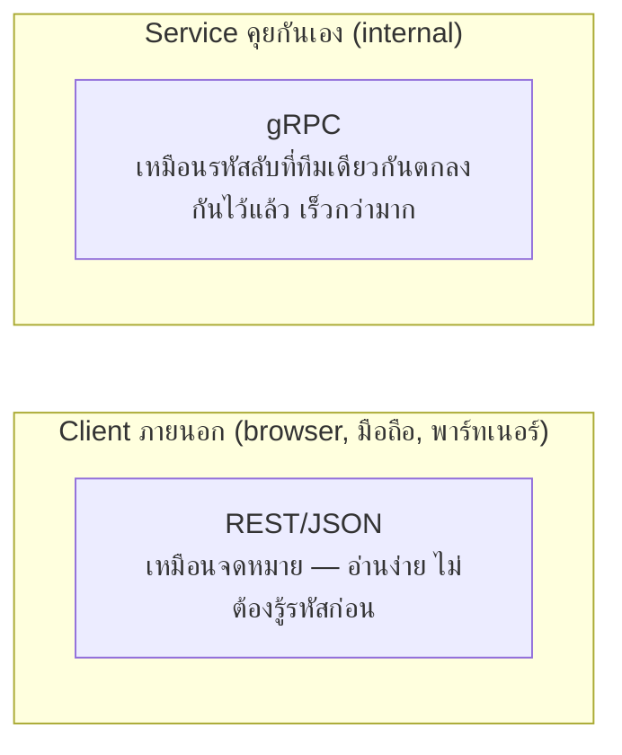

ลองนึกภาพสองวิธีสื่อสาร — วิธีแรกคือ**เขียนจดหมายเต็มรูปแบบ** อ่านง่าย ใครก็เข้าใจได้ทันทีแม้ไม่เคยรู้จักกันมาก่อน แต่ก็ยาวและกินเวลาเขียน/อ่านมากกว่า วิธีที่สองคือ**รหัสลับที่สองฝ่ายตกลงกันไว้ล่วงหน้า** เช่น "A=ไปประชุม, B=ยกเลิกนัด" สั้น กระชับ ส่งเร็วมาก แต่ต้องรู้รหัสก่อนถึงจะเข้าใจ ถ้าใครไม่รู้รหัสก็อ่านไม่ออกเลย

พอแตกเป็นฟู้ดคอร์ท (microservices, บทที่แล้ว) แต่ละร้านต้องคุยกันผ่าน "ทางเดินกลาง" (network) — สองมาตรฐานหลักที่ใช้กำหนด "จะคุยกันด้วยรูปแบบไหน" คือ **REST** (เหมือนจดหมายเต็มรูปแบบ) กับ **gRPC** (เหมือนรหัสลับที่ตกลงกันไว้ก่อน)

```demo
component: ComparisonDiagram
props: {"left":{"title":"REST (เหมือนจดหมายเต็มรูปแบบ)","points":["ใช้ HTTP verb ปกติ (GET/POST/PUT/DELETE)","payload เป็น JSON อ่านง่าย, debug ง่าย (เห็นด้วยตาเปล่า)","เครื่องมือ/library รองรับกว้างขวางมาก","เหมาะกับ: public API, API ที่ client ภายนอกเรียก"]},"right":{"title":"gRPC (เหมือนรหัสลับตกลงล่วงหน้า)","points":["กำหนด schema ล่วงหน้าด้วย Protocol Buffers","payload เป็น binary เล็กกว่า JSON, เร็วกว่ามาก","รองรับ streaming (client/server/bidirectional) ในตัว","เหมาะกับ: การสื่อสารระหว่าง service ภายในองค์กรเอง"]},"note":"REST เน้นความเข้ากันได้กว้าง/อ่านง่าย (ใครก็อ่านจดหมายออก), gRPC เน้นความเร็ว/ประสิทธิภาพ (แต่ต้องรู้รหัสก่อน)"}
```

## ตัวอย่างที่ส่งจริง

REST (จดหมาย/JSON) อ่านง่ายด้วยตาเปล่า:
```
POST /users
{ "name": "Alice", "email": "alice@example.com" }
```

gRPC (รหัสลับ) ต้องตกลง "พจนานุกรมรหัส" กันไว้ล่วงหน้าผ่าน `.proto` file:
```
message CreateUserRequest {
  string name = 1;
  string email = 2;
}
```
แล้ว compile เป็น binary format ที่เล็กกว่า JSON มาก (ไม่ต้องเขียนชื่อ field ซ้ำๆ ทุกครั้งแบบ JSON) — เร็วกว่าทั้งฝั่งส่งและฝั่งแปลงกลับ

## ทำไมถึงเลือกต่างกันตามบริบท



Public API ที่ third-party ต้องเรียกใช้ REST เหมาะกว่าเพราะเข้าถึงง่าย เหมือนเขียนจดหมายที่ใครก็อ่านออก ไม่ต้องมานั่งเรียนรหัสก่อน — แต่การสื่อสารภายในระหว่าง service ที่ทีมเดียวกันคุมทั้งสองฝั่ง (รู้รหัสลับตรงกันอยู่แล้ว) gRPC ให้ performance ที่ดีกว่าชัดเจน โดยเฉพาะเมื่อ traffic ภายในมีปริมาณสูงมาก (ทุกข้อความประหยัดเวลานิดหน่อย คูณด้วยจำนวนครั้งมหาศาล = ผลต่างใหญ่)
