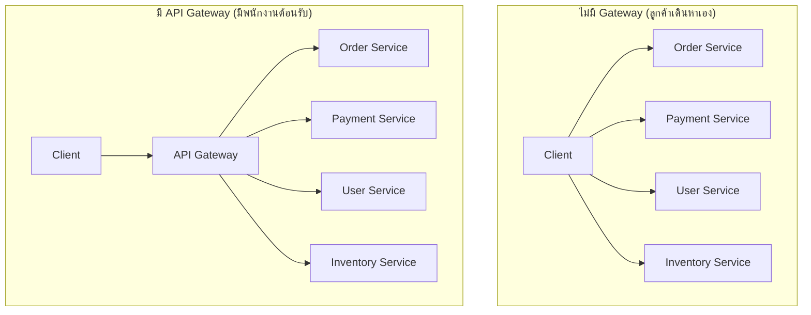
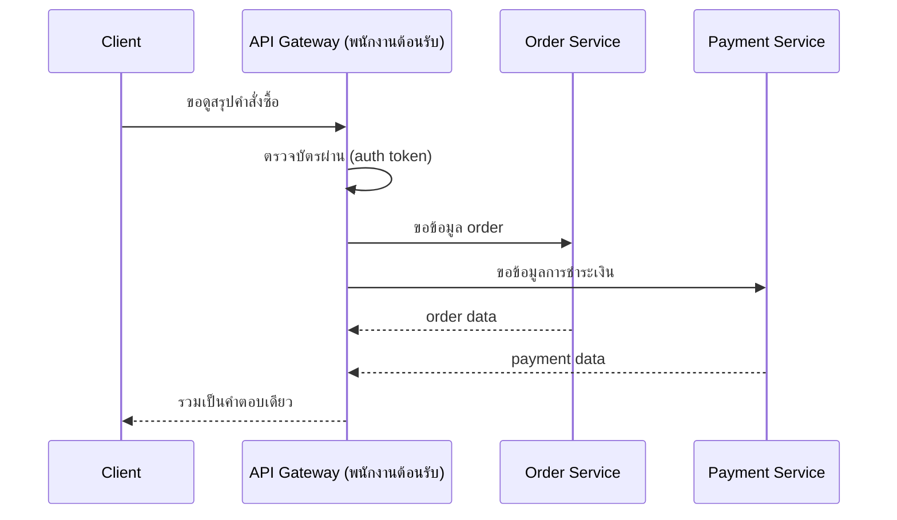

ลองนึกภาพห้างสรรพสินค้าใหญ่ที่มีหลายร้าน (ฟู้ดคอร์ท, ร้านเสื้อผ้า, ร้านหนังสือ) — ถ้าลูกค้าต้องรู้เองว่าแต่ละร้านอยู่ชั้นไหน ประตูไหน จะวุ่นวายมาก ห้างส่วนใหญ่เลยมี**พนักงานต้อนรับหน้าห้าง**คอยตอบคำถามลูกค้าว่า "ร้านหนังสืออยู่ชั้น 3 ครับ" หรือแม้แต่เดินพาไปส่งเลย ลูกค้าไม่ต้องรู้ผังห้างทั้งหมดเอง แค่ถามพนักงานต้อนรับจุดเดียวก็พอ

มี microservices หลายตัว (order, payment, user, inventory — เหมือนหลายร้านในห้าง) — ถ้าให้ client ภายนอกรู้จัก**ทุก service แยกกัน**ต้องยิง request ไปหลาย URL, จัดการ auth เองทุกที่, ปัญหาจะยุ่งเหยิงเร็วมาก <mark class="hl-term">API Gateway</mark> คือพนักงานต้อนรับหน้าห้างของระบบซอฟต์แวร์ — ประตูเดียวที่ client คุยด้วย

## ก่อนกับหลังมี Gateway



<mark class="hl-insight">Client เห็นแค่ประตูเดียว (Gateway) ไม่ต้องรู้ว่าเบื้องหลังมีกี่ร้าน หรือร้านไหนอยู่ชั้นไหน</mark> — คล้าย Load Balancer ในบทต้นๆ แต่คราวนี้ชี้ทางตาม**เนื้อหาที่ถาม** (ถามหาอะไร ไม่ใช่แค่กระจายโหลดเฉยๆ)

```demo
component: JourneyDiagram
props: {"nodes":[{"icon":"person","label":"Client"},{"icon":"building","label":"API Gateway"},{"icon":"building","label":"Order/Payment/User"}],"travelerIcon":"envelope","steps":[{"activeNode":1,"caption":"Client ยิง request มาที่ Gateway จุดเดียว — ไม่ต้องรู้จักแต่ละ service เอง"},{"activeNode":1,"caption":"Gateway ตรวจ token (auth) ครั้งเดียวที่นี่ ไม่ต้องให้ทุก service ตรวจซ้ำ"},{"activeNode":2,"caption":"Gateway กระจาย request ไปหลาย service ที่เกี่ยวข้อง"},{"activeNode":0,"caption":"รวมผลลัพธ์จากทุก service เป็นคำตอบเดียว ส่งกลับ Client"}]}
```

## หน้าที่ที่พนักงานต้อนรับ (Gateway) มักทำให้

```demo
component: StepThroughDiagram
props: {"steps":[{"label":"1. ชี้ทางไปร้านที่ถูก (Routing)","detail":"`/orders/*` ไปหา Order Service, `/users/*` ไปหา User Service — client ยิงมาที่ Gateway เส้นเดียว ไม่ต้องรู้ path จริงของแต่ละ service"},{"label":"2. ตรวจบัตรผ่านที่ประตูเดียว (Authentication รวมศูนย์)","detail":"ตรวจ token ที่ Gateway ครั้งเดียว ไม่ต้องให้ทุกร้านตรวจซ้ำเอง — ลด logic ซ้ำซ้อนกระจายอยู่ทุก service"},{"label":"3. จำกัดจำนวนคนเข้าห้าง (Rate Limiting)","detail":"จำกัดจำนวน request ต่อ client ที่จุดเดียว แทนที่จะให้ทุก service ทำ rate limit ของตัวเอง (เชื่อมกับโมดูล Reliability)"},{"label":"4. รวบรวมของจากหลายร้านมาให้ในถุงเดียว (Aggregation)","detail":"รวมผลลัพธ์จากหลาย service เป็น response เดียวให้ client เช่น หน้า dashboard ที่ต้องข้อมูลจาก 3 service พร้อมกัน"},{"label":"5. จดบันทึกคนเข้าออกที่ประตูเดียว (Logging/Monitoring รวมศูนย์)","detail":"เห็น traffic ทั้งหมดที่จุดเดียว ง่ายต่อการ debug และวิเคราะห์ ไม่ต้องไล่เปิด log ทีละ service"}]}
```



> ข้อควรระวัง: <mark class="hl-warning">Gateway กลายเป็นจุดเดียวที่ทุกคนต้องผ่านเหมือน Load Balancer เดี่ยวในบทต้น</mark> — ต้องมีพนักงานต้อนรับมากกว่า 1 คนเสมอ (เชื่อมกับโมดูล Reliability เรื่อง redundancy)
