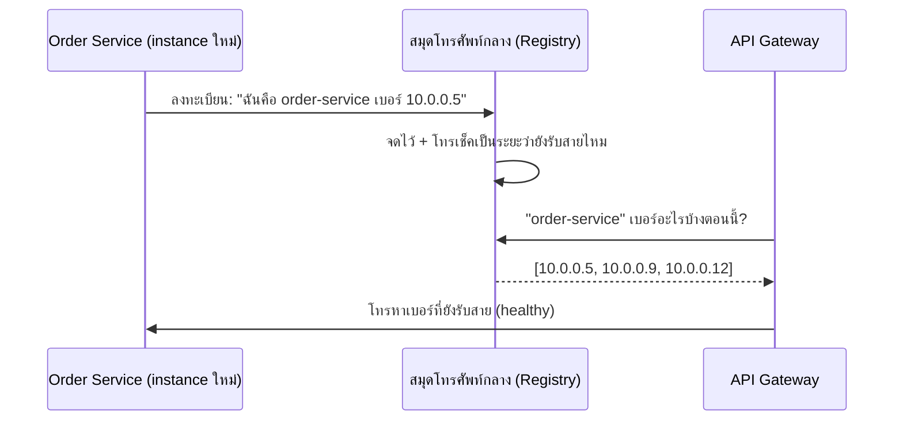

ลองนึกภาพออฟฟิศที่พนักงานย้ายที่นั่งบ่อยมาก — ถ้าคุณจำเบอร์โทรภายในของเพื่อนร่วมงานไว้ในหัว พอเขาย้ายแผนกหรือลาออก เบอร์นั้นก็ใช้ไม่ได้อีกต่อไป วิธีที่ออฟฟิศทำงานจริงคือมี**สมุดโทรศัพท์กลางที่อัปเดตตลอดเวลา** อยากติดต่อใครก็เปิดสมุดเช็คเบอร์ล่าสุดก่อนโทร ไม่ต้องจำเองให้เสี่ยงโทรผิด

Gateway (บทที่แล้ว) ต้องรู้ว่า "Order Service ตอนนี้อยู่ที่ IP ไหน" — แต่ใน microservices ที่ scale out/in ตลอดเวลา (container ถูกสร้าง/ทำลายเป็นระยะ เหมือนพนักงานย้ายที่นั่งตลอด) <mark class="hl-warning">IP ของแต่ละ instance เปลี่ยนตลอดเวลา จะจำ (hardcode) IP ไว้ไม่ได้เลย</mark> <mark class="hl-term">Service Discovery</mark> คือสมุดโทรศัพท์กลางที่แก้ปัญหานี้

## ปัญหา: IP ไม่คงที่


## สมุดโทรศัพท์กลาง (Service Registry)



ทุก instance ที่เปิดขึ้นมาใหม่จะ**ลงทะเบียนตัวเอง**กับสมุดกลาง (เช่น Consul, etcd, หรือ Kubernetes DNS ในตัว) พร้อมส่ง "สัญญาณว่ายังอยู่" (heartbeat) เป็นระยะเพื่อบอกว่ายัง healthy — ถ้า instance ตายและหยุดส่งสัญญาณ สมุดกลางจะลบเบอร์นั้นออกจากรายชื่ออัตโนมัติ เหมือนลบเบอร์พนักงานที่ลาออกไปแล้ว

```demo
component: JourneyDiagram
props: {"nodes":[{"icon":"building","label":"Instance ใหม่"},{"icon":"notebook","label":"Registry"},{"icon":"building","label":"Gateway"}],"travelerIcon":"envelope","steps":[{"activeNode":0,"caption":"Instance ใหม่บูตขึ้นมา ได้ IP ใหม่"},{"activeNode":1,"caption":"ลงทะเบียนตัวเองกับ Registry (สมุดโทรศัพท์กลาง) พร้อมส่ง heartbeat เป็นระยะ"},{"activeNode":2,"caption":"Gateway ถาม Registry ว่า instance ไหนยัง healthy อยู่บ้างตอนนี้"},{"activeNode":0,"caption":"Gateway โทรหา instance ที่ Registry ยืนยันว่ายังรับสายอยู่"}]}
```

ลองไล่ทีละ step ของ instance หนึ่งตัวตั้งแต่เกิดจนตาย:

```demo
component: StepThroughDiagram
props: {"steps":[{"label":"1. Instance ใหม่บูตขึ้นมา","detail":"container/VM ใหม่เริ่มทำงาน ได้ IP ใหม่ (เช่น 10.0.0.9) — ตอนนี้ยังไม่มีใครในระบบรู้จักมันเลย"},{"label":"2. ลงทะเบียนกับ Registry","detail":"instance บอก Registry ว่า 'ฉันคือ order-service เบอร์ 10.0.0.9' — เหมือนพนักงานใหม่โทรแจ้งเบอร์ตัวเองให้สมุดกลางบันทึกไว้"},{"label":"3. ส่ง heartbeat เป็นระยะ","detail":"ทุก 2-5 วินาที instance ส่งสัญญาณบอก Registry ว่า 'ฉันยังอยู่นะ' — ถ้าหยุดส่งเกินเวลาที่กำหนด Registry จะถือว่า instance นี้ตายแล้ว"},{"label":"4. Gateway/Client มา query","detail":"Gateway ถาม Registry ว่า 'order-service ตอนนี้มีเบอร์อะไรบ้าง' ได้ list ของ instance ที่ยัง healthy กลับมา แล้วเลือกโทรหาตัวใดตัวหนึ่ง"},{"label":"5. Instance ตาย → ถูกลบออกอัตโนมัติ","detail":"instance ถูก scale-in ลงหรือ crash หยุดส่ง heartbeat — Registry รอจนครบเวลา timeout แล้วลบเบอร์นั้นออกจากรายชื่อ ไม่ต้องมีใครมาลบมือ"}]}
```

## เช็คสมุดเองทุกครั้ง vs ให้คนอื่นเช็คให้

- **Server-side discovery** — client/gateway เปิดสมุดกลางเช็คทุกครั้งที่ต้องโทร (แบบตัวอย่างบน) ง่ายกว่าฝั่ง client แต่สมุดกลางต้องรับคนมาเปิดดูเยอะ
- **Client-side discovery** — แต่ละ client ขอสำเนารายชื่อทั้งหมดมาเก็บเอง แล้วเลือกเองว่าจะโทรหาใคร (มักผสมกับ load balancing algorithm ฝั่ง client เลย) ลด load ที่สมุดกลาง แต่ client ต้องฉลาดขึ้น

> เชื่อมกับโมดูล Scalability: <mark class="hl-insight">Service Discovery คือ "Load Balancer เวอร์ชันที่รู้จักเฉพาะ service ภายใน ที่จำนวน instance เปลี่ยนตลอดเวลา"</mark> ต่างจาก Load Balancer หน้าระบบที่มักจำนวน server ค่อนข้างคงที่กว่า
