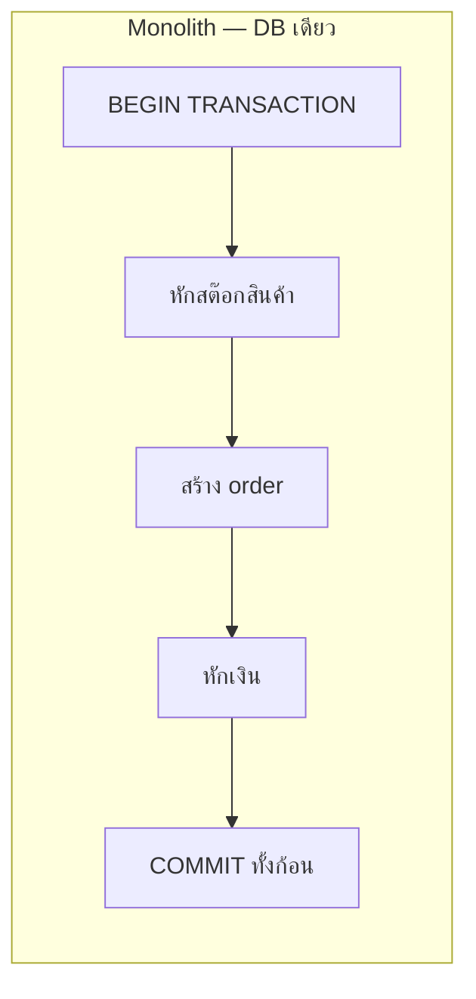
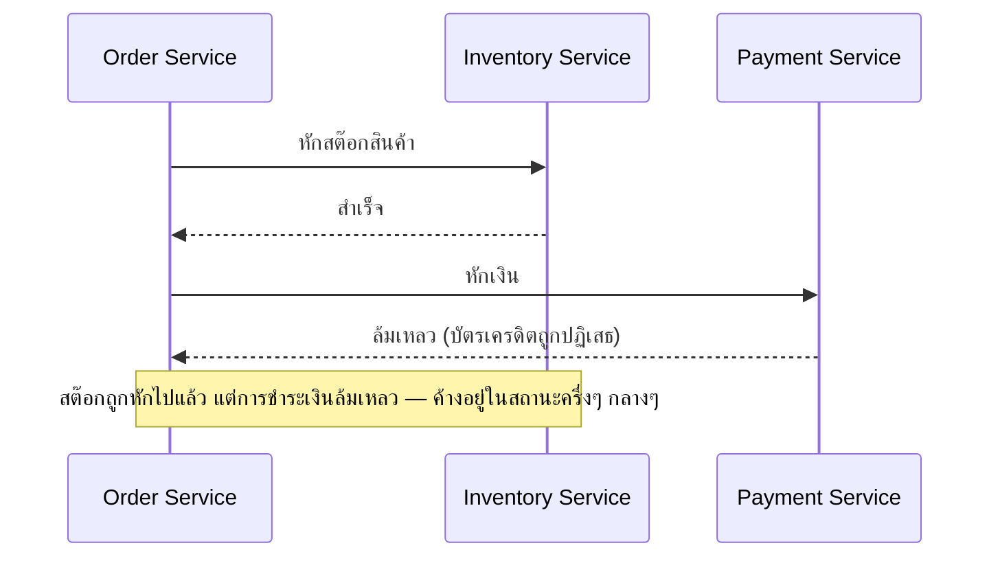

ลองนึกภาพจองทริปเที่ยวที่ต้องจอง 3 อย่างพร้อมกัน: ตั๋วเครื่องบิน, โรงแรม, รถเช่า — ถ้าจองตั๋วเครื่องบินสำเร็จ จองโรงแรมสำเร็จ แต่**รถเช่าเต็มจองไม่ได้** จะทำยังไง จะปล่อยทริปครึ่งๆ กลางๆ ไว้แบบนั้นไม่ได้ ต้อง**ยกเลิกตั๋วเครื่องบินกับโรงแรมที่จองไปแล้วด้วย** ถึงจะกลับสู่สถานะที่ถูกต้อง (ไม่มีอะไรค้างครึ่งๆ กลางๆ)

## ทำไม Database ธรรมดาแก้ปัญหานี้ไม่ได้อีกต่อไป

Database เดี่ยว (module ก่อนๆ) มี **transaction** ที่ทำให้หลายคำสั่งเป็น**ก้อนเดียวกัน** — `BEGIN`, ทำหลายคำสั่ง, ถ้าทุกอย่างสำเร็จค่อย `COMMIT`, ถ้ามีจุดไหนพังก็ `ROLLBACK` ย้อนกลับหมดอัตโนมัติ เหมือนเซ็นสัญญาฉบับเดียวที่มีหลายข้อ — ถ้าข้อไหนมีปัญหา ฉีกทิ้งทั้งฉบับ ไม่มีข้อไหนมีผลเลย



แต่พอแตกเป็น microservices (module ก่อนหน้า) แต่ละ service มี **database ของตัวเอง** — Order Service, Payment Service, Inventory Service คนละ database กันคนละเครื่องกัน <mark class="hl-warning">ไม่มี transaction เดียวที่ครอบคลุมทั้ง 3 database ได้อีกแล้ว</mark> เหมือนแยกไปเซ็นสัญญาคนละฉบับกับคนละบริษัท จะฉีกสัญญาทั้งหมดพร้อมกันด้วยการกระทำเดียวไม่ได้อีกต่อไป



## Saga Pattern — ทำทีละขั้น พร้อมแผนยกเลิกสำรอง

<mark class="hl-term">Saga</mark> คือชุดของ local transaction เล็กๆ ต่อกันเป็นทอด แต่ละขั้นมี**แผนยกเลิก (compensating transaction)** เตรียมไว้เผื่อขั้นถัดไปล้มเหลว — ถ้าขั้นไหนพัง ให้ไล่ยกเลิกขั้นก่อนหน้าย้อนกลับตามลำดับ (จองรถเช่าไม่ได้ → ยกเลิกโรงแรม → ยกเลิกตั๋วเครื่องบิน) แทนที่จะมี transaction เดียวครอบคลุมทั้งหมด

```demo
component: SagaCompensationDemo
caption: กด "เริ่ม Saga ใหม่" — บางครั้งจะสุ่มเจอ step ล้มเหลว แล้วดู compensate ย้อนกลับตามลำดับ
```

สังเกตว่าไม่มีขั้นตอนไหน "รอ" ให้ทุกอย่างพร้อมพร้อมกันแบบ transaction เดิม — แต่ละขั้น**ทำจริงและ commit จริงทันที** (จองตั๋วเครื่องบินจริง ไม่ใช่แค่ "เตรียมจอง") ถ้าขั้นหลังพัง ค่อยยิง compensating action ย้อนกลับ (ยกเลิกจริง ไม่ใช่ rollback แบบ database transaction เดิม)

## Choreography vs Orchestration — ใครเป็นคนสั่ง

- **Choreography (ต่างคนต่างฟัง event)** — แต่ละ service ประกาศ event ของตัวเอง (`InventoryReserved`, `PaymentFailed`) แล้ว service อื่นที่เกี่ยวข้อง**ฟังเองและตัดสินใจเอง**ว่าต้องทำอะไรต่อ (ใช้ Pub/Sub จากโมดูล Async & Messaging) — ไม่มีใครเป็นศูนย์กลาง แต่ยิ่ง saga มีหลายขั้นตอน ยิ่งตามรอย logic ยากขึ้นเรื่อยๆ (ไม่มีที่เดียวที่เห็นภาพรวมทั้งหมด)
- **Orchestration (มีคนสั่งกลาง)** — มี **Saga Orchestrator** service ตัวเดียวที่รู้ทั้งลำดับขั้นตอนและแผนยกเลิก คอยเรียกแต่ละ service ทีละขั้นตรงๆ (คล้าย API Gateway ที่เป็นจุดศูนย์กลาง) เห็น logic ทั้ง saga อยู่ที่เดียว debug ง่ายกว่า แต่ orchestrator เองต้องออกแบบให้ทนพัง (เชื่อมกับ Failover) เพราะกลายเป็นจุดสำคัญของทั้ง saga

> คำถามสัมภาษณ์: "ทำไมไม่ใช้ 2-Phase Commit (2PC) แก้ปัญหานี้แทน Saga" — 2PC คือวิธีดั้งเดิมที่พยายามทำให้หลาย database "โหวต" พร้อมกันก่อน commit จริง แต่ต้อง**ล็อก resource ทุก database ค้างไว้จนกว่าทุกฝ่ายจะโหวตเสร็จ** (เหมือนทุกคู่สัญญาต้องนั่งรอเซ็นพร้อมกันห้ามใครขยับ) ซึ่งช้าและเสี่ยง deadlock มากในระบบที่ service กระจายอยู่คนละเครื่องคนละ network — <mark class="hl-insight">Saga ยอมแลก "ไม่ atomic ทันที" (มีช่วงเวลาสั้นๆ ที่ข้อมูลไม่ตรงกัน) เพื่อแลกกับความเร็วและไม่ต้องล็อกอะไรค้างไว้เลย</mark> เหมาะกับ microservices ที่ scale จริงมากกว่า
