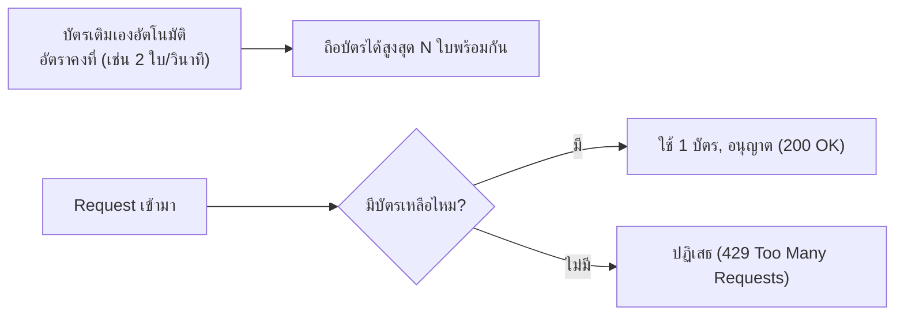

ลองนึกภาพสวนสนุกที่แจกบัตรเล่นเครื่องเล่นฟรีวันละ 8 ใบต่อคน — ใช้ครบ 8 ใบแล้ว ต้องรอถึงวันถัดไปถึงจะได้บัตรใหม่มาเติม ไม่ใช่ว่าจะเล่นกี่รอบก็ได้ไม่จำกัด กฎนี้ป้องกันไม่ให้คนกลุ่มเดียวยึดเครื่องเล่นทั้งวันจนคนอื่นไม่ได้เล่นเลย

ถ้า client ตัวหนึ่ง (ตั้งใจหรือบั๊กก็ตาม) ยิง request รัวๆ ไม่หยุด อาจทำให้ระบบล่มไปกระทบ user คนอื่นทั้งหมด <mark class="hl-term">Rate Limiting</mark> คือกฎ "แจกบัตรวันละ 8 ใบ" ของระบบซอฟต์แวร์ — จำกัดจำนวน request ที่รับได้ต่อช่วงเวลา

ลองเล่น demo: กด burst 8 requests ดูบัตรหมดแล้ว request ถัดไปโดนปฏิเสธ (429) จนกว่าบัตรจะเติมกลับ

```demo
component: RateLimiterDemo
```

## Token Bucket — บัตรที่เติมเองอัตโนมัติ



แนวคิด: บัตรเติมด้วยอัตราคงที่ ทุก request ที่เข้ามาต้อง "จ่าย" 1 บัตร ถ้าบัตรหมด request ถูกปฏิเสธทันที — จุดเด่นคือ<mark class="hl-insight">รองรับการเล่นรัวๆ ได้ในระดับหนึ่ง (ถ้าบัตรเต็มพอดี เล่นรัวๆ ได้จำนวนหนึ่งก่อนโดนบล็อก)</mark> ต่างจากการจำกัดแบบ "เล่นได้ N ครั้งต่อวินาทีตายตัว" ที่ไม่ยืดหยุ่นเลย

## ทำไม Rate Limiting ต้องอยู่หน้าสุด

Rate Limiter มักอยู่ที่ **API Gateway** (module ที่แล้ว) หรือ Load Balancer เพื่อเช็คบัตรก่อนปล่อยเข้าไปใช้เครื่องเล่นจริงข้างใน — ถ้าปล่อยให้คนเข้าไปถึงเครื่องเล่น (database) ก่อนค่อยเช็คบัตร ระบบก็ยังเปลืองทรัพยากรจัดการคนเหล่านั้นอยู่ดี

## ระดับการจำกัดที่พบบ่อย

- **Per-user (แจกบัตรตามรายคน)** — จำกัดตาม user/API key ป้องกัน user คนเดียวยึดเครื่องเล่นทั้งวัน
- **Per-IP (แจกบัตรตามที่มาของกลุ่ม)** — จำกัดตาม IP address ป้องกันการโจมตีจาก IP เดียว แม้ไม่มี auth
- **Global (จำกัดรวมทั้งสวนสนุก)** — จำกัดรวมทั้งระบบ ป้องกันระบบ downstream (เช่น database) ถูกยิงเกินกำลังรวม

> คำถามสัมภาษณ์: "ทำไมไม่จำกัดแค่ N request/วินาทีตรงๆ (fixed window)" — เพราะมีปัญหา <mark class="hl-term">boundary spike</mark>: <mark class="hl-warning">ถ้าจำกัด 100/วินาที คนสามารถยิง 100 request ตอนปลายวินาทีที่ 1 แล้วยิงอีก 100 ตอนต้นวินาทีที่ 2 ทันที รวมเป็น 200 request ใน 1 วินาทีจริงๆ (คร่อมขอบ window)</mark> — token bucket (บัตรเติมต่อเนื่อง) ลดปัญหานี้ได้ดีกว่า
