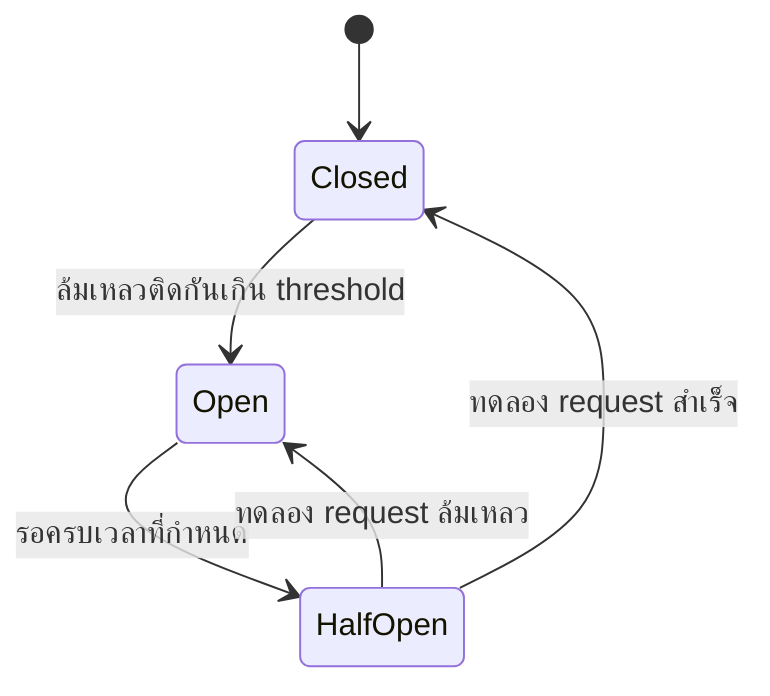

ลองนึกภาพเบรกเกอร์ไฟฟ้าที่บ้าน — ถ้าเครื่องใช้ไฟฟ้าตัวหนึ่งไฟช็อต เบรกเกอร์จะ**ตัดไฟทันที**ป้องกันไฟไหม้บ้าน แทนที่จะปล่อยให้กระแสไฟฟ้าไหลต่อไปเรื่อยๆ จนเกิดความเสียหายลุกลาม เบรกเกอร์ไม่ได้รอดูว่า "ลองอีกทีเผื่อหาย" มันตัดทันทีที่เห็นสัญญาณผิดปกติ

Service A เรียก Service B แต่ Service B ล่ม/ช้ามาก — ถ้า Service A ยังพยายามเรียกต่อไปเรื่อยๆ (แต่ละครั้งรอ timeout นาน) Service A เองก็จะช้าตามไปด้วย และอาจ**ลามไปกระทบ service อื่น**ที่เรียก Service A อยู่ **Circuit Breaker** ทำหน้าที่เหมือนเบรกเกอร์ไฟฟ้า — ตัดการเรียกทันทีที่เห็นสัญญาณผิดปกติถี่เกินไป

ลองกดล้มเหลวติดกันหลายครั้งดู breaker "เปิด" (ตัดไฟ) แล้วเริ่มปฏิเสธทันทีโดยไม่เรียก downstream จริง

```demo
component: CircuitBreakerDemo
```

## สามสถานะ — เหมือนเบรกเกอร์จริง



- **Closed (เบรกเกอร์ปกติ ไฟไหลผ่าน)** — สถานะปกติ ปล่อยให้ request ผ่านไปเรียก downstream จริง พร้อมนับจำนวนล้มเหลว
- **Open (เบรกเกอร์ตัดไฟ)** — ล้มเหลวเกิน threshold แล้ว **ปฏิเสธทันทีทุก request** (fail fast) ไม่เรียก downstream เลย ให้เวลามันฟื้นตัว เหมือนตัดไฟทิ้งไว้ก่อนจนกว่าจะเช็คว่าปลอดภัย
- **Half-Open (ลองเปิดไฟดูอีกครั้ง)** — ครบเวลาที่ตั้งไว้แล้ว ลองปล่อย request **1 ตัว**ผ่านไปทดสอบ เหมือนลองเปิดสวิตช์ดูว่าไฟยังช็อตอยู่ไหม — ถ้าสำเร็จกลับไป Closed (ไฟใช้ได้ปกติ) ถ้าล้มเหลวกลับไป Open ใหม่ (ยังช็อตอยู่ ตัดไฟต่อ)

## ทำไมต้อง "ตัดไฟทันที" แทนที่จะรอ

ถ้าไม่มี circuit breaker: request ที่เรียก downstream ที่ล่มอยู่ ต้อง**รอจน timeout** (อาจ 30 วินาที) ก่อนจะรู้ว่าล้มเหลว — เหมือนปล่อยให้กระแสไฟไหลต่อไปเรื่อยๆ ทั้งที่รู้ว่าผิดปกติ ถ้ามี 1,000 request/วินาทีเรียกไปที่เดียวกัน ทั้งหมดจะไปค้างรอพร้อมกัน กิน thread/connection ของ service ต้นทางจนหมด (**thread pool exhaustion**) ทำให้ service ต้นทางล่มตามไปด้วยทั้งที่ปัญหาจริงอยู่ที่ downstream คนเดียว circuit breaker ตัดวงจรไว้ก่อน ทำให้ request ล้มเหลวทันที (millisecond) แทนที่จะรอนาน ป้องกันไฟไหม้ลามไปทั้งบ้านได้จริง
