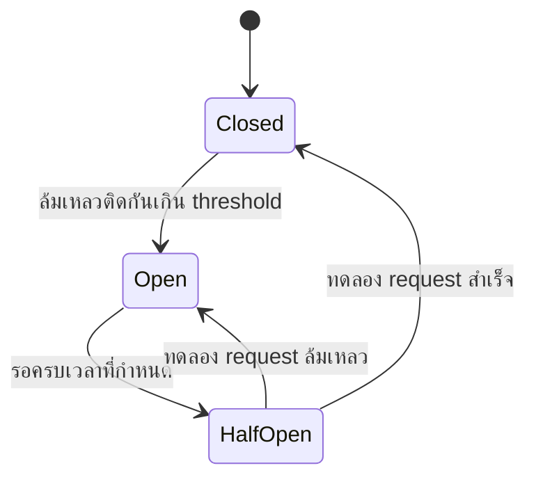

ลองนึกภาพเบรกเกอร์ไฟฟ้าที่บ้าน — ถ้าเครื่องใช้ไฟฟ้าตัวหนึ่งไฟช็อต เบรกเกอร์จะ**ตัดไฟทันที**ป้องกันไฟไหม้บ้าน แทนที่จะปล่อยให้กระแสไฟฟ้าไหลต่อไปเรื่อยๆ จนเกิดความเสียหายลุกลาม เบรกเกอร์ไม่ได้รอดูว่า "ลองอีกทีเผื่อหาย" มันตัดทันทีที่เห็นสัญญาณผิดปกติ

Service A เรียก Service B แต่ Service B ล่ม/ช้ามาก — ถ้า Service A ยังพยายามเรียกต่อไปเรื่อยๆ (แต่ละครั้งรอ timeout นาน) Service A เองก็จะช้าตามไปด้วย และอาจ**ลามไปกระทบ service อื่น**ที่เรียก Service A อยู่ <mark class="hl-term">Circuit Breaker</mark> ทำหน้าที่เหมือนเบรกเกอร์ไฟฟ้า — ตัดการเรียกทันทีที่เห็นสัญญาณผิดปกติถี่เกินไป

ลองกดล้มเหลวติดกันหลายครั้งดู breaker "เปิด" (ตัดไฟ) แล้วเริ่มปฏิเสธทันทีโดยไม่เรียก downstream จริง

```demo
component: CircuitBreakerDemo
```

## สามสถานะ — เหมือนเบรกเกอร์จริง


```mermaid
stateDiagram-v2
    [*] --> Closed
    Closed --> Open: ล้มเหลวติดกันเกิน threshold
    Open --> HalfOpen: รอครบเวลาที่กำหนด
    HalfOpen --> Closed: ทดลอง request สำเร็จ
    HalfOpen --> Open: ทดลอง request ล้มเหลว
```

- **Closed (เบรกเกอร์ปกติ ไฟไหลผ่าน)** — สถานะปกติ ปล่อยให้ request ผ่านไปเรียก downstream จริง พร้อมนับจำนวนล้มเหลว
- **Open (เบรกเกอร์ตัดไฟ)** — ล้มเหลวเกิน threshold แล้ว **ปฏิเสธทันทีทุก request** (fail fast) ไม่เรียก downstream เลย ให้เวลามันฟื้นตัว เหมือนตัดไฟทิ้งไว้ก่อนจนกว่าจะเช็คว่าปลอดภัย
- **Half-Open (ลองเปิดไฟดูอีกครั้ง)** — ครบเวลาที่ตั้งไว้แล้ว ลองปล่อย request **1 ตัว**ผ่านไปทดสอบ เหมือนลองเปิดสวิตช์ดูว่าไฟยังช็อตอยู่ไหม — ถ้าสำเร็จกลับไป Closed (ไฟใช้ได้ปกติ) ถ้าล้มเหลวกลับไป Open ใหม่ (ยังช็อตอยู่ ตัดไฟต่อ)

## ทำไมต้อง "ตัดไฟทันที" แทนที่จะรอ

ถ้าไม่มี circuit breaker: request ที่เรียก downstream ที่ล่มอยู่ ต้อง**รอจน timeout** (อาจ 30 วินาที) ก่อนจะรู้ว่าล้มเหลว — เหมือนปล่อยให้กระแสไฟไหลต่อไปเรื่อยๆ ทั้งที่รู้ว่าผิดปกติ ถ้ามี 1,000 request/วินาทีเรียกไปที่เดียวกัน ทั้งหมดจะไปค้างรอพร้อมกัน กิน thread/connection ของ service ต้นทางจนหมด (<mark class="hl-term">thread pool exhaustion</mark>) <mark class="hl-warning">ทำให้ service ต้นทางล่มตามไปด้วยทั้งที่ปัญหาจริงอยู่ที่ downstream คนเดียว</mark> <mark class="hl-insight">circuit breaker ตัดวงจรไว้ก่อน ทำให้ request ล้มเหลวทันที (millisecond) แทนที่จะรอนาน ป้องกันไฟไหม้ลามไปทั้งบ้านได้จริง</mark>

## ขั้นสูง: แยกสายไฟแต่ละห้องออกจากกัน ไม่ให้ห้องหนึ่งไฟช็อตแล้วดับทั้งบ้าน

Circuit Breaker ป้องกันการเรียก downstream ที่พังซ้ำๆ ได้ แต่ยังไม่ได้ป้องกันปัญหาที่ลึกกว่านั้น — <mark class="hl-warning">ถ้า Service A เรียก downstream หลายตัว (B, C, D) และใช้ thread pool เดียวกันสำหรับทุกการเรียก แค่ downstream B ช้าตัวเดียว ก็ทำให้ thread ทั้งหมดไปติดรอ B จนไม่มี thread เหลือไปเรียก C หรือ D เลย — ทั้งที่ C และ D ยังทำงานปกติดีอยู่</mark> เหมือนบ้านที่ทุกห้องต่อสายไฟเส้นเดียวกัน ห้องหนึ่งช็อตก็ดึงไฟทั้งบ้านดับไปด้วย

ทางแก้คือ <mark class="hl-term">Bulkhead Pattern</mark> — ชื่อมาจากผนังกันน้ำในเรือ (ถ้าห้องหนึ่งรั่วน้ำเข้า ผนังกันน้ำป้องกันไม่ให้น้ำท่วมไปห้องอื่น เรือยังลอยอยู่ได้) ในทาง software คือ **แยก thread pool/connection pool ให้แต่ละ downstream มีโควต้าของตัวเองแยกกัน** ไม่ใช้ pool เดียวกันร่วมกันทั้งหมด <mark class="hl-insight">ถ้า downstream B ใช้ thread ในโควต้าของตัวเองจนหมด การเรียก C และ D ยังมี thread ในโควต้าของตัวเองเหลือใช้ตามปกติ ไม่ได้รับผลกระทบจาก B เลย</mark>

Bulkhead กับ Circuit Breaker มักใช้คู่กัน — Bulkhead จำกัดขอบเขตความเสียหายไม่ให้ลามข้าม downstream ส่วน Circuit Breaker ตัดการเรียกที่พังซ้ำๆ ภายในขอบเขตนั้นให้เร็วขึ้น

> คำถามสัมภาษณ์: "Circuit Breaker กับ Bulkhead Pattern ต่างกันยังไง ใช้คู่กันได้ไหม" — Circuit Breaker ตัดสินใจว่า "ควรเรียก downstream ตัวนี้ต่อไหม" โดยดูจากอัตราความล้มเหลว ส่วน Bulkhead จำกัดว่า "downstream ตัวนี้ใช้ทรัพยากรร่วม (thread/connection) ได้แค่โควต้าของตัวเอง ไม่แย่งของ downstream อื่น" ทั้งสองแก้ปัญหาคนละมุมและใช้คู่กันได้ปกติ — Bulkhead ป้องกันไม่ให้ downstream ตัวเดียวดึงทรัพยากรทั้งหมดไปจนกระทบ downstream อื่น ส่วน Circuit Breaker ป้องกันไม่ให้เสียเวลาเรียก downstream ที่รู้อยู่แล้วว่าพัง
