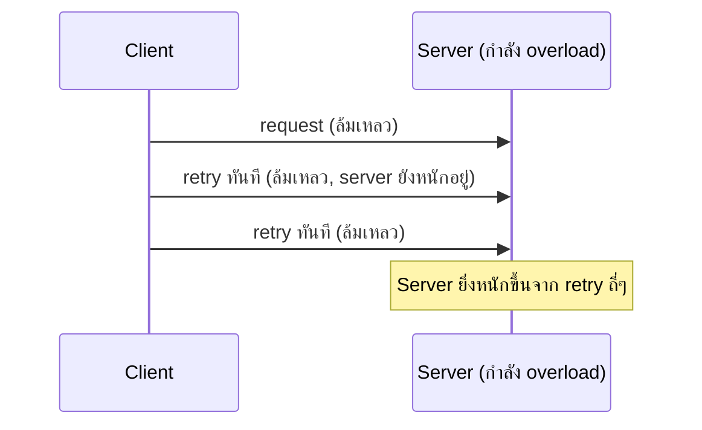

ลองนึกภาพโทรหาเพื่อนแล้วสายไม่ว่าง — ถ้าคุณกดโทรซ้ำทันทีรัวๆ ไม่หยุด นอกจากจะไม่ติดแล้ว ยังน่ารำคาญด้วย วิธีที่คนทั่วไปทำคือ**รอสักพักค่อยโทรใหม่** และถ้ายังไม่ติดอีก ก็รอนานขึ้นกว่าเดิมก่อนลองอีกครั้ง แทนที่จะกดโทรถี่ๆ ไม่มีจังหวะ

Circuit Breaker (บทที่แล้ว) จัดการตอน downstream ล้มเหลวถี่ๆ ต่อเนื่อง — แต่บางครั้ง request ล้มเหลว**แค่ครั้งเดียวชั่ววูบ** (network สะดุด, server เพิ่ง restart ไม่กี่วินาที) การ**ลองใหม่ (retry)** อาจแก้ปัญหาได้เลยโดยไม่ต้องทำอะไรซับซ้อน

## โทรซ้ำรัวๆ ทันทีมีปัญหา



ถ้า retry ทันทีโดยไม่รอเลย และมี client จำนวนมากทำแบบเดียวกันพร้อมกัน (เช่น service ที่พึ่งฟื้นจาก downtime) จะเกิด**thundering herd** — เหมือนสายเรียกเข้าถล่มโอเปอเรเตอร์พร้อมกันทันทีที่ระบบโทรศัพท์กลับมาใช้ได้ ทำให้ล่มซ้ำอีกรอบ

## Exponential Backoff — รอนานขึ้นเรื่อยๆ ก่อนลองใหม่

ลองกด "จำลอง request" ดูช่วงเวลารอที่ยืดขึ้นเรื่อยๆ ทุกครั้งที่ล้มเหลว

```demo
component: ExponentialBackoffDemo
```


แต่ละครั้งที่ retry ล้มเหลว **เพิ่มเวลารอเป็นเท่าตัว** (1, 2, 4, 8, 16 วินาที...) ให้เวลา server ฟื้นตัวมากขึ้นเรื่อยๆ แทนที่จะโทรซ้ำถี่ๆ ทันที และมักตั้ง**เพดานสูงสุด** (เช่น ไม่เกิน 60 วินาที) และ**จำนวนครั้งสูงสุด** (เช่น ลองไม่เกิน 5 ครั้งแล้วยอมแพ้ ส่งต่อ error ให้ผู้ใช้ — เหมือนโทรไม่ติด 5 ครั้งก็เลิกโทรแล้วส่งข้อความแทน)

## Jitter — สุ่มเวลานิดหน่อยกันชนกัน

ถ้า client หลายพันตัวล้มเหลวพร้อมกันแล้ว backoff ตามสูตรเดียวกันเป๊ะๆ ทั้งหมดจะ retry**พร้อมกัน**อีกครั้ง (ยังชนกันอยู่ดี เหมือนทุกคนโทรกลับพร้อมกันเป๊ะทุกนาทีที่ 1, 2, 4...) การเติม **jitter** (สุ่มเวลาบวกลบเล็กน้อยในแต่ละ retry) กระจายเวลาการ retry ของแต่ละ client ให้ไม่ตรงกันเป๊ะ ลดโอกาส thundering herd ลงไปอีก

> กฎสำคัญ: **ควร retry เฉพาะ error ที่มีโอกาสหายเองได้** (network timeout, 503 Service Unavailable — เหมือนสายไม่ว่างที่อาจว่างในอีกไม่กี่นาที) — ไม่ควร retry error ที่ผิดแน่นอนซ้ำ (เช่น 400 Bad Request, 401 Unauthorized — เหมือนโทรผิดเบอร์ ต่อให้โทรซ้ำกี่ครั้งก็ยังผิดเบอร์เดิม) เพราะแค่เปลืองทรัพยากรเปล่าๆ
