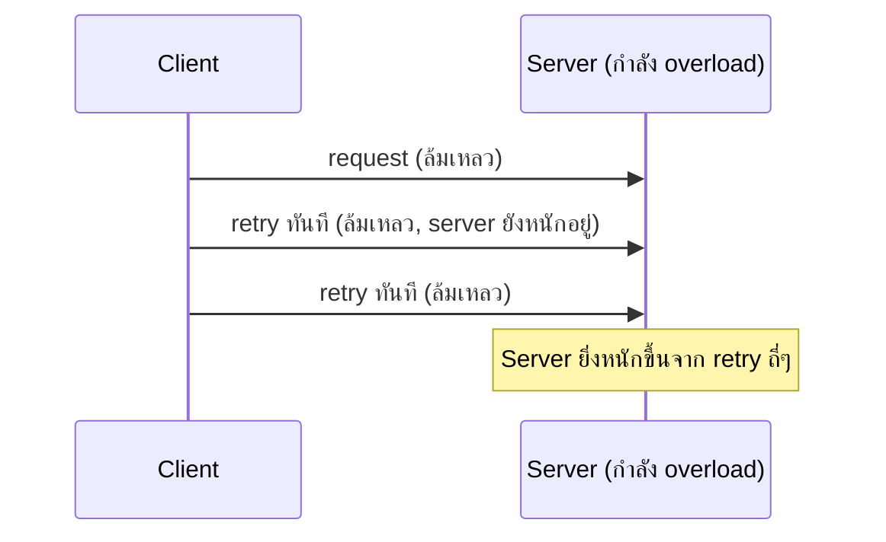

ลองนึกภาพโทรหาเพื่อนแล้วสายไม่ว่าง — ถ้าคุณกดโทรซ้ำทันทีรัวๆ ไม่หยุด นอกจากจะไม่ติดแล้ว ยังน่ารำคาญด้วย วิธีที่คนทั่วไปทำคือ**รอสักพักค่อยโทรใหม่** และถ้ายังไม่ติดอีก ก็รอนานขึ้นกว่าเดิมก่อนลองอีกครั้ง แทนที่จะกดโทรถี่ๆ ไม่มีจังหวะ

Circuit Breaker (บทที่แล้ว) จัดการตอน downstream ล้มเหลวถี่ๆ ต่อเนื่อง — แต่บางครั้ง request ล้มเหลว**แค่ครั้งเดียวชั่ววูบ** (network สะดุด, server เพิ่ง restart ไม่กี่วินาที) การ**ลองใหม่ (retry)** อาจแก้ปัญหาได้เลยโดยไม่ต้องทำอะไรซับซ้อน

## โทรซ้ำรัวๆ ทันทีมีปัญหา


```mermaid
sequenceDiagram
    participant C as Client
    participant S as Server (กำลัง overload)
    C->>S: request (ล้มเหลว)
    C->>S: retry ทันที (ล้มเหลว, server ยังหนักอยู่)
    C->>S: retry ทันที (ล้มเหลว)
    Note over S: Server ยิ่งหนักขึ้นจาก retry ถี่ๆ
```

ถ้า retry ทันทีโดยไม่รอเลย และมี client จำนวนมากทำแบบเดียวกันพร้อมกัน (เช่น service ที่พึ่งฟื้นจาก downtime) จะเกิด<mark class="hl-warning">thundering herd — สายเรียกเข้าถล่มโอเปอเรเตอร์พร้อมกันทันทีที่ระบบโทรศัพท์กลับมาใช้ได้ ทำให้ล่มซ้ำอีกรอบ</mark>

## Exponential Backoff — รอนานขึ้นเรื่อยๆ ก่อนลองใหม่

ลองกด "จำลอง request" ดูช่วงเวลารอที่ยืดขึ้นเรื่อยๆ ทุกครั้งที่ล้มเหลว

```demo
component: ExponentialBackoffDemo
```


```mermaid
flowchart LR
    A["ครั้งที่ 1 ล้มเหลว"] -->|"รอ 1 วิ"| B["ครั้งที่ 2"]
    B -->|"ล้มเหลว รอ 2 วิ"| C["ครั้งที่ 3"]
    C -->|"ล้มเหลว รอ 4 วิ"| D["ครั้งที่ 4"]
    D -->|"ล้มเหลว รอ 8 วิ"| E["ครั้งที่ 5"]
```

แต่ละครั้งที่ retry ล้มเหลว **เพิ่มเวลารอเป็นเท่าตัว** (1, 2, 4, 8, 16 วินาที...) ให้เวลา server ฟื้นตัวมากขึ้นเรื่อยๆ แทนที่จะโทรซ้ำถี่ๆ ทันที และมักตั้ง**เพดานสูงสุด** (เช่น ไม่เกิน 60 วินาที) และ**จำนวนครั้งสูงสุด** (เช่น ลองไม่เกิน 5 ครั้งแล้วยอมแพ้ ส่งต่อ error ให้ผู้ใช้ — เหมือนโทรไม่ติด 5 ครั้งก็เลิกโทรแล้วส่งข้อความแทน)

## Jitter — สุ่มเวลานิดหน่อยกันชนกัน

ถ้า client หลายพันตัวล้มเหลวพร้อมกันแล้ว backoff ตามสูตรเดียวกันเป๊ะๆ ทั้งหมดจะ retry**พร้อมกัน**อีกครั้ง (ยังชนกันอยู่ดี เหมือนทุกคนโทรกลับพร้อมกันเป๊ะทุกนาทีที่ 1, 2, 4...) การเติม <mark class="hl-term">jitter</mark> (สุ่มเวลาบวกลบเล็กน้อยในแต่ละ retry) กระจายเวลาการ retry ของแต่ละ client ให้ไม่ตรงกันเป๊ะ ลดโอกาส thundering herd ลงไปอีก

> กฎสำคัญ: <mark class="hl-insight">ควร retry เฉพาะ error ที่มีโอกาสหายเองได้ (network timeout, 503 Service Unavailable — เหมือนสายไม่ว่างที่อาจว่างในอีกไม่กี่นาที)</mark> — ไม่ควร retry error ที่ผิดแน่นอนซ้ำ (เช่น 400 Bad Request, 401 Unauthorized — เหมือนโทรผิดเบอร์ ต่อให้โทรซ้ำกี่ครั้งก็ยังผิดเบอร์เดิม) เพราะแค่เปลืองทรัพยากรเปล่าๆ

## ขั้นสูง: Retry ที่ดีของแต่ละ Service ทบกันจนกลายเป็นพายุ (Retry Amplification)

บทนี้พูดถึง retry ของ service เดียว — แต่ในระบบ microservices ที่ request วิ่งผ่านหลาย service ต่อกันเป็นทอด (A เรียก B, B เรียก C, C เรียก D) <mark class="hl-warning">ถ้าแต่ละ service ตั้ง retry สูงสุด 3 ครั้งเหมือนกันหมด และ D ล้มเหลว: C retry 3 ครั้งไปหา D (รวม 3 request), B retry 3 ครั้งไปหา C ที่แต่ละครั้ง C ก็ retry 3 ครั้งไปหา D อีก (รวม 9 request ไปหา D), A retry 3 ครั้งไปหา B ที่แต่ละครั้งขยายเป็น 9 ไปหา D (รวม 27 request ไปหา D จาก 1 request ตั้งต้น)</mark> — เรียกว่า <mark class="hl-term">Retry Amplification</mark> ยิ่ง chain ยาว ยิ่งขยายทวีคูณ อาจกระทบ downstream ที่กำลังพังอยู่แล้วให้หนักกว่าเดิมมาก

ทางแก้ที่ระบบจริงใช้:

- **Retry แค่ชั้นเดียว (edge retry only)** — ให้แค่ service ที่อยู่ปลายสุด (ใกล้ client) เป็นคน retry ส่วน service ภายในที่เหลือไม่ retry ซ้ำ ปล่อยให้ fail แล้วส่ง error กลับขึ้นไปให้ชั้นที่ retry อยู่แล้วจัดการเอง
- <mark class="hl-term">Retry Budget</mark> — จำกัดสัดส่วน request ทั้งระบบที่อนุญาตให้เป็น retry ได้ (เช่น ไม่เกิน 10% ของ traffic ทั้งหมดในหน้าต่างเวลาหนึ่ง) ถ้าเกินโควต้า ปฏิเสธ retry เพิ่มทันทีแม้ error นั้นจะ retry-able ก็ตาม ป้องกันไม่ให้ retry เองกลายเป็นสาเหตุที่ทำให้ downstream พังหนักกว่าเดิม

> คำถามสัมภาษณ์: "ทำไม retry ที่ดีของแต่ละ service กลับทำให้ปัญหาแย่ลงในระบบ microservices" — เพราะ retry ของแต่ละชั้นทบกันแบบทวีคูณตามความยาวของ call chain (retry amplification) — 1 request ที่ล้มเหลวที่ปลาย chain อาจขยายเป็นหลายสิบ request จริงๆ ที่ไปกระทบ downstream เดิม ทางแก้คือให้แค่ชั้นเดียว (มักเป็น edge) เป็นคน retry หรือตั้ง retry budget จำกัดสัดส่วน retry ทั้งระบบไม่ให้เกินเพดานที่กำหนด
