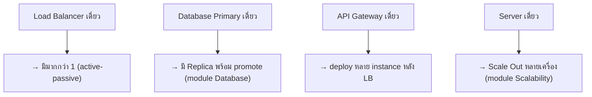
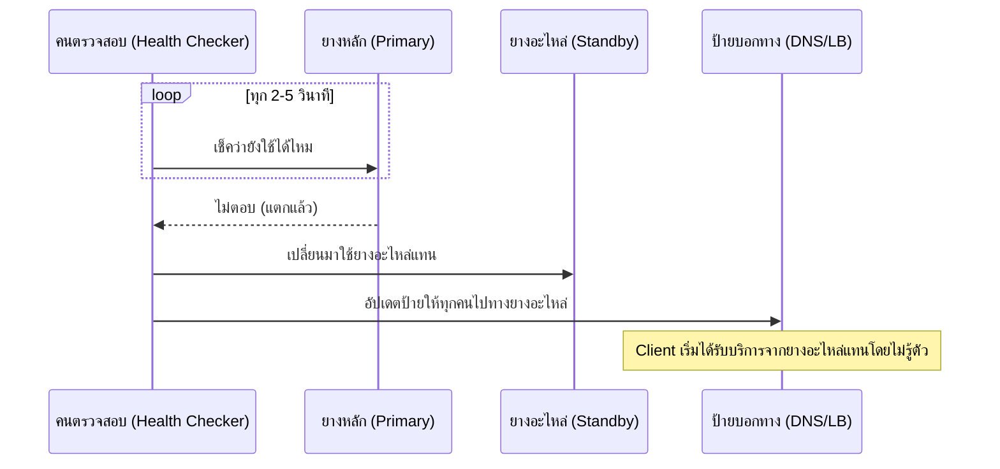

ลองนึกภาพยางอะไหล่ในรถ — ถ้ายางแตกกลางทาง คุณไม่ต้องจอดรอรถลากทั้งวัน แค่เปลี่ยนยางอะไหล่แล้วขับต่อได้เลย ยางอะไหล่ไม่ได้ถูกใช้งานทุกวัน แต่มีไว้**เผื่อวันที่จำเป็นจริงๆ** — ถ้าไม่มียางอะไหล่ ยางแตกทีก็จบทริปทันที

Rate Limiting, Circuit Breaker, Retry (บทที่ผ่านมา) ล้วนช่วยให้ระบบ**ทนต่อความล้มเหลวชั่วคราว** — แต่ถ้า component ทั้งตัวตายจริงๆ (เครื่องพัง, data center ไฟดับ) ต้องมี**ของสำรอง**อยู่แล้ว เหมือนยางอะไหล่ในรถ นี่คือหัวใจของ **Redundancy** และ **Failover**

## Redundancy — ไม่มีจุดไหนมีแค่ 1 ชุด

ตลอด curriculum นี้ ทุก component ที่เรียนผ่านมามี "เวอร์ชันเดี่ยว" ที่เป็นจุดอ่อน:



หลักการเดียวกันวนซ้ำทุกชั้น: **ไม่มีจุดไหนควรมีแค่ 1 ชุด** ถ้ามี ต้องมี "ยางอะไหล่" พร้อมสับเปลี่ยนได้เสมอ

## Failover — เปลี่ยนยางอะไหล่ยังไง



**Active-Passive (ยางอะไหล่นอนอยู่ในท้ายรถ)**: มีของสำรอง (standby) รอเฉยๆ ไม่ถูกใช้งานจนกว่า primary จะเสีย ค่อยเอามาใช้แทน — เรียบง่าย แต่ของสำรอง "นอนเฉยๆ ไม่ได้ใช้" ตอนไม่มีปัญหา

**Active-Active (รถมี 4 ล้อทำงานพร้อมกันหมด)**: ทุกชุดรับภาระพร้อมกันตลอดเวลา (เหมือน load balancing หลายเครื่องที่เรียนไปแล้ว) ถ้าชุดหนึ่งเสีย ที่เหลือรับภาระต่อทันทีโดยไม่ต้อง "สลับ" อะไรเลย — ใช้ทรัพยากรคุ้มกว่า แต่ต้องออกแบบให้ทุกชุด stateless (เชื่อมกับโมดูล Scalability) และรองรับการทำงานพร้อมกันได้ (เชื่อมกับโมดูล Consistency & CAP)

```demo
component: ComparisonDiagram
props: {"left":{"title":"Active-Passive (ยางอะไหล่นอนเฉยๆ)","points":["Standby รอเฉยๆ ไม่ถูกใช้งานจนกว่า primary จะเสีย","ง่ายกว่าในการออกแบบ","ทรัพยากรของ standby \"เสียเปล่า\" ตอนไม่มีปัญหา"]},"right":{"title":"Active-Active (ล้อทำงานพร้อมกันหมด)","points":["ทุกชุดรับภาระพร้อมกันตลอดเวลา","ใช้ทรัพยากรคุ้มค่ากว่า","ต้องออกแบบให้ stateless และรองรับการทำงานพร้อมกันได้"]},"note":"เชื่อมกับ module Scalability (stateless) และ Consistency & CAP (concurrent write)"}
```

## Multi-Region — ป้องกันระดับทั้งเมือง

ถ้าทั้งเมืองน้ำท่วมจนขับรถไม่ได้เลย (ไม่ใช่แค่ยางแตก) ต้องมีแผนสำรองระดับใหญ่กว่านั้น — สำหรับระบบคือมี data center สำรองในพื้นที่ทางภูมิศาสตร์อื่น พร้อม replicate ข้อมูลข้าม region — ต้นทุนสูงและซับซ้อนที่สุด (latency ระหว่าง region, consistency ข้าม region) มักใช้เฉพาะระบบที่ downtime มีค่าเสียหายมหาศาลจริงๆ

> คำถามสัมภาษณ์: "จะออกแบบระบบให้ไม่มี downtime เลยได้ไหม" — คำตอบตรงไปตรงมาคือ **ไม่มีระบบไหน 100% ไม่มี downtime** เหมือนไม่มีรถคันไหนยางไม่แตกตลอดชีวิต เป้าหมายจริงคือลด**โอกาส**และ**ความเสียหาย**ให้ต่ำที่สุดเท่าที่งบประมาณ/ความสำคัญของระบบนั้นสมเหตุสมผล (วัดเป็น "9 กี่ตัว" เช่น 99.9% = ~8.7 ชม./ปี, 99.99% = ~52 นาที/ปี)
