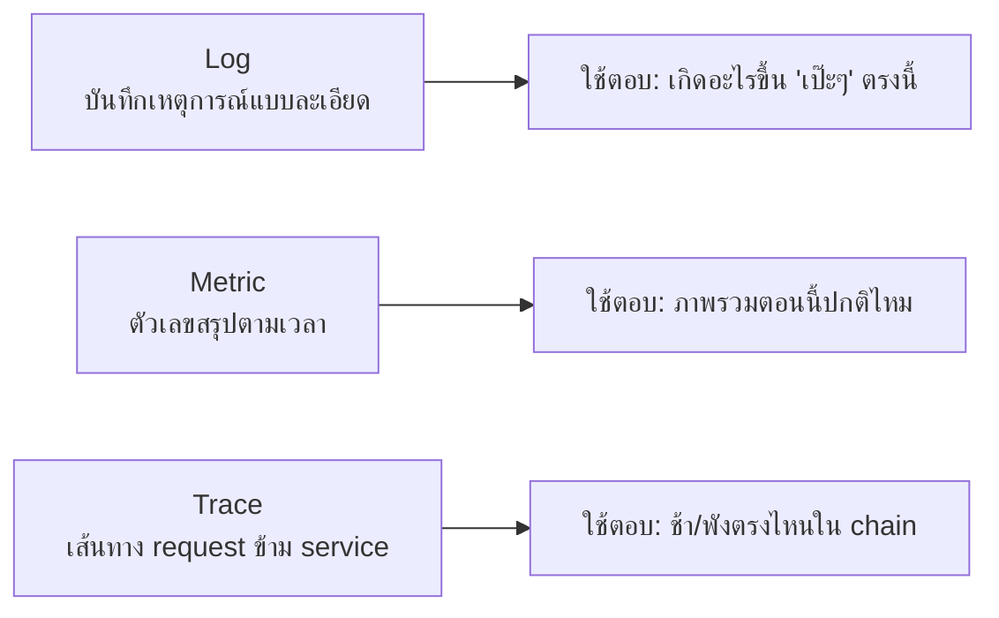
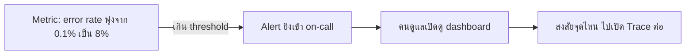

ลองนึกภาพโรงงานผลิตชิ้นส่วน ที่วิศวกรใส่**สารเรืองแสง (tracer)** เข้าไปในชิ้นงานตัวอย่างหนึ่งชิ้น แล้วเดินตามดูว่ามันไหลผ่านสถานีไหนบ้างกว่าจะออกมาเป็นสินค้าสำเร็จรูป — นี่คือที่มาของคำว่า **"tracing"** จริงๆ ในวงการ software ก็ทำแบบเดียวกัน: แปะ "รหัสติดตาม" ไปกับ request แล้วดูว่ามันเดินทางผ่าน service ไหนบ้าง ใช้เวลาที่ไหนนานผิดปกติ

Rate Limiting, Circuit Breaker, Retry, Failover (บททั้งหมดในโมดูลนี้) ล้วนช่วยให้ระบบ**ทนต่อความล้มเหลว** — แต่ทุกเทคนิคเหล่านั้นมีคำถามที่ยังไม่ได้ตอบเลย: **"รู้ได้ยังไงว่าตอนนี้ระบบกำลังจะพัง หรือพังไปแล้วตรงไหน"** นี่คือหน้าที่ของ **Observability**

## 3 เสาหลักของ Observability



3 อย่างนี้ตอบคำถามคนละแบบ เหมือนสืบสวนคดีที่ต้องใช้**กล้องวงจรปิดละเอียด (log)**, **มิเตอร์วัดอุณหภูมิ/แรงดันภาพรวมทั้งโรงงาน (metric)**, และ**สารเรืองแสงตามรอยชิ้นงานตัวอย่าง (trace)** ประกอบกัน — ขาดตัวใดตัวหนึ่งไป การสืบหาปัญหาจะช้าลงมาก

## Log — บันทึกเหตุการณ์แบบละเอียด

```
2026-09-06T10:22:41Z [ERROR] order-service req_id=8a3f user_id=5521 msg="payment timeout after 3000ms" gateway=stripe
```

Log ที่ดีต้อง**structured** (มี field แยกชัดเจนแบบตัวอย่างข้างบน) ไม่ใช่แค่ข้อความยาวๆ ให้คนอ่าน — เพราะจะได้**ค้นหา/กรอง**ทีหลังได้ (เช่น กรองทุก log ที่ `req_id=8a3f` เพื่อดูว่า request นี้เกิดอะไรขึ้นบ้างทุกจุด) ปัญหาของ log คือ**เยอะเกินไป**ถ้าระบบมี traffic สูง — เก็บทุกบรรทัดของทุก request ไม่ไหวทั้งพื้นที่เก็บและความเร็วในการค้นหา

## Metric — ตัวเลขสรุปภาพรวมตามเวลา



Metric คือตัวเลข**สรุป** (ไม่ใช่รายละเอียดทุก request) เก็บถูกกว่า log มาก เช่น request/วินาที, error rate, latency เฉลี่ย — เหมือนมิเตอร์วัดความดันในโรงงานที่บอกแค่ "ตอนนี้ 80 PSI" ไม่ได้บันทึกทุกโมเลกุลที่ไหลผ่าน จุดสำคัญคือ metric ผูกกับ **alerting**: ตั้ง threshold ไว้ (เช่น error rate เกิน 5%) พอข้ามเส้นนั้นระบบยิง alert บอกคนดูแลทันที **ไม่ต้องรอให้ user มาบ่นก่อน** — Health check ที่เจอในบท Failover ก่อนหน้าก็คือ metric ชนิดหนึ่ง (healthy/unhealthy เป็นตัวเลข 0/1 ที่เช็คตามเวลา)

## Trace — ตามรอย request ข้ามหลาย service

พอ metric บอกว่า "latency เฉลี่ยสูงขึ้น" แต่ระบบมีหลาย service ต่อกันเป็นทอดๆ (โมดูล Microservices) จะรู้ได้ยังไงว่า**ตัวไหน**ในสายพานคือตัวที่ช้า — Trace ตอบคำถามนี้ตรงๆ โดยติด **trace ID เดียวกัน** ไปกับ request ตั้งแต่เข้าระบบจนออก แล้ววาดเป็น**แผนภาพ waterfall** ว่าแต่ละ service ("span") ใช้เวลานานแค่ไหน กดจำลอง request ด้านล่างดูได้ — บางครั้งจะสุ่มเจอ span สีแดงที่ช้าผิดปกติ แบบที่เจอในระบบจริง

```demo
component: TraceWaterfallDemo
caption: Distributed Trace Waterfall — คลิกแถบเพื่อดูรายละเอียดแต่ละ span
```

เห็นชัดว่า**span ไหนกินเวลาไปเยอะสุด**โดยไม่ต้องเดา หรือไล่เปิด log ทีละ service — นี่คือคุณค่าหลักของ tracing เมื่อระบบมี service เยอะขึ้นเรื่อยๆ (จาก monolith ไป microservices ยิ่งจำเป็น เพราะ 1 request อาจวิ่งผ่าน 10+ service กว่าจะเสร็จ)

## ใช้ตัวไหนตอนไหน

| อาการ | เปิดดูอะไรก่อน |
|---|---|
| "ระบบตอนนี้ปกติไหม" | Metric dashboard |
| "error rate พุ่งขึ้นเมื่อกี้ ทำไม" | Metric (ดูว่าพุ่งช่วงไหน) → Trace (หา service ที่ error) |
| "request ของ user คนนี้ช้า/พังตรงไหน" | Trace (ตามรอย request นั้น) |
| "error message เป๊ะๆ คืออะไร มี stack trace ไหม" | Log (กรองด้วย req_id จาก trace) |

ลำดับการสืบสวนทั่วไปคือ **Metric บอกว่ามีปัญหา → Trace บอกว่าปัญหาอยู่ตรงไหน → Log บอกรายละเอียดว่าเกิดอะไรขึ้นเป๊ะๆ ที่จุดนั้น** — สามอย่างทำงานร่วมกันเป็นลำดับ ไม่ใช่เลือกใช้แค่อย่างเดียว

> คำถามสัมภาษณ์: "ระบบ microservices ที่มี 20 service จะ debug ยังไงเวลา request ช้า" — คำตอบที่ดีต้องพูดถึงทั้ง 3 เสาหลัก: มี metric คอย alert ก่อนว่าช้าจริง, มี distributed tracing ผูก trace ID ข้าม service เพื่อหาว่า span ไหนช้า, แล้วค่อยไปดู structured log ของ service นั้นเจาะจงเพื่อหาสาเหตุที่แท้จริง — ตอบแค่ "ดู log" อย่างเดียวจะดูไม่ไหวเมื่อ service เยอะขึ้น
