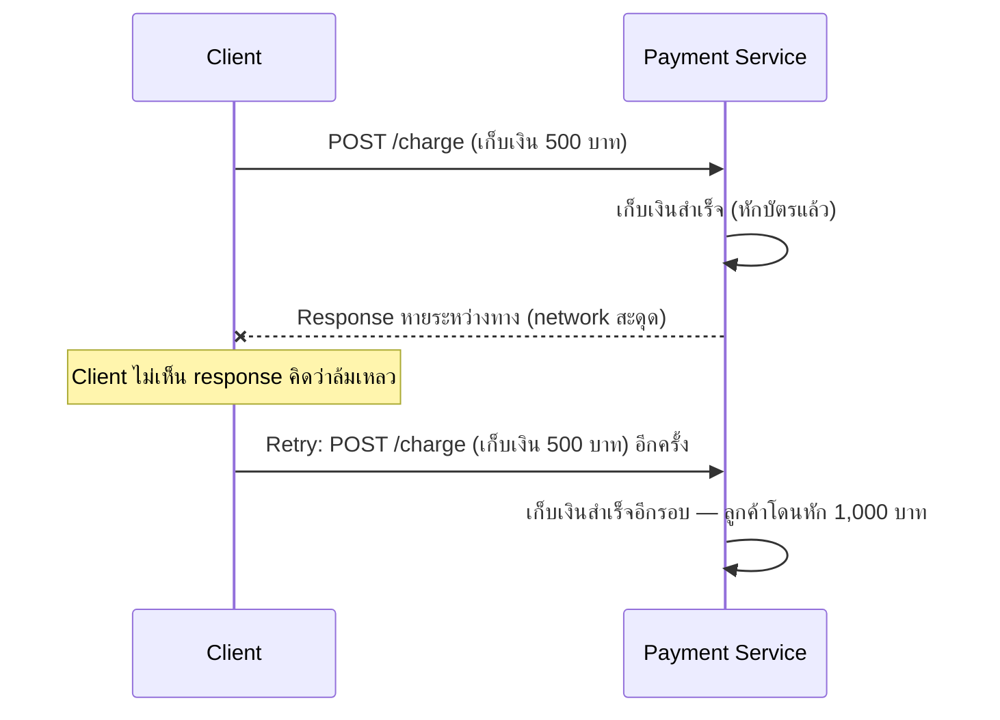

ลองนึกภาพปุ่มเรียกลิฟต์ — กดปุ่ม "ขึ้น" ครั้งเดียว ปุ่มติดไฟรอ ถ้ากดซ้ำอีก 5 ครั้งตอนไฟยังติดอยู่ ลิฟต์ก็ยังมาแค่คันเดียว **ไม่ได้เรียกลิฟต์มา 5 คัน** ไม่ว่าจะกดกี่ครั้ง ผลลัพธ์สุดท้ายเหมือนเดิมเป๊ะ — นี่คือแก่นของคำว่า **Idempotent**

## ปัญหาจริง: Retry (บทที่แล้ว) อาจอันตราย



Retry & Backoff (บทที่แล้ว) สอนว่า "network สะดุดให้ลองใหม่" — แต่กรณีนี้ **request แรกสำเร็จจริง** แค่ response หายกลับมาไม่ถึง client เท่านั้น ถ้า retry แบบเรียก API เดิมซ้ำตรงๆ โดยไม่มีอะไรป้องกัน จะเกิด**หักเงินซ้ำ** — retry ที่ควรจะช่วยเรื่องความน่าเชื่อถือ กลับกลายเป็นสร้างบั๊กร้ายแรงกว่าเดิม

## Idempotent คืออะไร (นิยามง่ายๆ)

**"ทำซ้ำกี่ครั้ง ผลลัพธ์สุดท้ายเหมือนเดิม เหมือนกดปุ่มลิฟต์ที่ติดไฟอยู่แล้ว"**

| HTTP Method | Idempotent? | เหตุผล |
|---|---|---|
| `GET` | ใช่ | แค่อ่าน ไม่เปลี่ยน state เลย อ่านกี่ครั้งก็เหมือนเดิม |
| `PUT` | ใช่ | "ตั้งค่า x = 5" ทำ 1 ครั้งหรือ 10 ครั้ง x ก็ยังเป็น 5 เหมือนเดิม (เหมือนกดสวิตช์ไฟไปที่ตำแหน่ง "เปิด" ซ้ำๆ ไฟก็ยังติดอยู่ ไม่ได้ติดสว่างขึ้นเรื่อยๆ) |
| `DELETE` | ใช่ (ส่วนใหญ่) | ลบของที่ถูกลบไปแล้ว ผลคือ "ไม่มีของนั้นอยู่" เหมือนเดิม |
| `POST` | **ไม่** | "สร้าง order ใหม่" ทุกครั้งที่เรียก **สร้างของใหม่เพิ่มอีกชิ้น** — เรียก 5 ครั้งได้ 5 order เหมือนกดปุ่มเรียกลิฟต์ที่ไม่มีไฟบอกสถานะ กดกี่ครั้งก็เรียกซ้ำใหม่ทุกครั้ง |

`POST` (สร้าง/เก็บเงิน/ส่งอีเมล ฯลฯ) คือตัวการหลักที่ต้องระวัง เพราะโดยธรรมชาติมันไม่ idempotent — ต้อง**สร้างความ idempotent ขึ้นมาเอง**

## แก้ยังไง: Idempotency Key

ลองไล่ทีละ step ว่า client/server ทำงานร่วมกันยังไงให้ retry ปลอดภัย

```demo
component: StepThroughDiagram
props: {"steps":[{"label":"1. Client สร้าง Idempotency Key ก่อนเรียกครั้งแรก","detail":"เหมือนเลขที่นั่งเฉพาะของ 'ความตั้งใจ' นี้ครั้งเดียว (ใช้ UUID สุ่ม) — key ผูกกับ 'ความตั้งใจจะจ่ายเงิน 500 บาทครั้งนี้' ไม่ใช่ผูกกับแต่ละ HTTP request ที่ยิงออกไป"},{"label":"2. ส่ง request พร้อม key แนบไปด้วย","detail":"POST /charge พร้อม header Idempotency-Key: abc-123 — server เห็น key นี้ครั้งแรก ไม่เคยเจอมาก่อน"},{"label":"3. Server เช็คก่อนทำงานจริง: เคยเห็น key นี้ไหม","detail":"ค้นใน dedup store (เช่น Redis/DB) ว่า key 'abc-123' เคยถูกประมวลผลหรือยัง — ยังไม่เคย จึงไปทำ step ถัดไป"},{"label":"4. ทำงานจริง + บันทึกผลลัพธ์คู่กับ key","detail":"หักเงิน 500 บาทจริง แล้วเก็บคู่ (key, ผลลัพธ์) ไว้ในที่เดียวกันแบบ atomic — เหมือนปุ่มลิฟต์ติดไฟค้างไว้ว่า 'เรียกไปแล้ว อย่าเรียกซ้ำ'"},{"label":"5. Response หาย → Client retry ด้วย key เดิม","detail":"Client ไม่รู้ว่าสำเร็จหรือไม่ จึง retry ตามหลัก Exponential Backoff — แต่ส่ง Idempotency-Key เดิม (abc-123) ไปด้วยเสมอ ไม่สร้าง key ใหม่"},{"label":"6. Server เจอ key ซ้ำ → ไม่ทำงานซ้ำ","detail":"เช็คแล้วพบว่า key 'abc-123' เคยประมวลผลไปแล้ว จึง 'ไม่หักเงินซ้ำ' แค่ส่งผลลัพธ์เดิมที่เก็บไว้กลับไปให้ client เหมือนกดปุ่มลิฟต์ที่ไฟติดอยู่แล้ว ไม่เรียกลิฟต์คันใหม่"}]}
```

## จุดที่ต้องระวังตอนสร้างจริง

- **Key ต้องสร้างฝั่ง client ไม่ใช่ server** — ถ้า server เป็นคน generate key ตอน client ไม่รู้ว่า request ก่อนหน้าสำเร็จหรือไม่ ก็จะได้ key ใหม่ทุกครั้งอยู่ดี (เหมือนลิฟต์ที่ไฟดับเองทุกครั้งที่มีคนมาดู กดใหม่ก็เรียกซ้ำ)
- **Race condition ตอน request ซ้ำมาถึงพร้อมกันเป๊ะ** — ถ้า client ยิง 2 request พร้อมกัน (เช่น double-click หรือ retry ชนกับ request เดิมที่ยังไม่เสร็จ) การ "เช็คแล้วค่อยบันทึก" (check-then-write) ต้องเป็น**atomic operation เดียว** ไม่งั้นทั้งสอง request อาจเช็คผ่านพร้อมกันก่อนใครจะบันทึกทัน กลายเป็นหักเงินซ้ำอยู่ดี
- **TTL ของ key** — เก็บ key ไว้ตลอดไปไม่ได้ (พื้นที่ไม่พอ) ต้องมีวันหมดอายุ (เช่น 24 ชม.) ยาวพอให้ retry ที่สมเหตุสมผลทั้งหมดยังใช้ key เดิมได้ทัน

> คำถามสัมภาษณ์: "ทำไม API เก็บเงินจริง (เช่น Stripe) ถึงบังคับให้ส่ง `Idempotency-Key` header มาด้วย" — เพราะเครือข่ายไม่น่าเชื่อถือ 100% (response หายได้เสมอ) client ที่ทำตาม best practice ต้อง retry เมื่อไม่ชัวร์ว่าสำเร็จหรือไม่ — แต่ retry บน operation ที่ "เก็บเงิน" (ไม่ idempotent โดยธรรมชาติ) โดยไม่มีกลไกป้องกัน จะหักเงินซ้ำได้จริงในโลกจริง ไม่ใช่แค่ทฤษฎี
