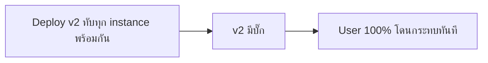
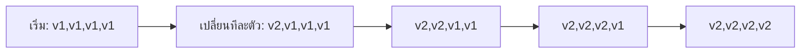
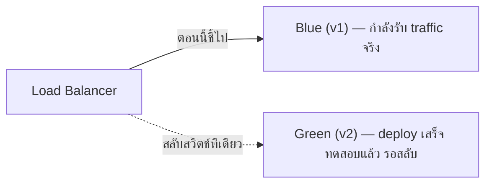

ลองนึกภาพคนงานเหมืองสมัยก่อนที่เอา**นกคีรีบูน**ลงไปในเหมืองถ่านหินด้วย — ถ้ามีแก๊สพิษรั่วในเหมือง นกจะตายก่อนคนเพราะไวต่อแก๊สกว่ามาก คนงานเห็นนกตายก็รีบขึ้นจากเหมืองทันทีก่อนแก๊สจะกระทบทุกคน นี่คือที่มาของคำว่า <mark class="hl-term">"canary deployment"</mark> จริงๆ — ปล่อย code เวอร์ชันใหม่ไปหา user กลุ่มเล็กๆ ก่อน (เหมือนนก) ถ้ามีปัญหาจะเห็นสัญญาณเตือนก่อนที่ user ทุกคนจะโดนกระทบ

Rate Limiting, Circuit Breaker, Retry, Failover, Observability, Idempotency (บททั้งหมดในโมดูลนี้) ล้วนรับมือกับความล้มเหลวที่**มาจากภายนอก** (traffic เกิน, network ขาด, service ล่ม) — แต่บั๊กที่อันตรายที่สุดในทางปฏิบัติ มักเป็นบั๊กที่**เราสร้างขึ้นเอง**ตอน deploy code เวอร์ชันใหม่ที่มีปัญหา คำถามคือ **จะปล่อยของใหม่ยังไงให้ปลอดภัยที่สุด**

## ปัญหา: Deploy ทีเดียวทั้งหมด (Big Bang)



วิธีง่ายที่สุดคือหยุดระบบ อัปเดตทุกเครื่องพร้อมกัน แล้วเปิดใหม่ — ถ้า v2 ไม่มีบั๊กก็จบด้วยดี แต่ถ้ามีบั๊ก <mark class="hl-warning">user ทุกคนโดนกระทบพร้อมกันทันที</mark> และการ rollback ก็ต้องหยุดระบบอีกรอบเพื่อกลับไป v1 — ความเสี่ยงสูงสุดเท่าที่จะเป็นไปได้

## Rolling Deployment — ทยอยเปลี่ยนทีละส่วน

เหมือนเปลี่ยนหลอดไฟทีละดวงในสำนักงาน ไม่ปิดไฟทั้งตึกพร้อมกัน:



ทยอย restart instance ทีละตัว (หรือทีละกลุ่มเล็กๆ) แทนที่จะทำพร้อมกันหมด — ระหว่างช่วงเปลี่ยนผ่าน**มีทั้ง v1 และ v2 รันพร้อมกัน** ซึ่งหมายความว่า API/database schema ต้อง**backward-compatible** ชั่วคราว (v1 กับ v2 ต้องคุยกับ database เดียวกันได้ทั้งคู่ระหว่าง rollout) ข้อดีคือไม่ต้อง downtime เลย ข้อเสียคือถ้า v2 มีบั๊ก กว่าจะรู้ตัวก็อาจกระทบไปหลาย instance แล้ว

## Blue-Green Deployment — สองชุดคู่ขนาน สลับสวิตช์เดียว

เหมือนมีบ้านสองหลังที่เหมือนกันทุกอย่าง (Blue กับ Green) — อยู่บ้าน Blue อยู่ ในขณะที่แอบไปสร้าง/ทดสอบบ้าน Green ให้เสร็จสมบูรณ์ก่อน แล้วค่อย **สลับป้ายหน้าบ้านทีเดียว**ให้ทุกคนไปที่ Green แทน:



Deploy v2 ทั้งชุดไปที่สภาพแวดล้อม Green ที่แยกจาก Blue โดยสมบูรณ์ก่อน ทดสอบให้มั่นใจ แล้วค่อยสลับ Load Balancer ให้ traffic ทั้งหมดไป Green **ทีเดียว** — ถ้ามีปัญหา สลับกลับไป Blue ได้ทันที (rollback เร็วมาก เพราะ Blue ยังอยู่ครบไม่ได้ถูกแตะเลย) ข้อเสียคือต้องมีทรัพยากร**สองชุดพร้อมกัน** (แพงกว่า rolling ที่ใช้เครื่องชุดเดียว)

## Canary Deployment — ปล่อยทดสอบกับคนกลุ่มเล็กก่อน

กลับมาที่นกในเหมือง — ลองเล่น demo ด้านล่าง ค่อยๆ ขยายสัดส่วน user ที่ไปเจอ v2 แล้วดู error rate (จากบท Observability):

```demo
component: CanaryRolloutDemo
caption: ขยายสัดส่วน canary ทีละขั้น สังเกต error rate ก่อนตัดสินใจว่าจะปล่อยต่อหรือ rollback
```

Canary ต่างจาก Rolling ตรงที่**จงใจปล่อยทีละเปอร์เซ็นต์เล็กๆ ก่อน แล้วหยุดดู metric** (error rate, latency) ก่อนขยายสัดส่วนเพิ่ม — ถ้า metric ผิดปกติ rollback ทันทีโดยกระทบ user แค่ไม่กี่เปอร์เซ็นต์ ไม่ใช่ทุกคน นี่คือจุดที่ <mark class="hl-insight">Observability กับ Deployment ทำงานคู่กัน: ไม่มี metric ที่ดี ก็ไม่รู้ว่าจะปล่อย canary ต่อหรือควร rollback</mark>

## เทียบทั้ง 4 วิธี

| วิธี | ความเร็ว rollback | ต้นทุนทรัพยากร | ความเสี่ยงถ้า v2 มีบั๊ก |
|---|---|---|---|
| Big Bang | ช้า (ต้อง deploy กลับทั้งหมด) | ต่ำสุด (ชุดเดียว) | สูงสุด (กระทบ 100% ทันที) |
| Rolling | ปานกลาง | ต่ำ (ชุดเดียว) | ปานกลาง (ทยอยกระทบ) |
| Blue-Green | เร็วมาก (สลับสวิตช์กลับ) | สูง (สองชุดพร้อมกัน) | ต่ำ (ตรวจก่อนสลับได้) |
| Canary | เร็ว (rollback แค่ % ที่ปล่อยไป) | ต่ำ-ปานกลาง | ต่ำสุด (กระทบแค่กลุ่มเล็ก) |

> คำถามสัมภาษณ์: "ทีมจะรู้ได้ยังไงว่า deploy ใหม่ปลอดภัยจะปล่อยเพิ่ม หรือควร rollback" — คำตอบที่ดีต้องเชื่อมกับ Observability: ตั้ง metric ที่ชัดเจนไว้ก่อน deploy (error rate, latency p99, business metric เช่น checkout success rate) แล้วปล่อย canary ทีละขั้นพร้อม**เฝ้าดู metric เหล่านั้นก่อนขยายสัดส่วนทุกครั้ง** — ไม่ใช่ปล่อยเต็มแล้วรอ user มาบ่นทีหลัง
