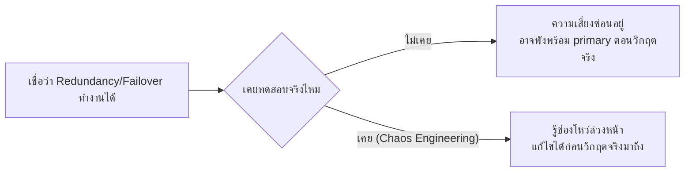
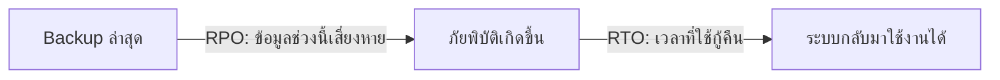

Failover & Redundancy (บทก่อนหน้า) แนะนำสั้นๆ ไว้ว่า "ยางอะไหล่ต้องเช็คว่ายังใช้งานได้จริง" ผ่านแนวคิด <mark class="hl-term">Chaos Engineering</mark> — บทนี้ลงรายละเอียดเต็มๆ ว่าทำจริงยังไง และเมื่อภัยพิบัติจริงเกิดขึ้น (ไม่ใช่แค่เครื่องเดียวล่ม แต่ทั้ง data center ล่ม) จะกู้คืนระบบยังไงให้เร็วที่สุด

## ทำไมต้องจงใจทำให้ระบบพังเอง

ลองนึกภาพทีมดับเพลิงที่ไม่เคยซ้อมดับเพลิงจริงเลย มีแต่อ่านคู่มือ — พอเกิดไฟไหม้จริง อาจทำพลาดเพราะไม่คุ้นมือ ทีมดับเพลิงที่ดีจะ**จัดซ้อมดับเพลิงสมมติเป็นระยะ**ในสภาพแวดล้อมที่ควบคุมได้ เพื่อรู้ว่าขั้นตอนที่วางไว้ใช้งานได้จริงหรือมีช่องโหว่ตรงไหน



<mark class="hl-insight">Chaos Engineering คือการจงใจสร้างความล้มเหลวขึ้นมาเองในสภาพแวดล้อมที่ควบคุมได้และมีคนพร้อมรับมือ — ดีกว่าปล่อยให้ความล้มเหลวเกิดขึ้นเองแบบไม่ทันตั้งตัว ซึ่งมักเกิดตอนเวลาที่แย่ที่สุดเสมอ (ตอนดึก, ตอน traffic สูงสุด)</mark> เครื่องมือชื่อดังคือ Chaos Monkey ของ Netflix ที่สุ่มปิด instance ทิ้งกลางวันแสกๆ ในสภาพแวดล้อม production จริง เพื่อพิสูจน์ว่าระบบทนได้จริงตามที่ออกแบบไว้

## หลักการ: ควบคุมขอบเขตความเสียหายก่อนเริ่ม (Blast Radius)

```demo
component: StepThroughDiagram
props: {"steps":[{"label":"1. ตั้งสมมติฐานก่อนทดลอง","detail":"เช่น \"ถ้า instance 1 ตัวใน availability zone A ตาย ระบบควรยัง serve traffic ได้ปกติ\" — ต้องรู้ล่วงหน้าว่าคาดหวังผลลัพธ์อะไร ไม่ใช่ทดลองแบบไม่มีเป้าหมาย"},{"label":"2. จำกัดขอบเขตความเสียหายให้เล็กที่สุดก่อน (Blast Radius)","detail":"เริ่มทดลองใน staging environment หรือ production ส่วนที่กระทบ user จริงน้อยที่สุดก่อน ไม่ใช่ปิดทั้งระบบทีเดียวตั้งแต่ครั้งแรก"},{"label":"3. รันการทดลอง พร้อมทีมเฝ้า metric","detail":"สุ่มปิด instance/ตัด network/เพิ่ม latency เทียม แล้วจับตา metric (error rate, latency) ตามหลัก Observability ว่าระบบตอบสนองตามที่คาดไว้ไหม"},{"label":"4. ถ้าผิดคาด หยุดทันทีและบันทึกช่องโหว่","detail":"ถ้าระบบพังเกินคาด (เช่น failover ไม่ทำงานจริง) หยุดการทดลองทันที บันทึกเป็นช่องโหว่ที่ต้องแก้ ไม่ใช่ปล่อยให้ลามต่อ"},{"label":"5. ขยายขอบเขตทีละขั้นเมื่อมั่นใจแล้ว","detail":"เมื่อผ่านขอบเขตเล็กแล้ว ค่อยขยายไปทดลองในสภาพแวดล้อมที่กระทบมากขึ้น (คล้ายหลัก canary rollout จากบท Deployment Strategies)"}]}
```

ทีมที่ทำ Chaos Engineering อย่างจริงจังมักจัด <mark class="hl-term">Game Day</mark> — วันที่กำหนดล่วงหน้าให้ทั้งทีมมาจำลองสถานการณ์วิกฤตร่วมกัน (เช่น "region หลักล่มทั้งหมด") ฝึกทั้งระบบและทีมคนไปพร้อมกัน ไม่ใช่แค่ทดสอบเครื่องอย่างเดียว

## เมื่อภัยพิบัติจริงมาถึง: วัดผลด้วย RTO และ RPO

ถ้า data center ทั้งหลังล่มจริง (ไม่ใช่แค่ instance เดียว) คำถามสำคัญสองข้อคือ "กู้กลับมาเร็วแค่ไหน" และ "ข้อมูลหายไปแค่ไหน" — วัดด้วยสองค่านี้:

- <mark class="hl-term">RTO (Recovery Time Objective)</mark> — ระบบ**หยุดทำงานได้นานสุดกี่นาที/ชั่วโมง**ก่อนต้องกลับมาใช้งานได้ (ยิ่งต่ำ ยิ่งต้องลงทุนกับ standby/automation มากขึ้น)
- <mark class="hl-term">RPO (Recovery Point Objective)</mark> — ข้อมูล**สูญหายได้มากสุดแค่ไหน**นับจากจุด backup ล่าสุด (ยิ่งต่ำ ยิ่งต้อง backup/replicate ถี่ขึ้น)



## ขั้นสูง: ระดับความพร้อมของ Disaster Recovery — ยิ่งเร็วยิ่งแพง

DR ไม่ใช่ทางเลือกเดียว มีหลายระดับให้เลือกตามงบและความสำคัญของระบบ ไล่จากถูกสุด/ช้าสุด ไปแพงสุด/เร็วสุด:

| ระดับ | หลักการ | RTO ประมาณ | ต้นทุน |
|---|---|---|---|
| **Backup & Restore** | เก็บ backup ไว้ ต้อง provision เครื่องใหม่ + restore ข้อมูลตอนภัยพิบัติเกิด | หลักชั่วโมง-วัน | ต่ำสุด |
| **Pilot Light** | มีโครงสร้างพื้นฐานขั้นต่ำ (เช่น database สำรอง sync ไว้) รอเปิดใช้ แต่ไม่ได้รันเต็มระบบ | หลักสิบนาที-ชั่วโมง | ต่ำ-ปานกลาง |
| **Warm Standby** | มีระบบสำรองรันอยู่จริงขนาดเล็กกว่า production ตลอดเวลา ขยายขนาดตอนสวิตช์ | หลักนาที | ปานกลาง-สูง |
| **Multi-Site Active-Active** | ทุก region รันเต็มรูปแบบพร้อมกันตลอดเวลา (รายละเอียดเต็มๆ ในบทถัดไป) | แทบเป็นศูนย์ | สูงสุด |

<mark class="hl-warning">ไม่มีระบบไหนควรเลือก DR ระดับสูงสุดโดยไม่คิด — ยิ่ง RTO/RPO ต่ำ ยิ่งต้องจ่ายแพงขึ้นแบบไม่เป็นเส้นตรง (คล้ายกฎเดียวกับ Scale Up ที่เรียนไปตอนต้นหลักสูตร)</mark> ต้องเลือกระดับที่สมเหตุสมผลกับความเสียหายที่ยอมรับได้จริงของธุรกิจนั้น ไม่ใช่เลือกที่ "ดีที่สุด" เสมอไป

> คำถามสัมภาษณ์: "RTO กับ RPO ต่างกันยังไง เลือกยังไงให้เหมาะกับระบบ" — RTO วัดว่า "หยุดทำงานได้นานแค่ไหนก่อนต้องกลับมา" ส่วน RPO วัดว่า "ข้อมูลหายได้มากแค่ไหน" สองค่านี้เป็นอิสระจากกัน — ระบบ banking อาจต้องการ RPO ต่ำมาก (ห้ามข้อมูลธุรกรรมหาย) แต่ RTO พอยอมรับได้บ้าง (หยุดสั้นๆ ได้) ส่วนระบบที่ downtime มีค่าเสียหายสูงกว่า (เช่น e-commerce วันลดราคา) อาจต้องการ RTO ต่ำเป็นพิเศษ ต้องถามความต้องการทางธุรกิจก่อนเลือกระดับ DR ไม่ใช่เลือกจากเทคโนโลยีอย่างเดียว
