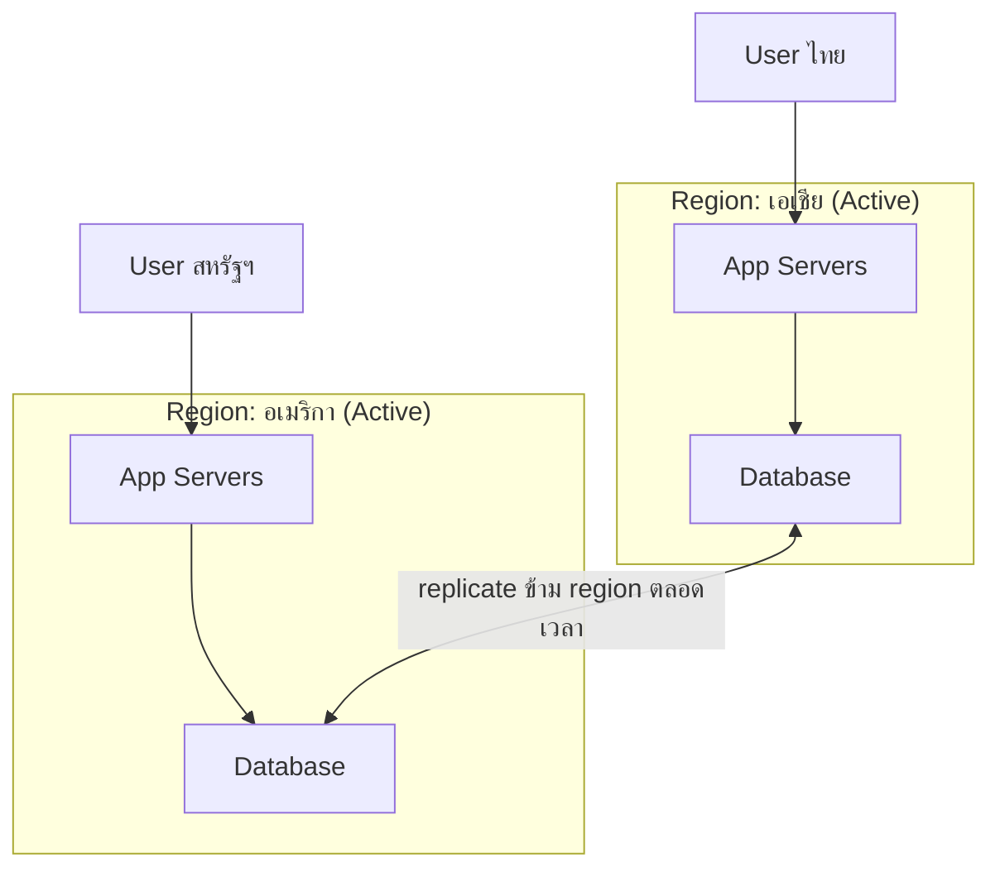

Disaster Recovery (บทก่อนหน้า) จัดระดับ Multi-Site Active-Active ไว้เป็นระดับสูงสุด — แพงสุดแต่ RTO แทบเป็นศูนย์ บทนี้ลงรายละเอียดว่า **การให้ทุก region ทำงานพร้อมกันตลอดเวลาจริงๆ** ต้องแก้ปัญหาอะไรบ้าง เพราะไม่ใช่แค่ตั้งเครื่องซ้ำกันหลายที่แล้วจบ

## ทำไมต้อง Multi-Region ทั้งที่มี Redundancy ในเครื่องเดียวอยู่แล้ว

Failover/Redundancy สอนไปแล้วว่ามี standby กันเครื่องเดียวล่ม — แต่ถ้า**ทั้ง data center**มีปัญหา (ไฟดับทั้งภูมิภาค, สายเคเบิลใต้น้ำขาด, ภัยธรรมชาติ) redundancy ในเครื่องเดียวช่วยไม่ได้เลย เหมือนมียางอะไหล่ในรถ แต่ถ้าน้ำท่วมทั้งเมืองจนขับไม่ได้เลย ยางอะไหล่ก็ไม่มีประโยชน์ — ต้องมี**สาขาอยู่คนละเมืองเลย**



<mark class="hl-insight">Active-Active แปลว่าทุก region รับ traffic จริงพร้อมกันตลอดเวลา (ไม่ใช่แค่ region หนึ่ง active อีก region นอนรอเป็น standby) — ได้ประโยชน์สองอย่างพร้อมกัน: ทนภัยพิบัติระดับภูมิภาค และ latency ต่ำสำหรับ user ทั่วโลก (เพราะ user ต่อเข้า region ที่ใกล้ที่สุดเสมอ ผ่าน GeoDNS ที่เรียนไปตอนต้นหลักสูตร)</mark>

## ปัญหาที่ตามมา: เขียนพร้อมกันสองที่ ใครถูกกว่า

ปัญหาใหญ่ที่สุดคือ — ถ้า user คนไทยแก้โปรไฟล์ที่ region เอเชีย และเพื่อนของเขาที่บังเอิญอยู่อเมริกาก็แก้ข้อมูลชุดเดียวกันที่ region อเมริกาในเวลาใกล้เคียงกันมาก **ทั้งสอง region เขียนสำเร็จในเครื่องตัวเอง** ก่อนจะรู้ตัวว่ามีคนอื่นเขียนชนกัน

```demo
component: JourneyDiagram
props: {"nodes":[{"icon":"person","label":"User (เอเชีย)"},{"icon":"building","label":"Region เอเชีย"},{"icon":"building","label":"Region อเมริกา"}],"travelerIcon":"envelope","steps":[{"activeNode":1,"caption":"User เอเชียเขียนข้อมูล A ที่ region เอเชีย สำเร็จทันที (ไม่รอ region อื่น)"},{"activeNode":2,"caption":"ในเวลาไล่เลี่ยกัน มีคนเขียนข้อมูลชุดเดียวกันเป็น B ที่ region อเมริกา สำเร็จทันทีเหมือนกัน"},{"activeNode":1,"caption":"พอ replicate ข้าม region มาเจอกัน ระบบต้องตัดสินว่า A หรือ B ใครชนะ — นี่คือ conflict ที่ active-active ต้องแก้"}]}
```

<mark class="hl-warning">นี่คือ trade-off ตาม CAP theorem ที่เรียนมาแล้ว — Active-Active เลือก Availability (ทุก region เขียนได้ทันทีไม่ต้องรอ) แลกกับความเสี่ยงที่ข้อมูลชนกันชั่วขณะ (สละ Consistency ทันทีแบบเข้มงวด)</mark> ทางแก้ที่ใช้จริง:

- **Last-Write-Wins (LWW)** — ใครเขียนทีหลังตาม timestamp ชนะ ง่ายที่สุดแต่ข้อมูลของฝั่งที่แพ้หายไปเงียบๆ
- **CRDT (Conflict-free Replicated Data Type)** — โครงสร้างข้อมูลที่ออกแบบให้**รวมผลจากสองฝั่งเข้าด้วยกันได้โดยอัตโนมัติ**โดยไม่ต้องเลือกทิ้งฝั่งใดฝั่งหนึ่ง (เจอรายละเอียดเต็มๆ ในโมดูล Consistency & CAP ตอน Consistency Models) เหมาะกับข้อมูลที่ merge กันได้เชิงตรรกะ เช่น shopping cart (รวมของจากสองฝั่งเข้าด้วยกัน ไม่ต้องเลือกทิ้ง)

## ขั้นสูง: ใครเป็นคนตัดสินว่า region ไหนคือของจริงตอน network ขาดระหว่างทวีป

ปัญหาที่ลึกกว่า conflict ข้อมูลคือ — ถ้าสายเคเบิลระหว่างทวีปขาดจริง (ไม่ใช่แค่ช้า แต่ตัดขาดสนิท) <mark class="hl-warning">ทั้งสอง region ยังคิดว่าตัวเอง "ยังทำงานได้ปกติ" และยังรับ write ต่อไปเรื่อยๆ โดยไม่รู้ว่าอีกฝั่งก็ทำเหมือนกัน — นี่คือ Split-Brain เวอร์ชันระดับโลก (ต่างจาก split-brain ระดับ node เดียวที่เรียนในบท Consensus & Leader Election แต่หลักการเดียวกัน)</mark> เพราะไม่มีทางรู้เลยว่า network ที่ขาดนั้นเป็นเพราะ region อื่น "ตายจริง" หรือแค่ "สายขาดชั่วคราว" — ถ้าเดาผิดแล้วยกอีก region ขึ้นมาเป็น primary ทั้งที่ region เดิมยังทำงานอยู่ ก็เกิด split-brain ทันที

ระบบที่จริงจังกับเรื่องนี้ใช้หลักการ <mark class="hl-term">Quorum ข้าม Region</mark> เดียวกับที่เรียนในบท Consensus — ต้องได้เสียงยืนยันจาก region ส่วนใหญ่ (เกินครึ่ง) ก่อนถือว่า write นั้นสำเร็จจริง ไม่ใช่แค่ region เดียวเขียนสำเร็จก็พอ <mark class="hl-insight">แต่การรอ quorum ข้าม region หมายถึงต้องรอ network round-trip ข้ามทวีป (หลัก 100-200ms ตามที่เรียนใน Capacity Estimation) ทุกครั้งที่เขียน — นี่คือเหตุผลที่ระบบส่วนใหญ่เลือกยอมรับ conflict แบบ LWW/CRDT (เร็ว) มากกว่าจะรอ quorum ทุกครั้ง (ช้าแต่ปลอดภัยกว่า) ขึ้นกับว่าข้อมูลนั้นสำคัญแค่ไหน</mark>

อีกเหตุผลที่องค์กรใหญ่ทำ Multi-Region ไม่ใช่แค่เรื่อง latency/DR เท่านั้น — บางประเทศมีกฎหมาย **data residency** (เช่น GDPR ในยุโรป) บังคับว่าข้อมูลของประชาชนต้องเก็บไว้ในประเทศ/ภูมิภาคนั้นเท่านั้น ทำให้ Multi-Region กลายเป็นข้อบังคับทางกฎหมาย ไม่ใช่แค่ทางเลือกด้าน performance

> คำถามสัมภาษณ์: "Active-Active หลาย region ป้องกัน Split-Brain ยังไงตอน network ขาดระหว่างทวีป" — ใช้หลักการ quorum เดียวกับ Consensus ระดับ node: ต้องได้เสียงยืนยันจาก region ส่วนใหญ่ก่อนถือว่า write สำเร็จจริง แต่แลกมาด้วย latency ที่สูงขึ้นมาก (ต้องรอ round-trip ข้ามทวีป) ระบบส่วนใหญ่จึงยอมรับความเสี่ยง conflict ชั่วคราว (แก้ด้วย LWW หรือ CRDT ทีหลัง) มากกว่าจะรอ quorum ข้าม region ทุกครั้งที่เขียน ขึ้นอยู่กับว่าข้อมูลนั้นทนต่อความคลาดเคลื่อนชั่วขณะได้แค่ไหน
