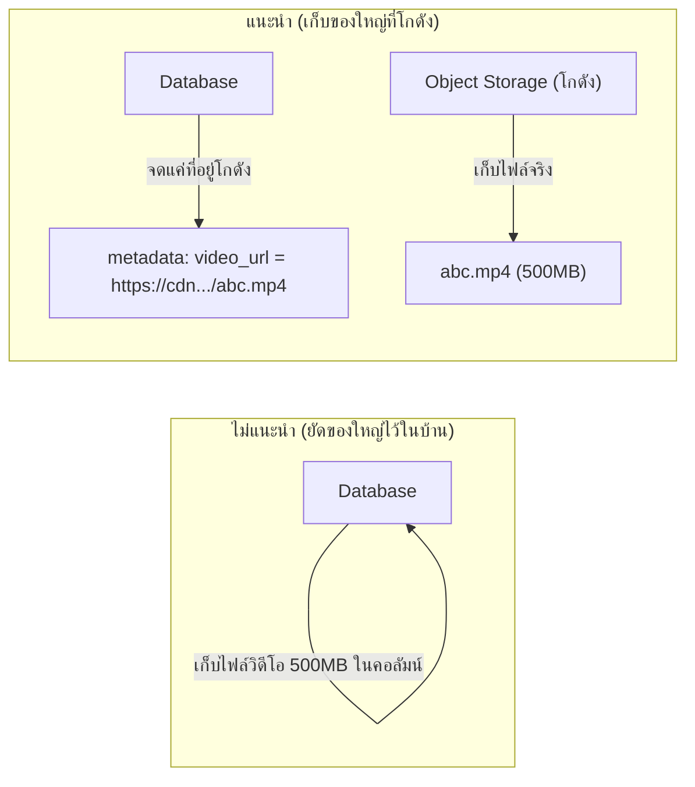

ลองนึกภาพบ้านที่มีของใหญ่ๆ เยอะ (จักรยาน, กล่องของเก่า, เฟอร์นิเจอร์สำรอง) — แทนที่จะยัดทุกอย่างไว้ในบ้าน จนบ้านรกและหาของยาก หลายคนเลือก**เช่าโกดังเก็บของนอกบ้าน** เก็บของใหญ่ๆ ไว้ที่นั่นแทน แล้วแค่จด**ที่อยู่โกดังกับรหัสล็อกเกอร์**ติดไว้ในสมุดที่บ้านก็พอ อยากได้ของก็ไปที่โกดังตามที่จดไว้

Database (module ก่อนหน้า) เหมาะกับข้อมูลมีโครงสร้าง (แถว, คอลัมน์) — แต่ไฟล์ขนาดใหญ่อย่างรูปภาพ, วิดีโอ, เอกสาร ไม่ควรยัดใส่ database แบบนั้น (เหมือนไม่ควรยัดจักรยานไว้ในบ้าน) ต้องใช้ <mark class="hl-term">Object Storage</mark> ซึ่งทำหน้าที่เหมือนโกดังเก็บของนอกบ้าน

## ทำไมไม่เก็บไฟล์ใน Database



Database ถูกออกแบบมาให้ query/index ข้อมูลมีโครงสร้างเร็ว — ถ้ายัดไฟล์ใหญ่เข้าไปด้วย จะทำให้ backup ช้าลง (เหมือนขนของทั้งบ้านย้ายทีต้องขนของใหญ่ไปด้วย), replication หนักขึ้น, และ database เองโตเกินความจำเป็น แนวทางที่ถูกต้องคือ<mark class="hl-insight">เก็บไฟล์จริงแยกไว้ที่โกดัง (Object Storage) แล้วเก็บแค่ "ที่อยู่โกดัง" (URL) ไว้ใน database</mark>

```demo
component: ComparisonDiagram
props: {"left":{"title":"Database","points":["เหมาะกับข้อมูลมีโครงสร้าง (แถว/คอลัมน์)","query/filter/join ได้เร็ว","backup/replication หนักขึ้นถ้ามีไฟล์ใหญ่ปนอยู่","แพงกว่ามากต่อ GB"]},"right":{"title":"Object Storage","points":["เหมาะกับไฟล์ก้อนใหญ่ (blob) ไม่มีโครงสร้างภายใน","เข้าถึงผ่าน key แบนราบ ไม่ query เนื้อหาในไฟล์ได้","scale เก็บได้แทบไม่จำกัด กระจายหลาย region","ถูกกว่ามากต่อ GB แต่ latency สูงกว่า DB โดยตรง"]},"note":"เก็บไฟล์จริงที่ Object Storage เก็บแค่ URL ไว้ใน Database — ใช้ทั้งคู่ตามหน้าที่ของมัน"}
```

```demo
component: JourneyDiagram
props: {"nodes":[{"icon":"person","label":"Client"},{"icon":"building","label":"Object Storage"},{"icon":"notebook","label":"Database"}],"travelerIcon":"envelope","steps":[{"activeNode":1,"caption":"Client อัปโหลดไฟล์วิดีโอ — ไฟล์จริงถูกเก็บที่ Object Storage (โกดัง) ไม่ใช่ Database"},{"activeNode":2,"caption":"Database เก็บแค่ metadata: URL ที่ชี้ไปหาไฟล์นั้น (เหมือนจดที่อยู่โกดังไว้ในสมุด)"},{"activeNode":0,"caption":"ตอนอยากดูวิดีโอ Client ขอ URL จาก Database แล้วไปดึงไฟล์จริงจาก Object Storage โดยตรง"}]}
```

## โกดังนี้ต่างจากตู้เก็บของทั่วไปยังไง

- **ไม่มีชั้นวางเป็นระเบียบซ้อนกันจริงๆ** — ทุกกล่อง (object) มีรหัสล็อกเกอร์แบนราบ (เช่น `users/123/avatar.png`) แม้จะดูเหมือนมีชั้นวางเป็นโฟลเดอร์ แต่จริงๆ คือ string รหัสเฉยๆ
- **ขยายได้แทบไม่จำกัด** — โกดังนี้ออกแบบมาสำหรับเก็บกล่องนับพันล้านกล่อง กระจายอยู่หลายเครื่อง/หลาย region
- **เข้าไปหยิบของผ่าน "ใบสั่งขอ" (HTTP API)** — ไม่ใช่เดินเข้าไปหยิบเองแบบ file system ปกติ ต้องส่งคำขอ upload/download ผ่าน REST call
- **แพงกว่า/ช้ากว่าลิ้นชักในบ้าน (SSD) แต่ของไม่หายง่ายกว่ามาก** — โกดังพวกนี้มักมี durability สูงมาก (ของไม่หายแม้โกดังสาขาหนึ่งพัง เพราะมีสำเนาหลายชุดในตัว)

> ตัวอย่างจริง: Amazon S3, Google Cloud Storage — เกือบทุกระบบที่ต้องเก็บไฟล์ user upload (รูปโปรไฟล์, วิดีโอ, เอกสาร) ใช้ pattern "เก็บของที่โกดัง จดที่อยู่ไว้ในบ้าน" นี้เกือบทั้งหมด

## ขั้นสูง: อัปโหลด/จัดเก็บของจริงที่ scale ใหญ่

**Multipart Upload** — ถ้าไฟล์ใหญ่มาก (วิดีโอหลาย GB) แล้วอัปโหลดเป็นก้อนเดียว เน็ตสะดุดกลางทางแม้แค่ครั้งเดียวต้องอัปใหม่ทั้งไฟล์ <mark class="hl-warning">เหมือนขนของทั้งกล่องใหญ่ทีเดียว ทำตกกลางทางต้องเดินกลับไปหยิบใหม่ทั้งหมด</mark> — แก้โดยแบ่งไฟล์เป็นชิ้นเล็กๆ อัปทีละชิ้นแยกกัน ชิ้นไหนพังก็อัปซ้ำแค่ชิ้นนั้น แล้วให้ Object Storage ประกอบไฟล์กลับเป็นชิ้นเดียวเองตอนอัปครบทุกชิ้น

**Presigned URL** — ปกติ client ต้องอัปไฟล์ผ่าน app server ก่อน แล้ว server ค่อยส่งต่อเข้าโกดัง (server กลายเป็นคอขวด กิน bandwidth ไปกับไฟล์ที่ไม่ได้ใช้ประมวลผลอะไรเลย) <mark class="hl-term">Presigned URL</mark> ให้ server ออก "ใบอนุญาตชั่วคราว" (URL ที่มี signature + วันหมดอายุสั้นๆ) ให้ client เอาไปอัปไฟล์**ตรงเข้าโกดังเลยโดยไม่ผ่าน server ตัวเอง** — ลดภาระ server ลงมาก โดยยัง controlled ได้ (ใบอนุญาตหมดอายุเร็ว ใช้ได้แค่ path ที่กำหนดไว้)

**Lifecycle & Versioning Policy** — ไฟล์เก่าที่ไม่มีใครเข้าถึงแล้ว (เช่น log เก่า, backup เก่า) ยังเสียค่าที่จัดเก็บราคาแพงเท่าไฟล์ที่ใช้บ่อยอยู่ ทางแก้คือตั้ง **lifecycle policy** ให้ระบบย้ายไฟล์เก่าไป storage tier ที่ถูกกว่าโดยอัตโนมัติตามเวลา (เช่น เกิน 90 วันย้ายไป cold storage) ส่วน **versioning** เก็บไฟล์เวอร์ชันก่อนหน้าไว้เสมอ กันเขียนทับ/ลบผิดพลาดแบบกู้คืนไม่ได้

> คำถามสัมภาษณ์: "ทำไมไม่ให้ client อัปไฟล์ผ่าน backend ตรงๆ" — เพราะ backend จะกลายเป็นคอขวดของ throughput ทั้งระบบทันทีที่มีคนอัปไฟล์ใหญ่พร้อมกันหลายคน — presigned URL ให้ client คุยกับ Object Storage ตรง (ที่ scale รับ throughput สูงกว่ามากอยู่แล้วโดยธรรมชาติ) โดย backend แค่เป็นคนออก "ใบอนุญาต" เท่านั้น ไม่ต้องรับไฟล์ผ่านตัวเองเลย
