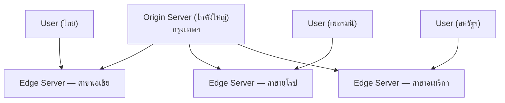
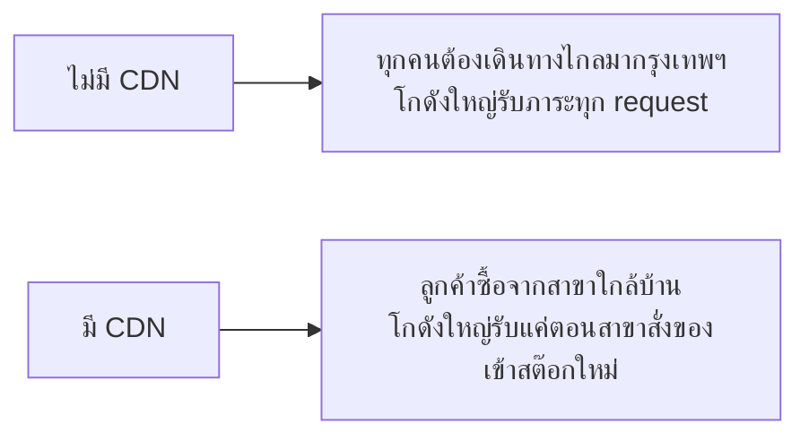

ลองนึกภาพร้านสะดวกซื้อสาขาเดียวที่อยู่กรุงเทพฯ แต่มีลูกค้าอยู่ทั่วประเทศ — ถ้าคนเชียงใหม่อยากซื้อของ ต้องขับรถมากรุงเทพฯ ทุกครั้ง ช้าและไม่สมเหตุสมผลเลย นี่คือเหตุผลที่ร้านสะดวกซื้อจริงๆ **เปิดสาขาใกล้บ้านลูกค้า** สาขาเชียงใหม่มีของเหมือนสาขากรุงเทพฯ ทุกอย่าง ลูกค้าไม่ต้องเดินทางไกล

Object Storage (บทที่แล้ว) เก็บไฟล์ไว้ที่ region เดียว — ถ้า user อยู่ห่างไกล (เช่น ไฟล์อยู่สหรัฐฯ user อยู่ไทย) ทุก request ต้องวิ่งข้ามทวีป ช้ามาก **CDN (Content Delivery Network)** แก้ปัญหานี้ด้วยการเปิด "สาขา" ไปวางใกล้ user

## หลักการ: สาขาใกล้บ้านมีของเหมือนสาขาใหญ่



CDN provider มี "สาขา" (edge server) กระจายอยู่หลายร้อยจุดทั่วโลก — ครั้งแรกที่มีคนขอไฟล์จากภูมิภาคหนึ่ง สาขาที่ใกล้ที่สุดจะไปเบิกจากโกดังใหญ่มาเก็บไว้ (**cache miss** ครั้งแรก — สาขาเชียงใหม่เพิ่งเปิด ต้องสั่งของจากส่วนกลางมาก่อน) คนถัดไปในภูมิภาคเดียวกันที่ขอไฟล์เดียวกัน จะได้จากสาขาใกล้บ้านทันที (**cache hit** เร็วมาก — ของมีอยู่ที่สาขาแล้ว ไม่ต้องรอสั่งใหม่)

CDN จริงๆ แล้วก็คือ**อีกชั้นหนึ่งของ cache** (จากโมดูล Caching) — ลองเล่น demo เดิมอีกครั้ง คราวนี้สังเกตเฉพาะชั้น "CDN":

```demo
component: CacheLayersDemo
caption: CDN คือหนึ่งในชั้น cache ที่ request ผ่าน — คลิกสลับว่าชั้นไหน "มีข้อมูล" บ้างแล้วกด "ส่ง request ใหม่"
```

## อะไรเหมาะกับการเปิดสาขา

- **Static content** — รูปภาพ, วิดีโอ, CSS, JS, font — ของที่เหมือนกันสำหรับทุกคน ไม่เปลี่ยนบ่อย (เหมือนขนมยี่ห้อเดียวกันขายทุกสาขา)
- **เนื้อหาที่ user ทุกคนขอเหมือนกัน** — ยิ่งคนขอของชิ้นเดียวกันเยอะ ยิ่งคุ้มที่จะสต๊อกไว้ที่สาขา (cache hit rate สูง)

ไม่เหมาะกับข้อมูลที่ personalize เฉพาะคน (เช่น dashboard ส่วนตัว) เพราะแต่ละคนต้องการของต่างกัน สต๊อกไว้ที่สาขาแทบไม่ช่วย (แม้บาง CDN สมัยใหม่จะรองรับ dynamic content ได้บ้างก็ตาม)

## ผลลัพธ์ที่ได้



นอกจากเร็วขึ้น CDN ยังช่วย**ลดโหลดที่ origin server อย่างมาก** — request ส่วนใหญ่ถูกตอบจากสาขาโดยไม่ต้องย้อนกลับไปที่โกดังใหญ่เลย เป็นการ scale แบบหนึ่งที่ต้นทุนต่ำมากเมื่อเทียบกับผลลัพธ์ที่ได้
