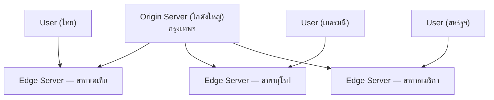
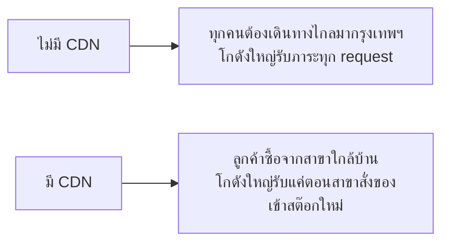

ลองนึกภาพร้านสะดวกซื้อสาขาเดียวที่อยู่กรุงเทพฯ แต่มีลูกค้าอยู่ทั่วประเทศ — ถ้าคนเชียงใหม่อยากซื้อของ ต้องขับรถมากรุงเทพฯ ทุกครั้ง ช้าและไม่สมเหตุสมผลเลย นี่คือเหตุผลที่ร้านสะดวกซื้อจริงๆ **เปิดสาขาใกล้บ้านลูกค้า** สาขาเชียงใหม่มีของเหมือนสาขากรุงเทพฯ ทุกอย่าง ลูกค้าไม่ต้องเดินทางไกล

Object Storage (บทที่แล้ว) เก็บไฟล์ไว้ที่ region เดียว — ถ้า user อยู่ห่างไกล (เช่น ไฟล์อยู่สหรัฐฯ user อยู่ไทย) ทุก request ต้องวิ่งข้ามทวีป ช้ามาก <mark class="hl-term">CDN (Content Delivery Network)</mark> แก้ปัญหานี้ด้วยการเปิด "สาขา" ไปวางใกล้ user

## หลักการ: สาขาใกล้บ้านมีของเหมือนสาขาใหญ่



CDN provider มี "สาขา" (edge server) กระจายอยู่หลายร้อยจุดทั่วโลก — ครั้งแรกที่มีคนขอไฟล์จากภูมิภาคหนึ่ง สาขาที่ใกล้ที่สุดจะไปเบิกจากโกดังใหญ่มาเก็บไว้ (**cache miss** ครั้งแรก — สาขาเชียงใหม่เพิ่งเปิด ต้องสั่งของจากส่วนกลางมาก่อน) คนถัดไปในภูมิภาคเดียวกันที่ขอไฟล์เดียวกัน จะได้จากสาขาใกล้บ้านทันที (**cache hit** เร็วมาก — ของมีอยู่ที่สาขาแล้ว ไม่ต้องรอสั่งใหม่)

CDN จริงๆ แล้วก็คือ<mark class="hl-insight">อีกชั้นหนึ่งของ cache</mark> (จากโมดูล Caching) — ลองเล่น demo เดิมอีกครั้ง คราวนี้สังเกตเฉพาะชั้น "CDN":

```demo
component: CacheLayersDemo
caption: CDN คือหนึ่งในชั้น cache ที่ request ผ่าน — คลิกสลับว่าชั้นไหน "มีข้อมูล" บ้างแล้วกด "ส่ง request ใหม่"
```

## อะไรเหมาะกับการเปิดสาขา

- **Static content** — รูปภาพ, วิดีโอ, CSS, JS, font — ของที่เหมือนกันสำหรับทุกคน ไม่เปลี่ยนบ่อย (เหมือนขนมยี่ห้อเดียวกันขายทุกสาขา)
- **เนื้อหาที่ user ทุกคนขอเหมือนกัน** — ยิ่งคนขอของชิ้นเดียวกันเยอะ ยิ่งคุ้มที่จะสต๊อกไว้ที่สาขา (cache hit rate สูง)

<mark class="hl-warning">ไม่เหมาะกับข้อมูลที่ personalize เฉพาะคน (เช่น dashboard ส่วนตัว) เพราะแต่ละคนต้องการของต่างกัน สต๊อกไว้ที่สาขาแทบไม่ช่วย</mark> (แม้บาง CDN สมัยใหม่จะรองรับ dynamic content ได้บ้างก็ตาม)

## ผลลัพธ์ที่ได้



นอกจากเร็วขึ้น CDN ยังช่วย**ลดโหลดที่ origin server อย่างมาก** — request ส่วนใหญ่ถูกตอบจากสาขาโดยไม่ต้องย้อนกลับไปที่โกดังใหญ่เลย เป็นการ scale แบบหนึ่งที่ต้นทุนต่ำมากเมื่อเทียบกับผลลัพธ์ที่ได้

## ขั้นสูง: แก้ไฟล์ที่โกดังใหญ่แล้ว แต่สาขาทั่วโลกยังขายของเก่าอยู่

ปัญหาที่มาพร้อมความเร็วของ CDN: ถ้าแก้ไฟล์ที่ origin (เช่น แก้ logo ผิดสี) <mark class="hl-warning">สาขาหลายร้อยจุดทั่วโลกที่เคย cache ไฟล์เก่าไว้แล้ว จะยังคงขายของเก่าให้ user ต่อไปจนกว่า TTL หมดอายุเอง</mark> — เหมือนแก้สูตรอาหารที่ส่วนกลางแล้ว แต่ต้องรอให้สาขาทุกจุดทั่วโลกได้รับข่าวและเปลี่ยนสูตรตามพร้อมกัน ซึ่งไม่เกิดขึ้นทันที

- **Purge/Invalidation API** — สั่ง CDN provider ให้ "เทของเก่าทิ้ง" ที่ทุกสาขาทันที เป็นทางแก้ตรงไปตรงมาที่สุด แต่ purge ทั่วโลกไม่ใช่ operation ที่เกิดขึ้นทันทีเป๊ะ (กระจายคำสั่งไปทีละสาขา ใช้เวลาหลักวินาทีถึงนาที) และ provider มักจำกัดจำนวนครั้ง purge ต่อเดือน (มี cost)
- <mark class="hl-term">Cache-Busting ด้วย Versioned URL</mark> — วิธีที่ระบบจริงนิยมใช้มากกว่า purge: เปลี่ยนชื่อไฟล์ทุกครั้งที่เนื้อหาเปลี่ยน (เช่น ใส่ content hash ต่อท้ายชื่อไฟล์ `logo.a3f9c2.png` แทน `logo.png`) — ไฟล์ใหม่มี URL ใหม่ = cache miss โดยธรรมชาติทันทีที่ deploy ไม่ต้องรอ purge กระจายให้ครบทุกสาขาเลย ส่วนไฟล์เก่าก็ปล่อยให้ค้าง cache ต่อไปได้เพราะไม่มีใครอ้างถึง URL เก่าอีกแล้ว

> คำถามสัมภาษณ์: "deploy โค้ดใหม่แล้ว แต่ user บางคนยังเห็นหน้าเว็บเก่าอยู่ เกิดจากอะไร" — คำตอบมาตรฐานคือ CDN/browser cache ไฟล์ static (CSS/JS) เก่าไว้ตาม TTL — ระบบที่ออกแบบดีจะตั้งชื่อไฟล์ static ด้วย content hash (cache-busting) ทุกครั้งที่ build ใหม่ ไม่ใช่พึ่งพา purge API ซึ่งไม่การันตีว่าจะเทของเก่าออกจากทุกสาขาได้ทันที
